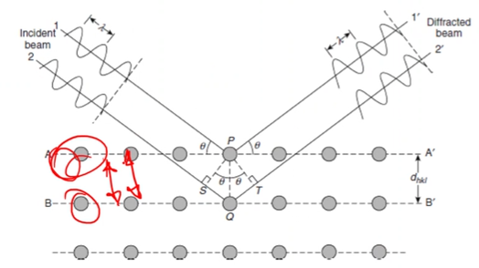

# Bragg Diffraction

Crystal structure determines the way electrons and x-rays are diffracted.
The crystal type and planar spacing will dictate the pattern formed when the #electron-beam reflects from that structure.

|  |
|:--:|
| The #Bragg-angle is the incidence angle where the electrons are constructively reflected: $n\lambda = 2d\sin(\theta)$. |

Using a #small-angles-assumption, Bragg's Law can be written as: $\lambda = 2d\theta$.