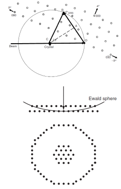

# Bragg's Law Equivalence

[Bragg's Law](bragg-diffraction.md) for any #crystal-planes are represented by the [Ewald sphere](ewald-sphere.md) surface, and it can be demonstrated geometrically.
The [reciprocal lattice](reciprocal-lattice.md) is an imaginary construct existing in all directions to maximum multiple in the crystal, but it is only revealed under the appropriate diffraction conditions.
$$\begin{split}
\text{Since } OC &= \frac{1}{\lambda}\text{, } OA = \frac{d^{*}_{230}}{2} \\
\text{Hence, } \sin(\theta) &= \frac{OA}{OC} = \frac{d^{*}_{230}/2}{1/\lambda} \\
\text{Recall } d_{230} &= \frac{1}{d^{*}_{230}} \\
\text{Thus, } \lambda &= 2d_{230}\sin(\theta)
\end{split}$$
This last equation is [Bragg's Law](bragg-diffraction.md).

