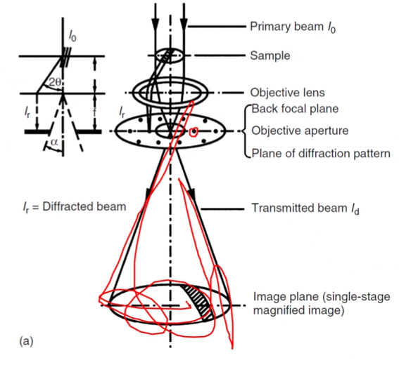

# Brightfield

...is the most common type and is a uniform illumination of the surface (or transmission through).

## TEM
The #diffraction-pattern contains a central spot that is the undeflected beam (high intensity).
The objective aperture is within that central spot, limiting the signal and scattered electrons.
Therefore, imaging mode (brightfield) is just the undeflected or very weakly deflected beam.

|  |
|:--:|
| These spots are generated no matter what. This is the default mode of most microscopes. The main beam is either untouched or weakly deflected. |