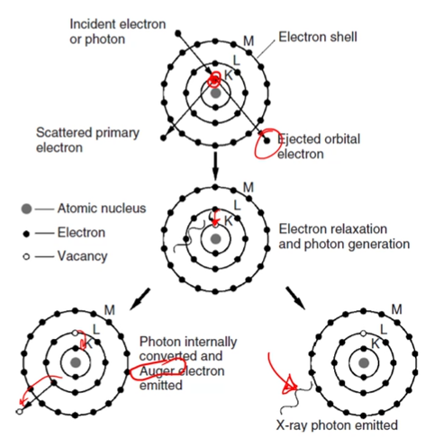

# Characteristic X-Rays

!!! hint
    Throughout all this, keep in mind the [electron volume](interaction-volume.md) coming from the beam incident to the material.

The ability to determined chemical composition comes rom the unique electron configurations of elements.
When an electron is knocked out of an inner shell orbital, an electron transitions from an outer shell and generates a photon (x-ray).
The energy difference between the two electron is specific to the shell and atom type ( #Moseleys-Law ), with resulting wavelength given the atomic #, Z, and shell-specific constants, B and $\sigma$: $\lambda = \frac{B}{(Z - \sigma)^{2}}$.

|  |
|:--:|
| A k-level electron is kicked out and an upper level electron must drop in energy state to fill that gap. |