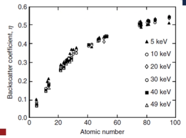

# Compositional Contrast

**Backscatter coefficient**
When more than one element or phase is present, there will be a difference in the #BSE signal.
Heavier elements (high Z number) will reflect electrons more than light elements, so the #BSE signal will be more intense which creates brighter areas with higher Z numbers.

|  |
|:--:|
| #BSE coefficient is the ratio of electrons put into the material to those escaping. $\eta = \frac{n_{BSE}}{n_{i}}$ |