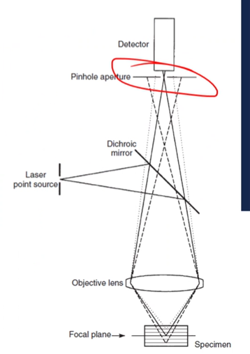

# Confocal Microscopy

The primary difference in confocal microscopy is that the sample is scanned with a high-intensity laser beam.
The small spot and focal point allow a single plane to be analyzed, and a pinhole at the detector eliminates out of focus areas.
The beam is often rastered across the surface at a fixed z-height, then the stage or objective is moved to the next plan and scanned again.

|  |
|:--:|
| The compilation of in-focus images is used to create a 3D image and measure those height differences. |