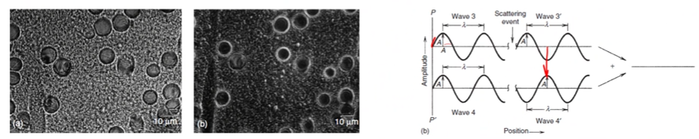

# Contrast

The ability to discern features on a distinction of feature boundaries.
The contrast is the difference in light intensity between an object and its background.
Visibility requires a contrast threshold, and depends on [brightness](brightness.md): bright light, contrast can be as as 3%; dim light, contrast must be as much as 200% or more.
$$\text{contrast} = \frac{I_{\text{object}} - I_{\text{background}}}{I_{\text{background}}}$$
Contrast is developed by varying signal, but the cause of signal variation can be from two primary sources:
1. [Topography](#topographical)
2. [Composition](#composition)

## Topographical
You can never get rid of topographical contrast.

### Trajectory
The #SEM produces images that appear 3D because the #SE signal is dependent on topography.
Surfaces oriented toward the detector will appear brighter because the signal is uninhibited from reaching it.
On the opposite side of a feature the #SE are absorbed in the material and signal is lost.

### Number
There are also signal intensity differences caused by the number effect which occurs where more electrons are emitted from the sample.
This can be in angled surfaces, at edges, and in thin sections.
Both #BSE and #SE are subject to this: ==#SE are more useful for topographical contrast==.

## Compositional
You can adjust compositional contrast intensity, but never rid the topographical information.

**Backscatter coefficient**
When more than one element or phase is present, there will be a difference in the #BSE signal.
Heavier elements (high Z number) will reflect electrons more than light elements, so the #BSE signal will be more intense which creates brighter areas with higher Z numbers.

|  |
|:--:|
| #BSE coefficient is the ratio of electrons put into the material to those escaping. $\eta = n_{BSE}/n_{i}$ |

## Phase contrast
Light can be altered in amplitude or phase to produce imaging contrast.
Phase contrast microscopy uses a condenser annulus and phase plate to induce destructive interference of the light: where the light is scattered, the image appears brighter.

|  |
|:--:|
| When a phase plate is tuned to some frequency of light, light passing through the annulus is shifted in phase to cancel out light of the opposite phase. Light waves that are shifted but not opposite or not shifted are allowed to pass through the annulus which is makes certain features in the image brighter. |

## Ion channeling contrast
The lack of #BSE in #ion-microscopy gives stronger orientation information: note that [compositional contrast](#compositional) is lost.
The #crystallographic-orientation allows varying levels of ion implantation at greater depths, so #SE generation varies.
Tilting the sample a few degrees can change the contrast and confirm the orientation dependence.

|  |
|:--:|
| Consult your local Neapolitan ice cream for order, but #crystallographic-orientation reflects less ions back the more adversely aligned with the ion column which appears as a darker region in the image. |

## Mass-density contrast
The number of electrons being deflected by nuclei will increase as the thickness and density of the sample increases.
The local changes in either feature will result in changes in signal/[brightness](brightness.md).
The objective aperture determines the maximum angle of deflection allowed to pass (0.01 rad).
The overall intensity is reduced for a smaller aperture, but the contrast is enhanced.
This is the main mechanism for imaging amorphous materials, such as polymers and biological samples: heavy metal stains can be used to further enhance contrast.

!!! quote <cite> #Mark-Atwater
    #TEM is for shadow puppets.

## Diffraction contrast
In crystalline samples, the electrons can undergo [Bragg diffraction](bragg-diffraction.md).
The planes with the crystal can be focused to a series of spots corresponding to the #crystal-structure (based on [Bragg diffraction](bragg-diffraction.md)).
The #diffraction-pattern (DP)[^1] is characteristic of #crystal-type and the #lattice-spacing.

[^1]: See [Lecture 16](lecture-16-tem-diffraction-patterns.md) for more info on #diffraction-pattern in #TEM.

|  |
|:--:|
| #polycrystalline materials appear as rings. |