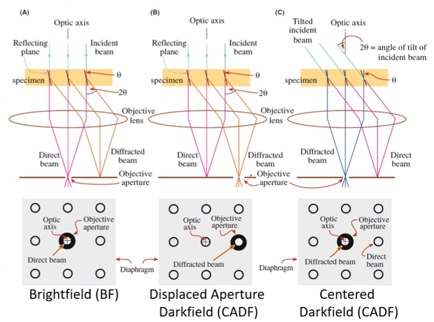

# Darkfield

...uses a central stop to only allow light rays to be used from the outer edge of the optics: this causes surface features to appear bright as they scatter oblique lighting back up through the objective ([topographical contrast](contrast.md#topographical)).

## TEM
Diffraction mode is used to switch between [brightfield](brightfield.md) and darkfield settings.
The central spot is for [brightfield](brightfield.md) imaging, but the #diffraction-spots can be selected for darkfield imaging.
Darkfield uses a particular reflection of limited range of reflections and blocks the central beam.
Moving the aperture uses off-axis electrons and can reduce image quality on some #TEM.

|  |
|:--:|
| Because these #diffraction-spots exist no matter what, darkfield aligns the objective aperture to a particular point to block the off-axis electrons: anything else that satisfies the diffracted beam condition in that spot would shine through. One could also tilt the beam to tilt the pattern. |

## Centered Darkfield
### Beam Tilt
To get #diffraction-spots on the optical axis, the beam must be tilted.
The beam can be shifted and titled using scan coils.
The process for achieving the proper tilt is more time consuming than aligning the aperture to the #diffraction-spots, so #CDF is only used if needed (low [aberration](aberrations.md) #TEM).

*[CDF]: Centered Darkfield

|  |
|:--:|
| Tilting the beam makes it appear as though the sample is inline with the optical axis of the intermediate lens without physically tilting the sample or moving the aperture. |

!!! example #Cu with dispersed #W particles.
    
    The darker section of (A) could be a thicker part of the specimen; whereas, the darker spots could either be compositional contrast from alloys or #grain-orientation which darkfield can tell the difference.
    **The needle in the center blocks out the central spot which would otherwise wash out the image.**
    By tilting the beam or moving the aperture, certain grains will shine through more prominently which is shown in (B) and (C).

### Hollow cone darkfield
Diffraction data is oriented around the central beam, such that all points corresponding to #crystal-planes or phases are equidistant: i.e. the rings in a #polycrystalline #diffraction-pattern.
A DF image created by #CDF or #DADF gives only a small section of the potential information.
By using scan coils, the beam can be shifted in a circular pattern to provide all of the darkfield information for a particular reflection.

*[DF]: Darkfield

### DF vs HCDF
The #polycrystalline sample only reveals a few grains for a single objective aperture position.
By tilting and rotating the beam so that the desired ring is on the optical axis, many #grains are highlighted.
Long exposure and numerous cycles per image are likely necessary to resolve the #grains.

|  |
|:--:|
| Think of a spirograph that the beam moves to trace around a ring. |