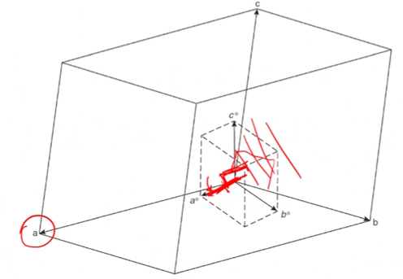

<!-- 20221010T13:12 -->
# Diffraction Patterns
## Objectives
- Refresh the concepts of diffraction pattern
- Detail the relationship between the crystal structure and reciprocal lattice
- Introduce the Ewald sphere and its construction from Bragg diffraction
- Describe the formation of the diffraction pattern using the Ewald sphere
- Highlight the process...

## Selected Area Diffraction (SAD)
SAD is a technique for selecting the back focal plane of the electron beam where a diffraction pattern is focused: only produced by crystalline materials.
BF images are created by putting the objective aperture over the central spot, which is undeflected or weakly deflected.
By moving the BF aperture to a strongly diffracted spot, a DF image is produced.

## Reciprocal lattice
Diffraction within a crystal results in a three-dimensional array of spots that is the reciprocal lattice of the crystal.
A reciprocal lattice is a series of points representing with Miller indices (hkl).
A direction is represented by vector ruvw with unit vectors a, b , and c in _real space_ (uvw corresponding to the indexing integers).
In _reciprocal space_, the direction vector dstarhkl has unit vectors of astar, bstar, and cstar.
$$\begin{split}
\mathbf{r}_{uvw} &= u\mathbf{a} + b\mathbf{b} + w\mathbf{c} \\
\mathbf{d}^{*}_{hkl} &= h\mathbf{a}^{*} + k\mathbf{b}^{*} + l\mathbf{c}^{*}
\end{split}$$

## Reciprocal space
a dimension in reciprocal space is the reciprocal of the dimension in real space such that....
Each crystal structure has a unique reciprocal lattice.
Each lattice point in reciprocal space represents a crystal plane (hkl), a nd the direction dstarhkl...

## Non-orthogonal crystal
Real and reciprocal directions are not parallel to each other.
$\mathbf{a}^{*}$ is perpendicular to $(100)$ and $\mathbf{a}$ is parallel to $[100]$.

## Zone axis
If a group of crystal planes (crystal zone) all have normal directions perpendicular to another direction --e.g. the electron beam--that direction is called zone axis direction.
A sample may need to be tilted to align the zone axis with the beam.

## Ewald sphere
Bragg's law describes the conditions necessary for constructive diffraction and the Ewald sphere is a graphical representation.
The Ewald sphere is imaginary and has a radius of $\lambda^{-1}$ in reciprocal space.
The crystal being examined is placed at the center of the Ewald sphere with the incident beam passing through the center of the sphere and dictating the origin of the reciprocal lattice on the surface.
The angle of diffraction is based on Bragg's law, satisfied when a lattice point touches the Ewald sphere surface.
A change in diffraction angle can be represented by rotating the reciprocal lattice at point O.

|  |
|:--:|
| In #TEM, the Ewald sphere radius is ginormous. |

## Bragg's Law Equivalence
Bragg's law for any crystallographic planes is represented by the Ewald sphere surface, and it can be demonstrated geometrically.
The reciprocal lattice is an imaginary construct existing in all directions to maximum multiple in the crystal, but it is only revealed under the appropriate diffraction conditions.
$$\begin{split}
\text{Since } OC &= \frac{1}{\lambda}\text{, } OA = \frac{d^{*}_{230}}{2} \\
\text{Hence, } \sin(\theta) &= \frac{OA}{OC} = \frac{\frac{d^{*}_{230}}{2}}{\dots}
\end{split}$$

## Relrods
Theoretically, a surface intersecting a point is only satisfied at one possible condition.
In reality, a point is only generated by an infinite lattice, and the real sample dimensions and shape factors spread the point into a rod (incomplete destructive interference, more on this in XRD).
The reciprocal lattice rod (relrod) gives varying intensity to the DP.

## Diffraction spacing
Angles of diffraction in TEM are very small (often less than 1 deg).
Using a small angle approx, Bragg's law can be written as: $\lambda = 2d\theta$.
Because DP is detected at some real distance, L, the spacing, R will be larger.
L is not a direct physical measurement as the imaging lenses will change the path length.
$\lambda L$ is known as the camera constant: Camera length can be effectively changed by (de)magnifying the beam (R changes).

## Indexing
### Cubic example
The pattern and spacing gives us the information about the crystal type and size.
By using the central spot on the zone axis of a single crystal, we can measure the distance (R) to each spot and determine the spacing from a given camera constant.
By choosing two spots and their included angle, the real lattice spacing can be determined:
$$\begin{split}
\lambda L &= RD \\
d_{hkl} &= \frac{1}{\sqrt{h^{2} + k^{2} + l^{2}}} \\
R_{(hkl)} &= \frac{\lambda L\sqrt{h^{2} + k^{2} + l^{2}}}{a}
\end{split}$$

At 200 kV, $\lambda = 0.00251 nm$:
- if L = 1, and a = 0.563 nm, Rm matches (200) and Rn matches (220).
- The angles between the two also..

### Assigning indices
The pattern has 180 deg. ambiguity, so the two points are indexed positive on the right and negative on the left.
Other spots can be indexed by vector addition and zone axis is the determined by the cross product: Rm \cross Rn.

## Summary
- The real crystal lattice dictates the reciprocal lattice where planes are represented by dots
- Diffraction patterns contain much more information about the crustal structure.
- A basic concept of the material is helpful to make indexing easier.