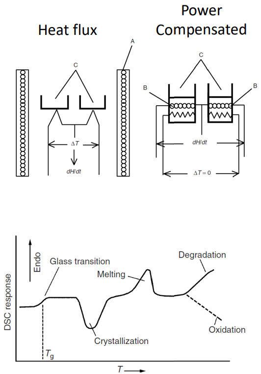
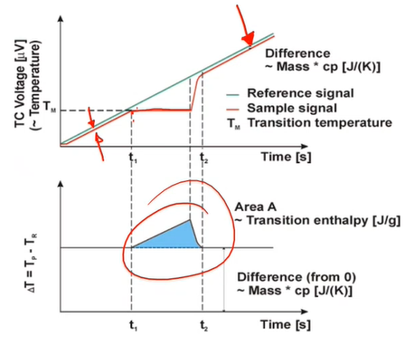
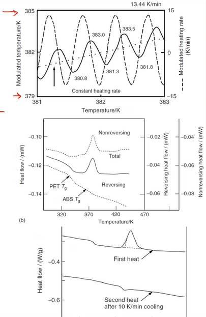

# DSC

#DSC measures the _heat flow_ differnce between a sample and reference (often an empty pan).
Two primary methods:
1. Heat flux #DSC: measures the difference under a single heat source.
2. Power componestated #DSC: adjusts the amount of heat to each sample to achiveve the same heat flow.

!!! example Example
    The offset in the sample voltage is a constant offset due to the spiecific heat of the sample.
    When a thermal event occurs, the difference becomes non-linear until the event is copmleted.
    When the reference is substracted, the area under the curve is the transition energy.

    

## Temperature modulated DSC
#TMDSC uses cyclic heating to separate reversible and non-reversible thermal events.
It superimposes a small, sinusoidal heating profile to a linearly increasing profile.
The interpreteation of the #DSC data is more complex.
By cycling around a temperatue, overlapping events can be separated: after the first cycle, only the reversible events will repeat.

