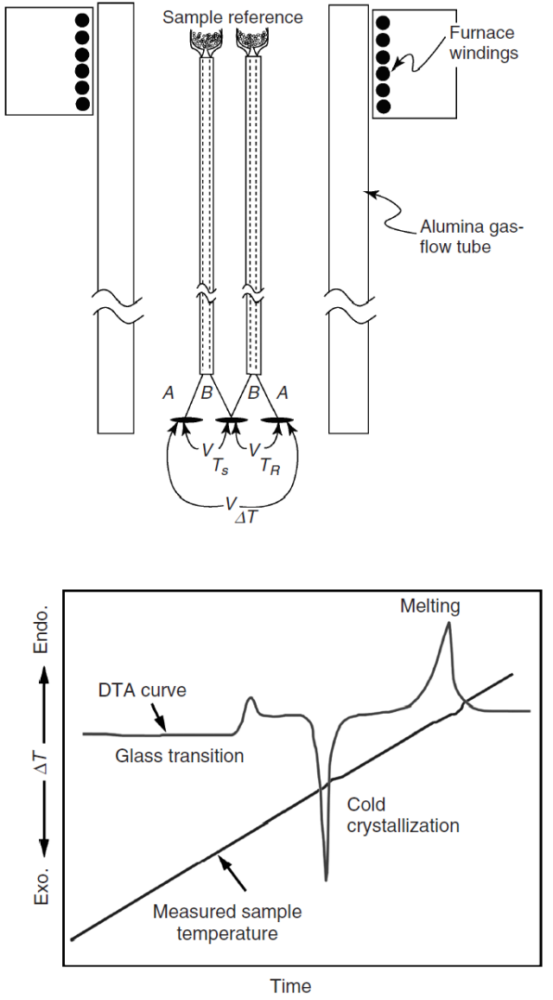

# DTA

#DTA measures the _temperature_ difference between a sample and reference.
The material is held in a crucible:
- Made from a amterial that is suirtable at temperatue.
- Does not react with the sample material.
- Does not undergo its own thermal events (e.g. Al2O3).

|  |
|:--:|
| A thermal event is indicated by a deviation from the reference temperature: higher is exothermic and lower is endothermic. Endothermic events are plotted in the positive direction by convention.
#DTA is capable of higher tmperateus than #DSC. |

!!! question Why would exothermic be negative? <cite> #Mark-Atwater
    Ordering the lattice lowers the entropy and gives off energy.