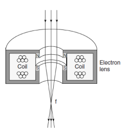

# Electromagnetic Lenses

Electrons will move perpendicular to a magnetic field.
By changing the strength of the field, the #electron-beam can be manipulated.
The magnetic field is altered through current in the lens, and by incorporating numerous sections, beam shape can be changed as well.
The beam is focused to a fine point by these lenses and rastered by *scan coils*.

