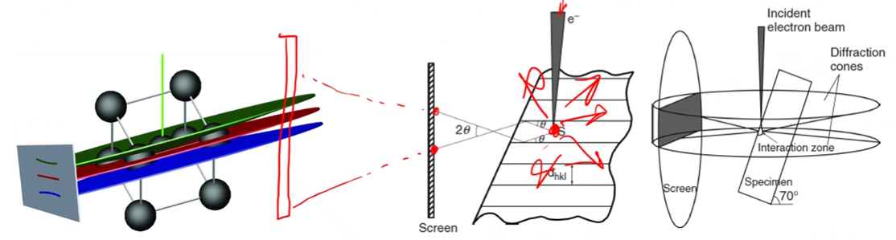
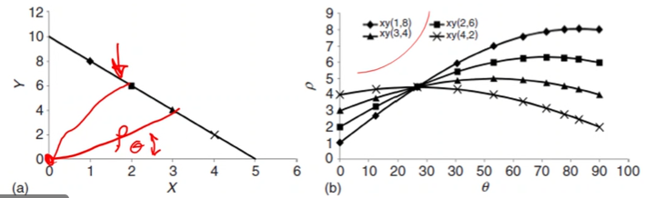
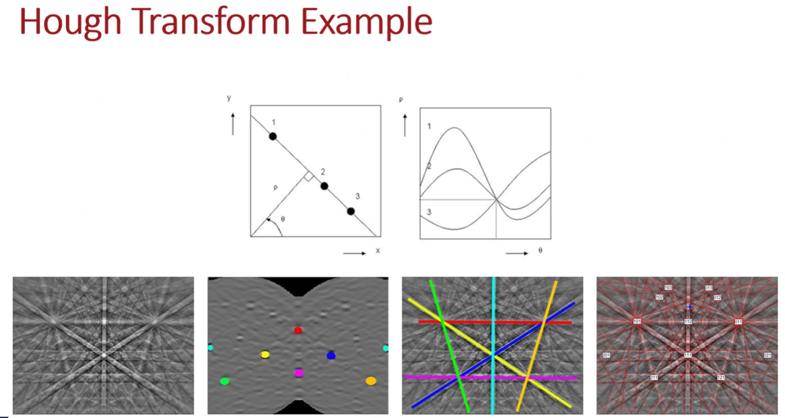

<!-- 20220919T13:10 -->
# Electron Backscatter Diffraction

## Objectives
- introduce the tehcnieu of EBSD
- describe the crystallography
- determine the fundamental factors of diffraction
- Identify the typical setup and the reasons behind *highlight kikuchi patterns created and hte informatined contained theiren
- identity the resulting information and interprtation of it.

## Crystallographic Structure
EBSD is applied to determine the #crystallographic information.
Nearly all metals and many ceramics are comprised of orderly sub-units ( #crystals ) that have varying orientations to each.
The size and orientation ditribution are determined fro the area of investigation.
#grain-size is of critical importance to strength: #Hall-Petch-Equation relation in metals.
Most #grains are 10s to 100s of microns.

## Crystallography (Briefly!)
A stereographic projection of a crystal maps out important crystallographic orientations based on its structure.
The pattern is dependent on the crystal structure, and the spacing is determine dby the element type: e.g. #copper and #aluminum are both #fcc, but they can be distribuished.

!!! tldr What is the crystal structure and the spacing of that structure?
    These are the questions answered in crystallogrpahy.

## Bragg Diffraction
Crystal strcture dtermined the way electrons (and later, x-rays) are diffracted.
The crystal type and planar spacing will dictate the pattern formed when the electron beam reflects from that structure.
|  |
|:--:|
| The bragg anlge is the incidence angle where the elctrons are constructively reflected: $n\lambda = 2d\sin(\theta)$. |

## Detector Setup
the sampel is plaved at high tilt angle (typically 70 degs) and the detector is brought close (typically within 20 mm).

## Scattering
The electron beam is scattered in all directions.
Some of those electrons are at the correct angle to be coherently scattered from various crystal planes, forming kikuchi lines.
The high tilt (70 degs) ensures a high output of inelastically scattered electrons near the surface.
Eelctron backscattered pattern (EBSP) can be interpreted to determine structure and orientation.

!!! quote <cite> #Mark-Atwater
    The purpose of tilting is to get more signal out of the tear drop of electron distribution.

|  |
|:--:|
| costle cones send in electrons which may reflect at very shallow angles. Some electrons will bounce into the screen the pattern of which can be indexed (later). The planes are not real planes, but simply atoms in-line with each other which are simply assigned as a plane to get the pattern. |

### Scattering Conditions
Since the bragg diffraction equation is wavelength dependent, the beam condition (eV) will ditate the scattering conditions.
The electron beam wavelength comes from Planck's constant over the momentum of the electron: $\lambda_{e} = \frac{\hbar}{p}$.
So that the, in terms of beam energy, the wavelength at a given energy, $E [eV]$ is: $\lambda_{e} \text{[nm]} = \frac{1.226}{\sqrt{E}...}

## Voltage Effects
The kikuchi lines ar enarrower at high voltage.
The bragg angle decreases, and lines are separated by twice the bragg angle.

|  |
|:--:|
| Although appearing to be straight lines, the pattern is formed on conic sections (Kossel cones). |

!!! tip Kikuchi Lines
    Typically generated at $20 kV$ because lower voltages make for thicker lines wherein those lines may be difficult to interpret.

## Detecting the EBSP
A phosphor screen is placed near to the sample surface to detect the electrons.
Each bnd represnts one plane, and the bands are indexed based on the orientations.
A high voltage ($>10 kV$) and high current are preferred to generate sufficient signal.
Surface prep is particularly critical to get a clean pattern.

|  |
|:--:|
| Scratches and platic deformation will alter or eliminate the pattern formation. |

### EBSP patterns
bands on the kikuchi pattern are proportiaonal in width to the interplanar spacing.
The intersection of bands is a pole or zone axis.
The angle between lines is the same as the interplanar angle.
There many lines and orientations, and indexing is best accomplishing by a computer using a Hough transform or pattern simulation.
A background subtraction is also used to reduce unwanted noise from the pattern.

### Hough Transformation
To aid in automatically distinguishing zones axes, a hough transformation can be performed.
A line equation $(x, y)$ is represented by a distance and angle (polar coordinates): $\rho = x\cos(\theta) + y\sin(\theta)$.

|  |
|:--:|
| A sigle point in hough space is then a sinusoidal curve of $\cos(\theta) + \sin(\theta)$ type. The intersection of sinusoidal curves in Hough space is a single line in rectilinear coordinates which appears as a bright spot on the computer screen. |

### Pattern simulation
A basic kinematical approach uses the scattering intesnity ofrom certain planes to determine the spacing, orietation, and intensity of the patter.
A multiple-beam dynamical approach adds realsim in the sense that the beam is scatterd numerous times....

### Spherical indexing
A full stereographic porjectis is used and back projected to quickyly compare to measued pattern.
Does not require a multidue of reference patterns.

|  |
|:--:|
| Dynamically simultaed master pattern oor austenitc steel. |

## post-processing
the data collected for each pixel is used to determine where oritneation or phase chane.es
The phase boundaries can bthen be sued to determine th grain size and oreitation distribution.
Ohter information, such as strin, can be measured by ditrorting in the indexing that not sufficient to be considered a near grain (kernal average misotirationa).
The "clean up" of data should be carefully applied for accuracy.

## pole fiugues
the orietnation dataa revelas if there is "referred" oreitnation (texture) or if the microscture is equiaxed.
The pole figures indicates the intensity (frequency) of grains iwhtin a particular oritenation of the streergrapoihc poroject.
An inverse pole figure represente lattice orientation relative ot crystallographic planes.

## Sumary
- EBSD provides valuable cystallographic information
- it requies a specialized stetup and detector to achive the necesary disngal.
- The data collected si generat though electron diffraction from custallograpoihc structure
- the scrystal structure determines the ppatern of diffracted electrons.
- The hieavy lifting of EBSD is related to pattern recogniztion whichi i handled by the software.

