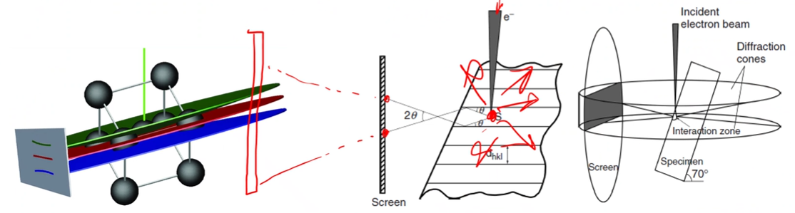

# Electron Scattering

The #electron-beam is scattered in all directions.
Some of those electrons are at the correct angle to be coherently scattered from various #crystal-planes, forming #Kikuchi-lines.
The high tilt ($70\degree$) ensures a high output of #inelastically scattered electrons near the surface.
Electron backscattered pattern ( #EBSP ) can be interpreted to determine #crystal-structure and #crystal-orientation.

!!! quote <cite> #Mark-Atwater
    The purpose of tilting is to get more signal out of the [tear drop of electron distribution](interaction-volume.md).

|  |
|:--:|
| #Kossel-cones send in electrons which may reflect at very shallow angles. Some electrons will bounce into the screen the pattern of which can be indexed (later). The planes are not real planes, but simply atoms in-line with each other which are simply assigned as a plane to get the pattern. |

## Conditions
Since the [Bragg diffraction equation](bragg-diffraction.md) is wavelength dependent, the beam condition (eV) will dictate the scattering conditions.
The #electron-beam wavelength comes from #Plancks-Constant over the momentum of the electron: $\lambda_{e} = \hbar/p$.
So that the, in terms of beam energy, the wavelength at a given energy, $E [eV]$ is: $\lambda_{e} \text{[nm]} = 1.226/[E(1 + 0.979E - 6E)]^{1/2}$.