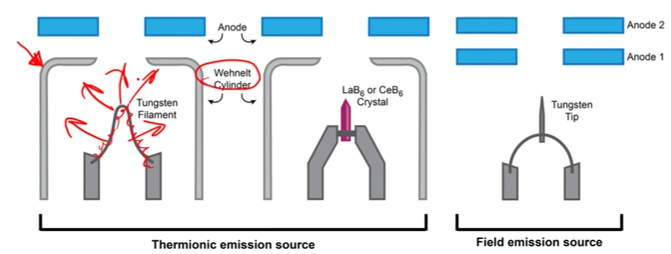

# Electron Source

The way electrons are generated for #SEM imaging is important to the [resolution](../engr-743-001-damage-and-fracture/resolution.md) of the microscope.
To generate an #electron-beam, the #work-function of source must be overcome.
The source (cathode) is combined with a #Wehnelt-cap.
The two main categories are [thermionic](#thermionic) and [field emission](#field-emission).
The cost and capability of these sources are inversely proportional, and the system changes can also rapidly increase the cost.

### Thermionic
Thermionic sources heat a filament to high temperature to "boil" off electrons.
==The lowest cost version is a #W wire.==
A lanthanum hexaboride ($LaxB_{6}$) emitter has a lower #work-function (less than half that of #W).
#LaB6 has a higher brightness (10X) and longer lifetime (10X) but high cost (10X).
#LaB6 also requires higher vacuum and that raises the complexity and cost of the microscope.

### Field emission
Field emission gun ( #FEG ) #SEM use a strong electrostatic field to draw electrons off the tip of the emitter.
A tip that is not heated is considered a #cold-FEG and requires an extremely sharp tip.
#Schottky-FEG uses lower temperature heating that [thermionic sources](#thermionic) and a $ZrO$ coating to reduce the #work-function of a #single-crystal #W emitter.
#cold-FEG produce the best [resolution](../engr-743-001-damage-and-fracture/resolution.md), but #Schottky-FEG tips provide greater analytical capability and stability: #cold-FEG require extremely high vacuum and may need to be "flashed" to remove surface contamination.

