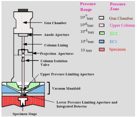

# Environmental SEM

A specialized #SEM where hydrated samples can be imaged in their native state with modest cooling.
Pressure may be $2500 Pa$ versus 10s or 100s of Pa in [VPSEM](variable-pressure-sem.md)/: high-vac #SEM usally $10^{-4} Pa$ or so.
Enables the best perseveration of biological materials and others that would be compromised by coating/dehydrating.

