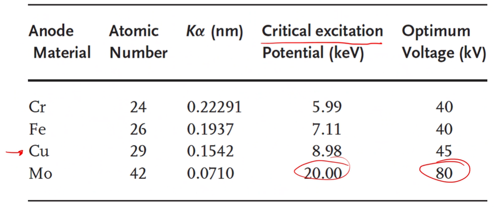

<!-- 20221017T13:06 -->
# Equipment and Setup (XRD)
## Objectives
- Introduce XRD as a techinuq for crystlalography and composition
- discuss the fundemantals of the technique and general setup
- detmine th...

## X-Ray Diffraction (XRD)
XRD is used to identify crystallographic information.
The benefit of XRD over EDS and similar techniuqes is that XRD can identify different phases of the same composition.
Spectroscopic XRD uses x-ray relfection over a range of angles to identify varying intensity: like EDS spectra, but not wavelength or energy based.
Photographic XRD uses a single pattern generated by a sampleto determine the crystla structure: like DPs in TEM.

!!! note
    Expands on EDS or EBSD because it tells you the phase of what composition is there.

## X-Ray source
x-rays are generated by high-energy electrons bombarding a metal target.
The x-ray wvelength is determined by the target material and the acclerating voltage applied in an x=ray tube.
X-rays are genereted in all directions, but they are limited to exiting through a window in the tube.
Cooling is critical as only 1% of the enrgy input is converted to x=rays.

$$\lambda = \frac{1.2398e3}{V}~nm$$

## X-ray characteristics
There is a contnuous x=ray specturm (white x-rays) that create a background signal.
The iminum wavelngth is determined by the maximum electron energy: e.g. 0.062 nm at 20 kV.
The background is punctuated by sharp maxima that correspond to the characteristics x-rays of the target materl.
it is deriable to produce monochromatic radioation, so filtering out the background and other peaks is performed.

|  |
|:--:|
| Everything below the peaks are non-sense. |

## X-ray generation
We have discussed the process of x=ray generation in relation to EDS and WDS.
One of th ekey aspects to remember is Siegbahn notation:
- Transition from L to K shell: $K_{\alpha}$
- Transition from M to K shell: $K_{\beta}$
- Different subshells: Kalpha1, kalpha2, etc.

The intensity of $K_{\alpha}$ will be higher than halpha because the probability is highr, but the wavelength of kbeta is shorter.
Subshell energy differences are somthimes....

|  |
|:--:|
| Copper is rather common, but may need to choose another for higher signal to noise ratio. |

## Filtering
The unwanted x-rays must be removed and/or accounted for.
The continouus and undesirable characteric x-rays should be filtered from the beam.
The most common way to achieve this is to put a material that abosrvs x-rays other than the characterisitc wavelngth desired.
Absorption is a function of the linear absoprtion coefficient (mu) and mass density (rho): i.e. the mass-absorotpion coefficient (mu/rho), which depnds only on composition.
Intensity (I) through thickness (x)....

## Mass-absortopion coefficint
Decreases with decreasing wavelgnth of radiation.
There are distinct drops in the absoprtion, known as absoroption adeges.
These adges are idnciative of the energies neededto excite charactersitis excitations in the mateiral.st
 eh material used as a filter can be selected such that the absoprtion edge occurs just below the target's characterstic wavelnth.

## Bragg's LAw (again...)
We have seen the importance of Bragg's law in EBSD and TEM.
XRD is the most common analytical method where this is applied.
This will determine (motly) what the pattern of reflections for a given structure is:

$$\begin{equation}
n\lambda = 2d\sin(\theta)
\end{equation}$$

The incoming x-rays may interact constructively or destructivelu.
To reinfroce one another, hte phtoons must stay in phase.
The path length difference bteween the reflections must be anieger multiple ($n\lambda/2$ is complete destructive).
The path length difference: $SQ+QT=2dsin(\theta)$

## Cubic reflections
The crustrysla structue determine the lattice spacing and available planes for relfection.
The most basic strcutuves are cubic, and plane spacings can be determined geometrically: $d_{hkl} = a/\sqrt{h^{2} + k^{2} + l^{2}}$.
The diffraction resulting form parallel planes in the crustal strcutre: $\sin^{2}(\theta) = \lambda^{2}/(4a^{2})(h^{2} + k^{2} + l^{2})$.
The difference data has to be interpreed from squared hkl values.
Indentiying relfection goemetrically is not neceessar in most cases, as the indentification of phases is softwre based.

## General diffractometer setup
The most widely used XRD systems are based on powder diffraction.
These systems scan use a constant x-ray impoingmeent while the source, detector, and/or sample are rotated.
This allows a wide range of angles to be scanned and peaks to be indentified.
The sample may be horizontal or vertical, depending on the machine, and in a horizaontla setup, the sample be rotated.

## Beam path
the beam passes through slits which act in a manner siilar to the aperture diaphragm in microscopy.
soller slits are aprallel to the beam and closely spaced to eliminate excessive divergence.
The divergence slit determines the irradiated are of the sampel: controls backgorund and intensity.
Teh scattering slit determined the observe are of the sample: reduces background.

## Sampl
"powder" diffraction uses a powdered metaerial.
The goal is to randomly and unformly arrange the crystal strcture.
Single crystal and textured materials can alos be observed with differen setups in the same machine.
The sample isobvered by programming thr arate and rang of motion during analysis.
It is important to have thes apmel at the correct eigh to ensure the angle is accurate.
Tehs ampel holder may influence the pattern so "low-background" substrates are typically used.
ohter attachments, such as heating chambers, can also be used to run experiment

## summar
- XRD is a cverstile....

