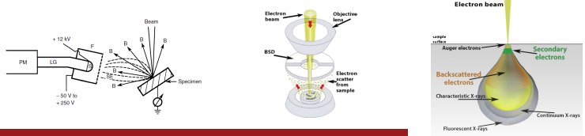

# Everhart-Thornley Detector

...applies a biased grid to attract (or reject) electrons produced #inelastically in the sample ( #SE )
A positive grid bias allows electrons to be collected that are generated in areas with line-of-sight to the detector.

Some electrons from the source interact #inelastically with the sample, and these are called backscattered electrons ( #BSE ).
These are high-energy electrons and not susceptible to the small grid bias on the ET detector.
The majority of these electrons are reflected toward the pole piece (objective lens), and a separate detector can be placed there to detect #BSE.
#SE provide [topographical contrast](contrast.md#topographical) and #BSE provide [compositional contrast](contrast.md#compositional).

