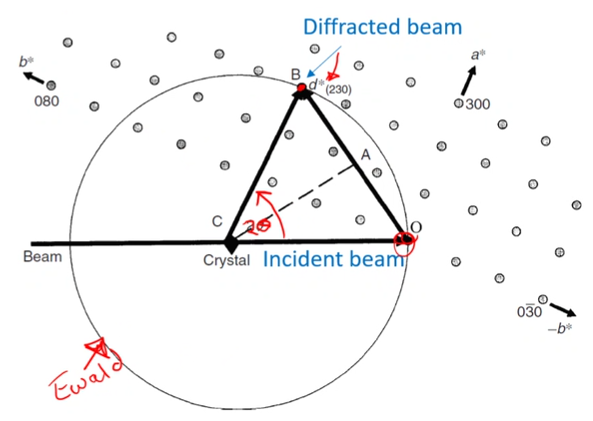

# Ewald Sphere

[Bragg's law](bragg-diffraction.md) describes the conditions necessary for constructive diffraction and the Ewald sphere is a graphical representation.
The Ewald sphere is imaginary and has a radius of $\lambda^{-1}$ in [reciprocal space](reciprocal-space.md).
The crystal being examined is placed at the center of the Ewald sphere with the incident beam passing through the center of the sphere and dictating the origin of the [reciprocal lattice](reciprocal-lattice.md) on the surface.
The #diffraction-angle is based on [Bragg's law](bragg-diffraction.md), satisfied when a lattice point touches the Ewald sphere surface.
A change in #diffraction-angle can be represented by rotating the [reciprocal lattice](reciprocal-lattice.md) at point $O$.

|  |
|:--:|
| In #TEM, the Ewald sphere radius is ginormous. |