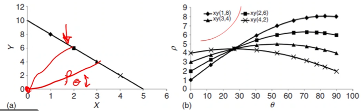

# Hough Transformation

To aid in automatically distinguishing zones axes, a Hough transformation can be performed.
A line equation $(x, y)$ is represented by a distance and angle (polar coordinates): $\rho = x\cos(\theta) + y\sin(\theta)$.

|  |
|:--:|
| A single point in Hough space is then a sinusoidal curve of $\cos(\theta) + \sin(\theta)$ type. The intersection of sinusoidal curves in Hough space is a single line in rectilinear coordinates which appears as a bright spot on the computer screen. |

