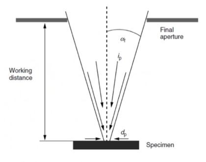
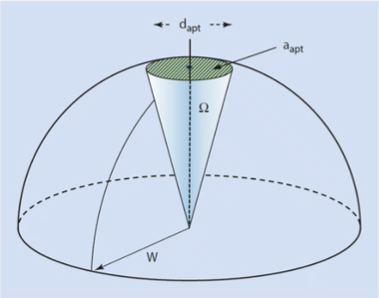
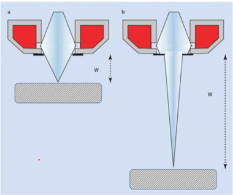
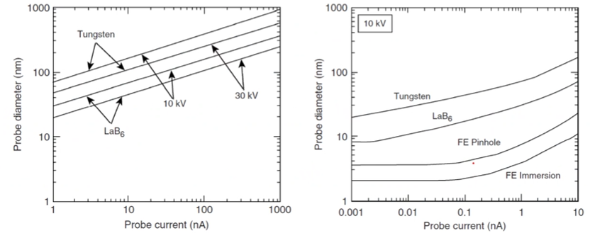
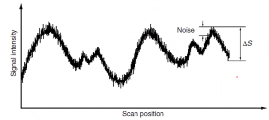
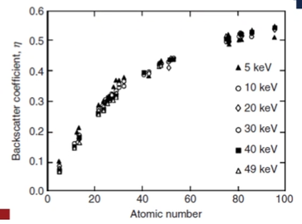

<!-- 20220907T09:38 -->
# Image Formation

## Objectives
* determine the machansism by which images are formed using an electorn beam
* determine beam conditions and their effects on imaging
* discuss the beam-sample ineratction and the finormation generated
* identify the practical controls to opitimze the reoslution

## Probe Size and Resolution
Recall from OM that the wavelength of light determines the resolution for a given NA: half the Airy disk diamater. In EM, the probe diameter is now the limiting factor, as *it* is scanned across the surface. The probe diamater is related to the probe current, $i_{p}$, beam brightness, $\beta$, and angle of convergence, $\alpha_{f}$.

|  |
|:--:|
| $d_{p} = \sqrt{\frac{4i_{p}}{\beta(\pi\alpha_{f})^{2}}}$ |

### Another way of looking at it
!!! question What if we decrease working distance and aperture size at the same time? How does this affect our depth of field? <cite> 
    
    |  |
    |:--:|
    | One of the key benefits of SEM is high depth of field for its magnification because the cone is already so narrow. |

## Probe brightness
The brightness of th beam is determined by the probe current, diameter, and convergence angle, as reorganized from the prioer equation for beam size: units are $\frac{A}{m^{2}sr}$ (current density per unit solid angle). Brightness is a constant based on source type, so the other vairables must scale proptortionaltiy.

$$\begin{split}
\beta &= \frac{4i_{p}}{(\pi d \alpha_{f})^{2}} \\
\beta &\propto eV_{0}
\end{split}$$

## Aberrations and minimum resolution
We cannot simply increase th econvergence angle without pentalyt. High $\alpha_{f}$ values introduce greater degrees of aberrations. At an optimzed $\alpha_{f}$, the probe size is $d_{min} = KC_{s}^{\frac{1}{4}}(\frac{i_{p}}{\beta} + \lambda^{2})^{\frac{3}{8}}$. $K$ is a constant $\approx 1$....

## Gun type and settings
|  |
|:--:|
| Probe diameter goes down with increased acceleration voltage. Probe diameter also goes down with source type. |

Why this is trye is similar to comparing the ability to focus light from a standard filament bulb and a laser pointer.

## Emitter type
cold field emitters have ea very high brightness but relatively low probe current: the CFE has a small tip area and small angle of departure. Schottky FE also have a high brightness, but they have a alarger tip area and greater electron desnity energy spread.

## Signal generation
the beam must have sufficient current to produce usable signal, so lower current is not a means to better resolution. The signal generated from the incident beam will be lower than that of the incident beam, and can be obstructed by noise at very low intensities.

|  |
|:--:|
| Too much noise and you cannot differentiate what you are focusing on. |

## Signal to noise
the Rose visibilit crtiertion states that the signal must be fives times greater than the noise to distinguish objects. The deviation can be determined from the swquare root of the mean of n counts of S: $\Delta S > 5N$ or...

## Probe current and signal
the number of counts is what is detected and is propportional to the elctrons put into the smaple and the dwell time: $i_{s} = \frac{\bar{n}e}{\tau}$. A proprtionality constant betweent he probe and signal current is applied with the contrast: $i_{p} = \frac{25e}{\epsilon C^{2}\tau}$. Dwell time is often the frame rate, or time, $t_{f}$ to complete a scan of one frame with $n_{PE}$ pixels: $\tau = \frac{t_{f}}{n_{PE}}$.

Faster scan speeds reduce dwell time and things will not be as crisp and clear.

## Sources of contrast
Contrast is developed by varying signal, but the cause of signal varitation can be from two primary sources:
1. Topography
2. Composition

Both can contribute simultaneously, but the electrons from each are different in character and can be optimally collected in different ways. The beam interaction will be different in each case.

## Interaction volume
When a high energy beam interactions with a sample surface, many scattering events occur. This results in a tear-drop or pear-shape zone beneath the surface. SEs and BSEs are generated throughout, but are dominant at different depths: Causing individual resolution limits. X-rays are also produced, but we will discuss those in detail later.

|  |
|:--:|
| Notice that the resolution is larger with BSE than from secondary electrons. |

## Topographical contrast
### Trajectory
The SEM produces images that appear 3D because the SE signal is depedent on topography. Surfaces oriented toward the detector will appear brighter because the signal is unhibinited from reaching it. On the opposite side of a feature the secondary electrons are absorbed in the material and signal is lost.

### Number
There are also signal intensity differences caused by the number effect which occurs where more electrons are emitted from the sample. This can be in angled surfaces, at edges, and in thin sections. Both BSEs and SEs are subject to this: Ses are more useful for topographical contrast.

## Composition contrast
### Backscatter coefficient
When more than one element or phase is present, there will be a difference in the BSE signal. Heavier element (high Z number) will reflect electrons more than light elements, so the SBE signal will be more intense which creates brigther areas with higher Z numbers.

|  |
|:--:|
| BSE coefficient is the ratio of electrons put into the material to those escaping. $\eta = \frac{n_{BSE}}{n_{i}}$ |

!!! question What conditions are needed to get good contrast between phases? <cite> 
    Distinct phases and a good difference of Z number in sample composition.

## Summary
The beam is of ciritical importance to the image in SEM. The source will determine what is possible and practical for both image resolution and signal output. the miniumum probe size is aachieed witha  high brightness, lowe current, and high convverece angle, but only to a limit....