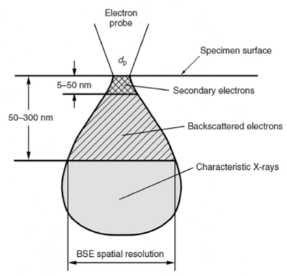
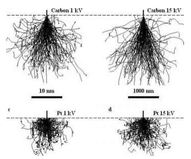
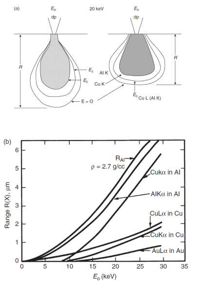

# Interaction Volume

When a high energy beam interactions with a sample surface, many scattering events occur.
This results in a tear-drop or pear-shape zone beneath the surface.
#SE and #BSE are generated throughout, but are dominant at different depths: causing individual [resolution](../engr-743-001-damage-and-fracture/resolution.md) limits.
X-rays are also produced, but we will discuss those in detail later.

|  |
|:--:|
| Notice that the [resolution](../engr-743-001-damage-and-fracture/resolution.md) is larger with #BSE than from #SE. |

## X-rays
The beam interaction varies for different materials, but the x-rays are always generated from sub-surface interactions that are larger in area than the #electron-beam: the emission volume is smaller than the electron volume.
The depth and cross-section (range) of #x-ray-generation[^1] can be estimated: $$R = \frac{0.0064[E_{0}^{1.7} - E_{ex}^{1.7}]}{\rho}$$

[^1]: See [Lecture 12](lecture-12-x-ray-generation.md) for more details.