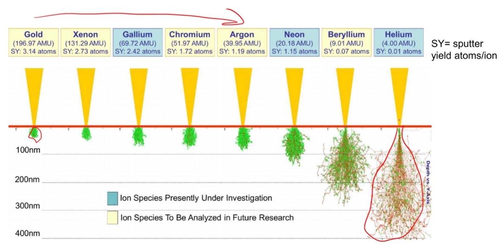
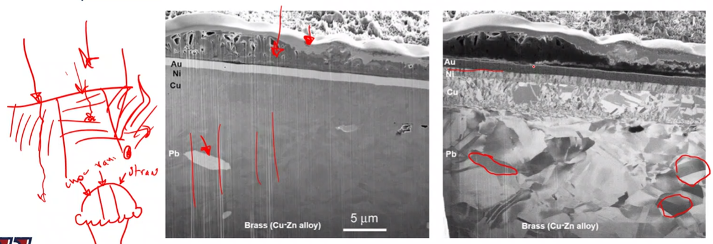

<!-- 20220921T13:11 -->
# Ion Milling

## Objectives
- introduce focused ion beam techniques
- identify the unique aspects of ion beams vs celectron beams
- deertermine the ...

## Fovused Ion Beam (FIB)
- FIB is a generalaized description where ions are produced, focused, and rastered ocross a sample in a manner similar to eletrons
- the ions can be used to proudace and image or to remove material: typically, one cannot be achieved without the other.
- The ion source is often a liquid metal (Ga) and has to be replaced with use (1000s of hrs).
- the majority of FIBs are part of a dualbeam system, that also has en electron column for imaign.

!!! note Melting Point of Ga
    $\approx 30^{\circ}$; therefore, could melt in your hand and re-solidify when you drop it.

!!! warning Imaging
    When you image with ions, you risk damaging the sample.
    Ions are typically reserved for cutting.

## FIB source
Ga must be heated to make it liquid.
The liquid Ga wets a needle.
The Ga is extracted from the needle using a high voltage.

## FIB column
the column design and focusing are similar to electron system.
The ions are accelerated and focused based on their positive charge.
Electrostatic lenses are used instead of magnetic: they must be very strong (high=voltag) to focus heavy ions.

## Beam interaction
ions interact with the sample surface in a manner reminiscent of electrons.
The primary interaction sof interest[^1]:
- SE generation
- sputtering
- implantation

The last two modes are damage induced by the beam.

[^1]: Sputtering and implantation are destrictuve.

## Plasma FIB
other ion sources, such as gases like Xe or Ar, can be used to imporve material removal rate or reduce damage.
the fas is ionize dby creating a plasma.
Much higher currents are possible with plasma.
The material removal [^2] rate can be 50X faster with less damage.
Bouns: ions actually have a shorter wavelength than electrons at the same voltage( better resolution).
What's the downside?
Look into HIM.

[^2]: this is interchangeable with "sputtering".

*[HIM]: Helium Ion Microscopy

## Ion interactions
|  |
|:--:|
| Ga is most common liquid metal for ion milling, but other elements are available. |

## Dual beam operation
the ion beam and electro nbeam are separated by a defined angle ($54^{\circ}$).
The ion beam and electron beam intersect at the eucentric height.
The ion beam is used at low current to quickly image the surface and a milling area is defined, then it is milled at higher current.
The section can be imaged using the electron beam by tilting it toward the electron beam.

## Ion milling
The FIB is primarily used to remove (mill) material.
the goal is often to characterize interior feature at specific locations.
In this way, it is a sample preparation technique.
The ion beam is only suitable for small volumes (10s of microns on a isde) in most cases.
The material is removed at high current to "rough" out the area, then low current to provide a smooth cross-section with less damage (like sequences of abrasives).

## Serial sectioning/reconstruction
By repeatedly removing a thin slice of material and then using SEM imaging, a 3D volume can be reconstructed.
This can contain compositional and microstructural infromation.

## ion channeling contrast
the lack of BSEs in ion microscopy gives stronger orietation information: note that compositional contrast is loast.
the crystallographic orientation allows varying levels of ion implanatation at greater depths, so SE generation vaies.
Tilting the sample a few degrees can change the contrast and confirm the orientation dependence.

|  |
|:--:|
| Consult your local Neapolitan ice cream for order, but crystallographic orientation reflects less ions back the more adversely aligned with the ion column which appears as a darker region in the image. |

## A note on redeposition
the sputtered material will redeposity on tohter surfaces.
This can appear amorphous or nanocrystalline
the phenemon should be carefully avoided or considered to avoid erroneous conclusions...

## More than just some ions
FIB is able to prepare samples for other analysis.
TEM lift-out, micropillar, compression, atom probe tomography, etc. are done by or within the FIB/SEM.

## Gas injection and micromanipulators
To reduce damage to a cross-section, a protective layer can be applied in the microscope.
This is accomplished by removing a needle close to the sample, injecting a gas containing the desired cover material, and using the electron beam to "crack" the gas and leave the material behind.
A precision needle or other instrucments can also be inserted to atach a sample for light out or other anlaysis.

## TEM lift out procedure
TEM requires a thin (100 nm or less) sample to be created.
This can be done from a surface by trenching out each side and then undercutting to create a sort of bridge.
That section is then attached to microneedle...

