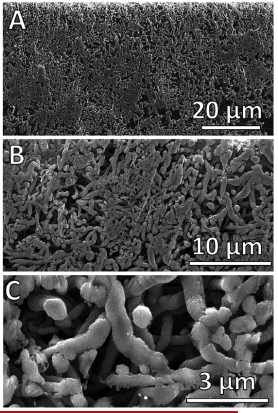

# Ion Milling

The [FIB](focused-ion-beam.md) is primarily used to remove (mill) material.
The goal is often to characterize interior feature at specific locations.
In this way, it is a sample preparation technique.
The #ion-beam is only suitable for small volumes (10s of microns on a side) in most cases.

|  |
|:--:|
| The material is removed at high current to rough out the area, then low current to provide a smooth cross-section with less #damage (like sequences of abrasives). |

## Broad Beam Ion Milling
BBIM uses an #ion-beam to polish a surface, but it is not site-specific.
The technique is slower than [FIB](focused-ion-beam.md), but it covers a larger area.
The technique typically uses #Ar ions.
It can be applied in planar or cross-sectional variations.
It is often a method for smoothing and removing #damage from a sample surface.
There may be two or more beams and the same can be rotated for even cross-sectioning.
There are other variations on ion milling, such as those for thinning the center of a #TEM sample.

!!! example Examples
    
    