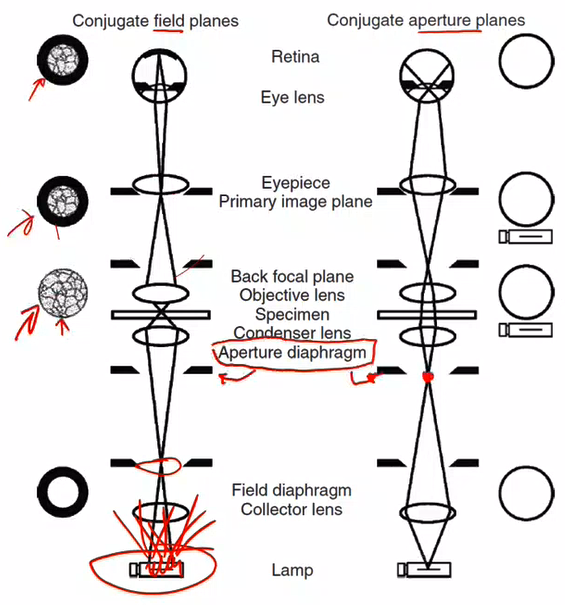

# Koehler Diaphragms

The #field-diaphragm is placed at the focal plane for image formation rays and determines the illumination area.

|  |
|:--:|
| This diaphragm can be seen in the image when sufficiently closed. Restricts scattering light for improved image quality |

The #aperture-diaphragm is placed at the focal plane for illuminating rays and determines alpha (and thereby resolution and $D_{f}$).
The aperture diaphragm cannot be seen in the image plane.