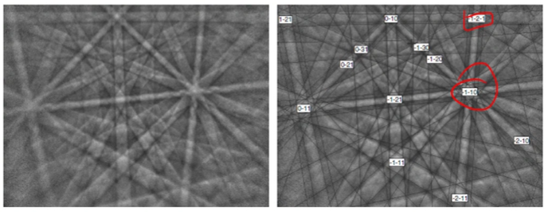

<!-- 20220919T13:10 -->
# Lecture 10: SEM Electron Backscatter Diffraction
## Objectives
- Introduce the technique of electron backscatter diffraction #EBSD.
- Describe the basics of crystallography.
- Determine the fundamental factors of diffraction.
- Identify the typical setup and the reasons behind it.
- Highlight #Kikuchi-patterns created and the information contained therein.
- Identity the resulting information and interpretation of it.

## Crystallographic Structure
#EBSD is applied to determine the #crystallographic information.
Nearly all metals and many ceramics are comprised of orderly sub-units ( #crystals ) that have varying orientations to each.
The size and orientation distribution are determined from the area of investigation.
#grain-size is of critical importance to strength: #Hall-Petch-Equation relation in metals.
Most #grains are 10s to 100s of microns.

## Crystallography (Briefly!)[^1]
A #stereographic-projection of a crystal maps out important #crystallographic orientations based on its structure.
The pattern is dependent on the #crystal-structure, and the #lattice-spacing is determined by the #crystal-type: e.g. #copper and #aluminum are both #fcc, but they can be distinguished.

[^1]: For an expanded discussion on crystallography see [here](../engr-839-001-mechanical-metallurgy/miller-indices.md).

!!! tldr What is the #crystal-structure and the #lattice-spacing of that structure?
    These are the questions answered in crystallography.

## [Bragg Diffraction](bragg-diffraction.md)

## Detector Setup
The sample is placed at high tilt angle (typically $70\degree$) and the detector is brought close (typically within $20 mm$).

## [Scattering](electron-scattering.md)

## Voltage Effects
The #Kikuchi-lines are narrower at high voltage.
The #Bragg-angle decreases, and lines are separated by twice the #Bragg-angle.

|  |
|:--:|
| Although appearing to be straight lines, the pattern is formed on conic sections ( #Kossel-cones ). |

!!! tip #Kikuchi-lines
    Typically generated at $20 kV$ because lower voltages make for thicker lines wherein those lines may be difficult to interpret.

## Detecting the #EBSP
A phosphor screen is placed near to the sample surface to detect the electrons.
Each band represents one plane, and the bands are indexed based on the orientations.
A high voltage ($>10 kV$) and high current are preferred to generate sufficient signal.
Surface prep is particularly critical to get a clean pattern.

|  |
|:--:|
| Scratches and #plastic-deformation will alter or eliminate the pattern formation. |

### #EBSP patterns
Bands on the #Kikuchi-patterns are proportional in width to the interplanar spacing.
The intersection of bands is a pole or [zone axis](zone-axis.md).
The angle between lines is the same as the interplanar angle.
There many lines and orientations, and indexing is best accomplishing by a computer using a [Hough transform](hough-transformation.md) or pattern simulation.
A background subtraction is also used to reduce unwanted noise from the pattern.

### [Hough Transformation](hough-transformation.md)

### Pattern simulation
A basic kinematical approach uses the [scattering intensity](electron-scattering.md) from certain planes to determine the spacing, orientation, and intensity of the pattern.
A multiple-beam dynamical approach adds realism in the sense that the beam is scattered numerous times and the pattern is more diffuse.
A dictionary (reference database) can also be used to compare the patterns, but it is time consuming and lower accuracy than [Hough transform](hough-transformation.md).

### Spherical indexing
A full #stereographic-projection is used and back projected to quickly compare to measured pattern.
Does not require a multitude of reference patterns.

|  |
|:--:|
| Dynamically simulated master pattern for austenitic steel. |

## Post-processing
The data collected for each pixel is used to determine where orientation or phase changes.
The #phase-boundaries can be then used to determine the #grain-size and #grain-orientation distribution.
Other information, such as #strain, can be measured by distorting in the indexing that not sufficient to be considered near #grains ( #kernel-average-misorientation ).

|  |
|:--:|
| The "clean up" of data should be carefully applied for accuracy. |

## Pole figures
The orientation data reveals if there is "referred" orientation ( #texture ) or if the #microstructure is equiaxed.
The #pole-figure indicates the intensity (frequency) of #grains within a particular orientation of the #stereographic-projection.
An #inverse-pole-figure represents #lattice-orientation relative to #crystal-planes.

## Summary
- #EBSD provides valuable #crystallographic information.
- It requires a specialized setup and detector to achieve the necessary signal.
- The data collected is generated though #electron-diffraction from #crystal-structure.
- The #crystal-structure determines the pattern of #electron-diffraction.
- The heavy lifting of #EBSD is related to pattern recognition which is handled by the software.
- The interpretation of the data must be carefully applied, especially as it relates to post-processing.