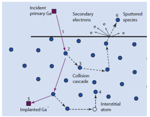
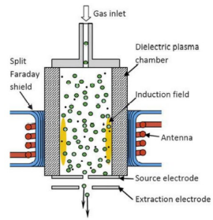
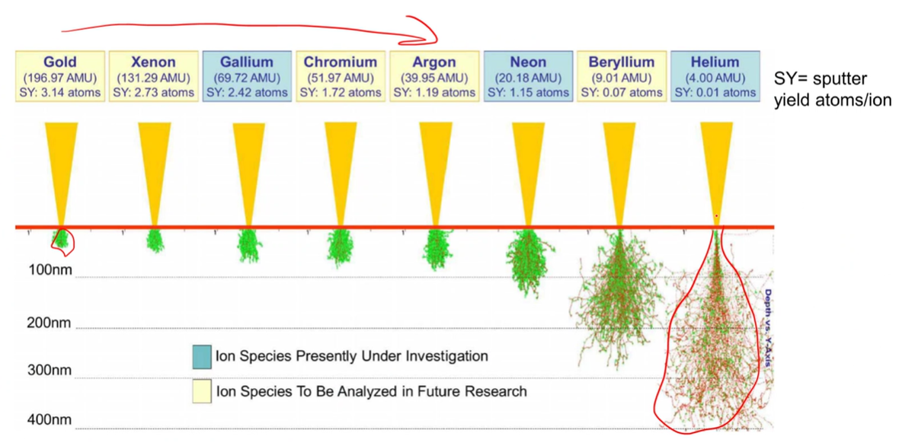
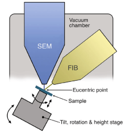
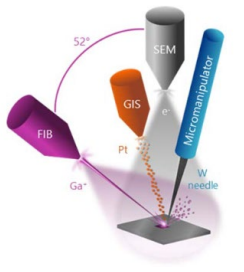

<!-- 20220921T13:11 -->
# Lecture 11: SEM Ion Milling

## Objectives
- Introduce focused ion beam techniques.
- Identify the unique aspects of #ion-beam versus #electron-beam.
- Determine the appropriate use for imaging and sample processing.
- Detail the uses of milling processes and the analysis it benefits.
- Demonstrate the technique through various examples.

## [Focused Ion Beam (FIB)](focused-ion-beam.md)

## Beam interaction
Ions interact with the sample surface in a manner reminiscent of electrons.
The primary interactions of interest[^1]:
- #SE generation
- Sputtering
- Implantation

The last two modes are #damage induced by the beam.

[^1]: Sputtering and implantation are destructive.

## Plasma [FIB](focused-ion-beam.md)
Other ion sources, such as gases like #Xe or #Ar, can be used to improve material removal rate or reduce #damage.
The gas is ionized by creating a plasma.
Much higher currents are possible with plasma.
The material removal [^2] rate can be 50X faster with less #damage.
Bonus: ions actually have a shorter wavelength than electrons at the same voltage (better [resolution](../engr-743-001-damage-and-fracture/resolution.md)).
What's the downside?
Look into #HIM.

[^2]: this is interchangeable with "sputtering".

*[HIM]: Helium Ion Microscopy

## Ion interactions
|  |
|:--:|
| #Ga is most common liquid metal for [ion milling](ion-milling.md), but other elements are available. |

## Dual beam operation
The #ion-beam and #electron-beam are separated by a defined angle ($54\degree$).
The #ion-beam and #electron-beam intersect at the eucentric height.
The #ion-beam is used at low current to quickly image the surface and a [milling](ion-milling.md) area is defined, then it is milled at higher current.
The section can be imaged using the #electron-beam by tilting it toward the #electron-beam.

## [Ion milling](ion-milling.md)

## Serial sectioning/reconstruction
By repeatedly removing a thin slice of material and then using #SEM imaging, a 3D volume can be reconstructed.
This can contain compositional and microstructural information.

## [Ion channeling contrast](contrast.md#ion-channeling-contrast)

## A note on redeposition
The sputtered material will redeposit on other surfaces.
This can appear amorphous or #nanocrystalline.
The phenomenon should be carefully avoided or considered to avoid erroneous conclusions about the material.

## More than just some ions
[FIB](focused-ion-beam.md) is able to prepare samples for other analysis.
[TEM lift out](tem-lift-out.md), #micropillar, compression, [atom probe tomography](atom-probe-tomography.md), etc. are done by or within the [FIB](focused-ion-beam.md) / #SEM.
This requires many ancillary devices, such as micromanipulators, gas injection needles, and more.
Each of these subsystems makes the microscope more capable but more expensive.

## Gas injection and micromanipulators
To reduce #damage to a cross-section, a protective layer can be applied in the microscope.
This is accomplished by removing a needle close to the sample, injecting a gas containing the desired cover material, and using the #electron-beam to "crack" the gas and leave the material behind.
A precision needle or other instruments can also be inserted to attach a sample for light out or other analysis.

## [TEM lift out procedure](tem-lift-out.md)

## [Atom Probe Tomography](atom-probe-tomography.md)

## [Broad Beam Ion Milling](ion-milling.md#broad-beam-ion-milling)

## Summary
- [Focused ion beam (FIB)](focused-ion-beam.md) techniques are important to material analysis.
- They are complimentary to #SEM and often included on the same equipment.
- The way the beam is formed differs and the primary importance is #damage when imaging.
- The unique behavior allows techniques like [ion channeling contrast](contrast.md#ion-channeling-contrast) to be performed.
- Perhaps the most useful aspect is the [milling](ion-milling.md) of material to expose site specific information or prepare samples for testing or further examination.