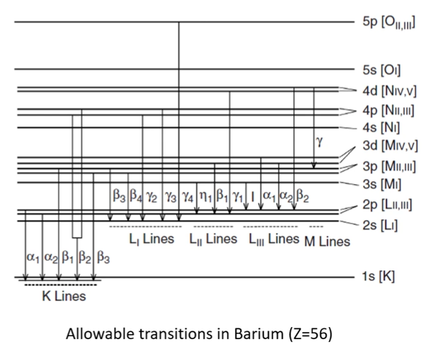
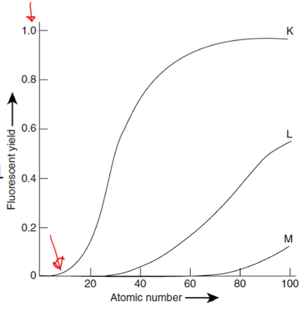
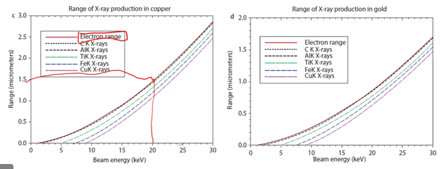

# Lecture 12: X-Ray Generation
## Objectives
- Introduce x-rays for chemical identification
- Describe the process of x-ray generation
- Determine the critical factors in the electron-atom interactions to generate an x-ray
- Describe the possible secondary effects after generation, such as absorption
- Identify the value of x-ray spectroscopy to materials analysis

## X-ray chemical analysis
#X-ray-spectroscopy includes techniques that identify chemical elements by their #characteristic-x-rays.
The detection of these emitted x-rays can be achieved through wavelength or energy differences:
1. Wavelength dispersive x-ray spectroscopy ( [WDS](wavelength-dispersion-spectrometry.md) ): more expensive and less common
2. Energy dispersive ( #EDX / #EDS ): cheaper and more common

The equipment these are used with includes x-ray fluorescence ( #XRF ) spectrometers and electron microscopes.

## Characteristic X-Rays
!!! hint
    Throughout all this, keep in mind the [electron volume](interaction-volume.md) coming from the beam incident to the material.

The ability to determined chemical composition comes rom the unique electron configurations of elements.
When an electron is knocked out of an inner shell orbital, an electron transitions from an outer shell and generates a photon (x-ray).
The energy difference between the two electron is specific to the shell and atom type ( #Moseleys-Law ), with resulting wavelength given the atomic #, Z, and shell-specific constants, B and $\sigma$: $\lambda = \frac{B}{(Z - \sigma)^{2}}$.

|  |
|:--:|
| A k-level electron is kicked out and an upper level electron must drop in energy state to fill that gap. |

## Wavelength-energy relationship
The energy, $E$ of #characteristic-x-rays can be determined from wavelength by the relationship of wavenumber (recripocal wavelength), frequency, ($\nu$), and #Plancks-Constant ($h = 6.626\times 10^{-34}$).

## Quantum number refresher
Electrons have wave-like and particle-like characteristics.
Two wave-like characteristics are:
1. Electron position in terms of probability density: shape, size, orientation of probability density determine by quantum numbers.
2. Quantum numbers
   1. $n$ = principal (shell)
      1. K, L, M, N, O (1, 2, 3, 4, etc)
   2. $\mathcal{l}$

## Electron Energy States
Electrons have discrete energy values and tend to occupy lowest available energy states.

## Selection Rules
Only certain electron transitions are possible:
1. Change in $n$ must be at least 1 ($\Delta n \geq 1$)
2. Change in $ell$ must be $\pm 1$
3. Change in total momentum, $J$, must be $0$ or $\pm 1$ (an integer).

|  |
|:--:|
| Allowable transitions in Barium ($Z = 56$). |

## K, L, and M series x-rays
X-rays can be described as K-series, which means that the electron vacancy is in the K-shell.
The only transitions allowed are from $L_{2}$ and $L_{3}$ to $K$.
The $L_{3} \rightarrow K$ transition is a $K\alpha_{1}$, and the $L_{2} \rightarrow K$ is the $K\alpha_{2}$ transition.
This is in #Siegbahn-notation, where an English letter is followed by a lowercase Greek letter with subscript number.
The Greek letter indicates x-ray intensity ($\alpha > \beta > \gamma$).

## Fluorescent yield (FY)
FY ($\omega$) is a measure of the output of x-rays for a given element and transition.
For light elements, the FY is negligible, and signal is weak or non-existent: this is an intrinsic weakness in the #X-ray-spectroscopy.
K-series emission is always higher than L, which is higher than M.

|  |
|:--:|
| L zeroes out at Z < 20 (Ca) and M < 57 (La). |

!!! tip Heavier elements will appear more efficiently than lighter elements.
    This does not mean if there is weak signal that there is not much of that element being examined, just that the signal is not very efficient.

## Typical energy range
Just because a transition has a high yield doesn't mean it will be the best signal to use.
$Au K\alpha_{1}$ has an energy of $67 keV$, and $L\alpha_{1} \rightarrow 9.7 keV$ and $M\alpha_{1} \rightarrow 2.1 keV$.
Most analysis occurs between 0.2 and 20 keV, so lower energy transitions are more likely to be seen with heavier elements.
The x-ray generation source, such as #electron-beam, must overcome the #ionization-energy ( #critical-excitation-energy ).
Other complex transitions are less abundant and often ignored for practical purposes.

!!! example Example
    If peaks overlap each other, the only way to differentiate them is to jump to higher energies to see where resolution is lost.

## Non-characteristic x-ray generation
#Bremsstrahlung-radiation or #braking-radiation occurs when an #electron-beam is repulsed by the electrons in the material.
As it decelerates, it loses kinetic energy and releases a photon.
The amount of energy released can vary widely (up to the beam energy), but most are on the low end: going to zero at the [Duane-Hunt limit ($E_{v} = E_{0}$)](duane-hunt-limit.md).
The spectrum generated is the x-ray continuum which forms a background signal (noise).
While signal generated is anisotropic, in thick signals the signal is practically isotropic.

[Duane-Hunt Limit](duane-hunt-limit.md)
: ~$$I_{c} \approx \ell_{p}Z\Bigg[ \frac{E_{0} - E_{v}}{E_{v}} \Bigg]$$

This background energy is substracted from the chart to cancel Moby Dick out.

## X-ray interaction range
X-rays are generated throughout he interaction volume, with the Z-number determining what elements can still be excited within the material.
As energy is lost within the material, fewer elements can be ionized: the electron beam goes further than x-ray generation.

## x-ray absorption
The x-rays generated within the volume may not escape the material.
An x-ray can interact with an electron in another atom, causing the same process of x-ray or Auger electron generation described earlier.
This process is photoelectrical absorption and calculated by the mass absorption coefficient ($\frac{\mu}{\rho}$) for a given thickness, s and density rho.
There are distinct absorption edges where the photon energy is just above the excitation energy.

$$\frac{I}{I_{0}} = \exp(-(\frac{\mu}{\rho})\rho s)$$

## Summary
- X-rays can be generated by other x-rays or high-energy electrons
- The x-rays generated are characteristic of the element and transition involved in the x-ray generation
- The x-rays generated can be part of the continuum, absorbed by the material, or emitted from the sample
- Each element has a series or transitions with expected frequency (intensity) that it can be identified by

!!! quote <cite> Dr. Atwater
    Keep reports on light elements with a big grain of salt.