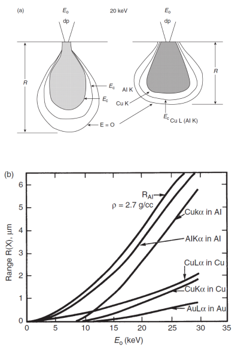

<!-- 20220928T09:42 -->
# Lecture 13: X-ray Equipment and Techniques
## Objectives
- Introduce the technique of x-ray fluorescence ( #XRF ).
- Determine the mechanisms of detection in wavelength and energy dispersive spectrometers.
- Identify the advantages and disadvantages for each.
- Highlight detector technology and limits of use.
- Consider the qualitative and quantitative methods for analysis.

## Refresher
Recall from [last time](lecture-12-x-ray-generation.md) that the two techniques we will highlight are #EDS and #XRF.
#XRF uses a primary x-ray source to generate secondary x-rays.
#EDS uses an #electron-beam for #x-ray-generation.
A continuum of x-rays is generated, but the element(s) in the sample will have [characteristic x-rays](characteristic-x-rays.md).
X-ray energies are notated according to their transition type.

## Energy vs. wavelength
#x-ray-spectrometry can be achieved by measuring energy ( #EDS ) or wavelength dispersion ( [WDS](wavelength-dispersion-spectrometry.md) ).
The detector is much different for each.
[WDS](wavelength-dispersion-spectrometry.md) uses #single-crystal-diffraction to detect the #characteristic-wavelength at specified angle ([Bragg diffraction](bragg-diffraction.md)).
#EDS uses a photon detector to detect specific energies of photons, corresponding to the element and transition they were generated by.

## [Wavelength Dispersion Spectrometry (WDS)](wavelength-dispersion-spectrometry.md)

## XRF Source
The #XRF uses primary (incident) x-rays to generate secondary, [characteristic x-rays](characteristic-x-rays.md) in the sample.
The #x-ray-generation by an x-ray tube in which an anode (target) is bombarded with electrons at high energy: e.g. 0.5-3 kW, 30-50 kV).
The optimum ratio is approximately 3-5 times the #critical-excitation-energy.
The target is made from #Cu, #Cr, #W, #Ir, #Mo, etcetera and emits a continuum x-ray signal as well as [characteristic x-rays](characteristic-x-rays.md): the target material affects how the incoming x-rays interact with the sample.

|  |
|:--:|
| A cascading effect wherein problems and concepts build from generating the x-rays to later reading x-rays generated by the first set of x-rays in the resulting monochromatic beam. |

!!! warning X-Ray Poisoning
    These x-rays are much more toxic than medical x-rays.

## Filters
The selection and filtering of x-ray wavelengths is used to remove unwanted signal.
Monochromatic x-rays make the interpretation of the data easier.
A filter is used to remove the $K_{\beta}$ peak by choosing a metal with an absorption edge between $K_{\alpha}$ and $K_{\beta}$: one Z lower than the target for metals near Z = 30.
The beta peak is reduced from $\sim\frac{1}{9}$ to $\frac{1}{500}$ the intensity of the alpha peak.
The removal of beta comes with a loss of alpha, so a compromise has to be made.
Filters are often thin foils placed in the beam path.

!!! tip Common Metals for Filters
    Copper and cobalt are common anodic metals to filter of $K_{\beta}$ peaks.

## Analyzing Crystals
The #analyzing-crystal is critical to the performance of the #WDS system.
The maximum angle traversed in #WDS is $\sim73\degree$, so the maximum $\lambda$ of diffracted x-rays is 1.9d of the crystal.
The crystal can be changed to provide a different range of analysis: e.g. for light elements.
- For long wavelengths, a large d-spacing is needed.
- For small d-spacings have higher resolution, but smaller range.

Materials include: LiF, pentaerythritol (PE), thallium acid phthalate (TAP), and layered synthetic microstructure (LSM).

[Bragg Diffraction](bragg-diffraction.md)
: ~$$\begin{equation}
\lambda = \frac{2d\sin(\theta)}{n}
\end{equation}$$

X-ray Dispersion
: ~$$\begin{equation}
\frac{d\theta}{d\lambda} = \frac{n}{2d\cos(\theta)}
\end{equation}$$

!!! hint
    If the element of interest is really light (low Z numbers) may need other, more expensive analyzing crystals.

## [Wavelength Dispersive Spectra](wavelength-dispersion-spectrometry.md#spectra)

## Energy Dispersive X-ray spectroscopy (EDS)
#EDS detectors determine the x-ray energy, not the wavelength.
They are simpler as they do not have any moving parts.
They are faster, as all energies are collected simultaneously.
They do not have as good resolution (120+ eV) as [WDS](wavelength-dispersion-spectrometry.md).
Although sensitivity to light elements is a challenge, newer technology allows light elements to be detected down to #Li.

## EDS detector technology
The basic mechanism of energy detection uses a #Si medium in which electron-hole pairs are created by incoming x-ray photons: $\sim3.8 eV/pair$.
This charged pair is then swept toward the anode by an electric field.
The number of charge carriers (voltage) generated is proportional to the x-ray energy.
Older detectors used a #Si ( #Li ) design requiring LN2 (liquid nitrogen) cooling to reduce noise.
Newer #Si drift detectors (SDDs) have better sensitivity, much faster count rates, and can be cooled by Peltier.
Also, newer window technology reduces signal loss for light elements.

## Energy dispersive spectra
Like [WDS](wavelength-dispersion-spectrometry.md), the signal generated will be a series of peaks, this time at corresponding energies.
The spectrum can cover the entire range of detectable elements, and is often from 0-10 keV or 20 keV.
Heavier elements will be determined through L or M lines.
The intensity units may be in counts per seconds (cps) or total counts.
Signal to noise and [resolution](../engr-743-001-damage-and-fracture/resolution.md) are both about an order of magnitude lower than [WDS](wavelength-dispersion-spectrometry.md).

## Pulse pile-up and dead time
Pulse pile-up
: Signal is coming so close together from the charge carriers and the detector does not know how to resolve the signal.

#EDS detectors can be overwhelmed by a high flux of x-rays.
If the charge carriers cannot be detected fast enough to separate them, they can be counted as one higher energy photon.
The dead time is the time required to process the incoming signal when another signal is not detected (10s of nanoseconds).
Newer detectors are rather hard to overwhelm with signal.

!!! tip
    $\sim 30\%$ dead time should the be maximum in most cases.

!!! question What does a high dead time mean and how would you lower it? <cite> #Mark-Atwater
    There is so much signal coming into the detector that it cannot keep up and it means the detector is being overwhelmed.
    To mitigate this, lower the amperage or reduce the final aperture.
    Lowering voltage may have some effect, but not as much as amperage or aperture.
    The signal may also not be at the optimal #working-distance or angle; however, changing #working-distance affects pattern of #x-ray-generation.

## EDS in SEM
Rather than using primary x-ray beam, #EDS in #SEM uses a high energy #electron-beam to generate electrons.
#EDS is much more common than [WDS](wavelength-dispersion-spectrometry.md) on #SEM, as it is cheaper and more compact with good performance.
The small spot size of the beam lends the term microanalysis to the technique.
Like #BSE detection, the trajectory in linear and subject to shadowing: dependent on the take-off angle.

## [Interaction volume](interaction-volume.md)
The beam interaction varies for different materials, but the x-rays are always generated from subsurface interactions that are larger in area than the e-beam: the emission volume is smaller than the electron volume.
The depth and cross-section (range) of x-ray generation can be estimated:
$$\begin{equation}
R = \frac{0.0064[E_{0}^{1.7} - E_{ex}^{1.7}]}{\rho}
\end{equation}$$

## Modes of SEM EDS
The #electron-beam can be:
- Concentrated at a spot
- Scanned along a line
- Rastered across an area

!!! tip Analyzing X-ray Images
    X-ray images can always be reanalyzed for spot, line, or area analysis; however, you cannot generate another x-ray image.
    Every pixel in an x-ray image is a database of information for analysis.

The dwell time determines the signal to noise and should be higher for trace elements to be detected.
The time should also be increased if the beam energy is near the expected excitation energy.

## Qualitative Analysis
Identifying chemical elements is relatively straightforward since there are few overall ($\sim$90) and less that are common or expected.
Each likely only has a few peaks, and they are spread across a wide energy range: some peaks like 1, 2 might be too close to resolve, but alpha/beta differences are typically sufficient.
The peaks will have theoretical intensity ratio, so peak convolution can be determined if the ratio is off.

## Quantitative Analysis
The peak intensity differences between elements can be used to determine their relative abundance.
A standard of known composition under the same conditions must be used to calibrate the result.
The machine and matrix factors ($Z_{i}A_{i}F_{i}$) must be considered in quantitative analysis to determine other efficiency effects on weight fraction of element $i$ in the sample ($C_{i}$) and standard ($C_{(i)}$):
$$\begin{equation}
\frac{C_{i}}{C_{(i)}} = (Z_{i}A_{i}F_{i})\frac{I_{i}}{I_{(i)}} = (Z_{i}A_{i}F_{i})k_{i}
\end{equation}$$
The #ZAF-Method is not a typical user operation, and software accounts for much of the needed calculations.

## Summary
- #x-ray-spectrometry is a versatile and valuable tool for chemical analysis.
- The differences in [WDS](wavelength-dispersion-spectrometry.md) and #EDS are important, with #EDS being generally simpler in design and [WDS](wavelength-dispersion-spectrometry.md) being more accurate.
- The way it is applied can vary, such as #XRF or in #SEM / #TEM.
- The methods are rather simple to apply, once standards are set and calibrated.
- The use in #SEM is common and may be applied in various modes.
- #EDS in #SEM should always be taken with some caution, as it is almost always semi-quantitative.