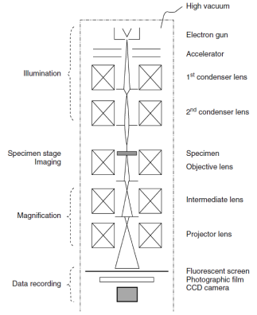
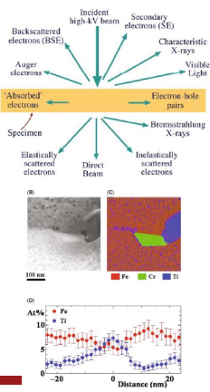
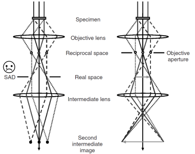
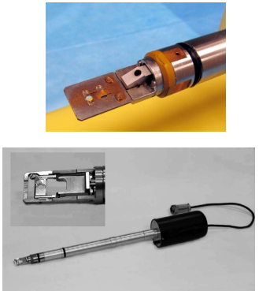

<!-- 20221003T13:22 -->
# Lecture 14: TEM Equipment and Techniques
## TEM Basics
The #TEM is similar to #optical-microscopy, while #SEM is similar to [confocal](confocal-microscopy.md).
The #TEM has more lenses and apertures than a light microscope.
#TEM has the basic ingredients of:
- Source
- Condenser lens
- Specimen stage
- Objective lens
- Projector lens

## General TEM Setup
|  |
|:--:|
| There is no scanning because point source light is de-magnified to illuminate a larger area of the specimen which generates a dimmer image. |

## Source and lens refresher
Like #SEM, #TEM can use a variety of electron guns.
They are the same as in #SEM, but the voltages used are higher.
Most #TEM are $200 kV$ or $300 kV$, but lower and higher are available.
The lenses are [electromagnetic](electromagnetic-lenses.md) and focus electrons more or less strongly based on current.

## Interactions
The same, basic electron-matter interactions occur as in #SEM, but with the addition of a transmitted, direct beam.
Similar analysis to #SEM, like #EDS, can be performed in the #TEM (or #Scanning-TEM): also, new types of analysis can be done.
The [depth of field](depth-of-field.md) is equal to or greater than the sample thickness in most cases: this can lead to features at different positions looking as if they are coplanar.

!!! quote <cite> #Mark-Atwater
    This is similar to #SEM, but without the diffracted beam interactions.

## Lens system
The primary difference with #TEM is that the #electron-beam is de-magnified by the condenser lenses.
The condenser lenses determine the beam size and #convergence-angle.
Magnification is controlled by the objective and projector lenses.
The intermediate lens switches between imaging and diffraction modes.

## Specimens
#TEM requires an #electron-transparent sample.
This means the sample bust be very thin (typically $< 100 nm$).
The lateral dimensions are also relatively limited, often to $3 mm$ disks.
The sample can be thinned and dimensioned to fit, or for powders and small samples, it can be supported on a grid.

|  |
|:--:|
| The grid has a thin carbon, formvar, or other support structure so that the sample does not fall through. |

## Specimen holder
The holder must secure the sample, often by clamping down.
Holders may be single or double-tilt and may incorporate other capabilities for #in-situ testing.
The holder is inserted into a load lock which is pumped down before the sample is inserted the rest of the way.
The o-rings along the holder provide the seal to maintain vacuum and must be carefully maintained.

## Sample preparation
Like metallographic techniques, the preparation is done in a progression of steps to achieve the final thickness.
The thickness is not the only important feature, as sample #damage is a major concern.
As an example, a metallic material would be cut to a $3 mm$ disk, thinned by metallographic techniques to $\sim 100 \mu m$, preferably using a fixture to assist.
Only the center of the sample is #electron-transparent, so #dimple-grinding or other tools may be used to preferentially thin the center.

## Sample finishing
To create an ultra-thin, low-damage section for examination, a variety of techniques may be applied.
#electrolytic-thinning uses an etchant and voltage to etch away material: a twin-jet polisher uses opposing streams to thin the center of a sample, and automatically shuts off once light is sensed through the sample.
[Ion-milling](ion-milling.md) uses high-energy #Ar ions to knock off sample atoms at low angle to create a wedge cross-section:
- This results in a smoother, lower damage surface.
- Heating can be problematic and cooling is often applied.

## Ultramicrotomy
For soft samples, especially heat-sensitive materials, the prior preparation methods are incompatible.
#ultramicrotomy is a version of #microtomy capable of creating #electron-transparent samples.
It uses the same principle of operation but has greater precision.

## Summary
- #TEM has fundamental differences in its setup, but it is similar in many ways to #SEM.
- The key differences are the #electron-transparent requirements and transmission imaging modes.
- The sample preparation is more stringent than in #SEM, but the resolution and capabilities of the #TEM are often necessary for the related analysis.