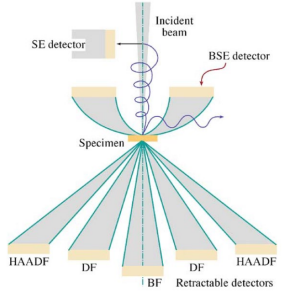
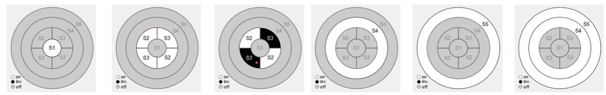

<!-- 20221005T09:34 -->
# Lecture 15: TEM Imaging Modes
## Objectives
- Identify the primary imaging methods in #TEM.
- Describe the sources of [contrast](contrast.md).
- Detail the [diffraction pattern](lecture-16-tem-diffraction-patterns.md) formation and usefulness.
- Identify the principles of [darkfield imaging](darkfield.md) and various techniques.
- Introduces #Scanning-TEM (STEM) and its imaging modes.

## Imaging
General imaging in the #TEM is called [brightfield](brightfield.md), similar to #optical-microscopy.
The direct #electron-beam is transmitted through the sample, and absorption is only a minor contributor to the image.
The primary source of [contrast](contrast.md) is deflection of the beam.
Two sources of deflection are [mass-density contrast](contrast.md#mass-density-contrast) and [diffraction contrast](contrast.md#diffraction-contrast).

### [Mass-density contrast](contrast.md#mass-density-contrast)
The number of electrons being deflected by nuclei will increase as the thickness and density of the sample increases.
The local changes in either feature will result in changes in signal/brightness.
The objective aperture determines the maximum angle of deflection allowed to pass (0.01 rad).
The overall intensity is reduced for a smaller aperture, but the contrast is enhanced.
This is the main mechanism for imaging amorphous materials, such as polymers and biological samples: heavy metal stains can be used to further enhance contrast.

!!! quote <cite> Dr. Atwater
    #TEM is for shadow puppets.

### [Diffraction contrast](contrast.md#diffraction-contrast)
In crystalline samples, the electrons can undergo Bragg diffraction.
The planes with the crystal can be focused to a series of spots corresponding to  the crystal structure (based on Bragg diffraction).
The diffraction pattern (DP) is characteristic of crystal type and the lattice spacings.

|  |
|:--:|
| Polycrystalline materials appear as rings. |

## Mode setup
To switch between the #diffraction-pattern and image, the apertures and focus must change.
In _imaging_ mode, the objective aperture is inserted, and the #SAD aperture is removed: the intermediate lens strength is relatively high to magnify the image.
In diffraction mode, the #SAD aperture is inserted and the objective lens aperture is removed: the intermediate lens strength is lower to preserve the pattern in the back focal plane.

|  |
|:--:|
| Remember that the image is reversed (similar to #optical-microscopy), but the image is reversed again to the true direction. |

*[SAD]: Selected Aperture Detector

!!! quote <cite> Dr. Atwater
    You focus the #diffraction-pattern by weakening the intermediate lens detection.

## [Brightfield](brightfield.md#tem)
The diffraction pattern contains a central spot that is the undeflected beam (high intensity).
The objective aperture is within that central spot, limiting the signal and scattered electrons.
Therefore, imaging mode (brightfield) is just the undeflected or very weakly deflected beam.

|  |
|:--:|
| These spots are generated no matter what. This is the default mode of most microscopes. The main beam is either untouched or weakly deflected. |

## Diffraction pattern and [darkfield](darkfield.md#tem)
Diffraction mode is used to switch between brightfield and darkfield settings.
The central spot is for brightfield imaging, but the diffraction spots can be selected for darkfield imaging.
Darkfield uses a particular reflection of limited range of reflections and blocks the central beam.
Moving the aperture uses off-axis electrons and can reduce image quality on some TEM.

|  |
|:--:|
| Because these spots exist no matter what, darkfield aligns the objective aperture to a particular point to block the off-axis electrons: anything else that satisfies the diffracted beam condition in that spot would shine through. One could also tilt the beam to tilt the pattern. |

## [Centered Darkfield](darkfield.md#centered-darkfield)

## STEM
#Scanning-TEM (STEM) uses a rastered beam to generate an image by transmission.
The beam must be kept parallel to the optic axis while rastering or the image interpretation would be highly complex.
The rastering allows for mapping of #grain-phases.
#Scanning-TEM images are not limited by imaging [lens aberrations](aberrations.md), which is advantageous to [resolution](../engr-743-001-damage-and-fracture/resolution.md).

|  |
|:--:|
| #Scanning-TEM is becoming more popular for reducing the risk of [lens aberrations](aberrations.md). |

## STEM BF and DF
The [BF](brightfield.md) image is formed by the transmitted beam and its intensity variations on the detector.
The [DF](darkfield.md) image is formed using an annular detector concentric to the central [BF](brightfield.md) detector:
- This annular DF ( #ADF ) image is composed of the highly scattered electron signal.
- There may be another ring outside of the #ADF detector for high-angle #ADF ( #HAADF ) which isolates the most strongly scattered electrons.

*[BF]: Brightfield
*[DF]: Darfield
*[ADF]: Annular Darkfield
*[HHADF]: High-Angle Annular Darkfield

|  |
|:--:|
| #HAADF intensifies [Z contrast](contrast.md#compositional), only received the most significantly scattered electrons. |

## Multi-segment detectors
The various modes for #Scanning-TEM detection can be broken up into segments to allow orientation effects to be highlighted.
The sections can be independently operated to isolate signal in certain directions.
These segments can be turned off or inverted to generate varying appearances of the deflected electrons.

!!! example Example
    |  |
    |:--:|
    | The 4-channel a #Scanning-TEM detector allows a parallel read out of up to four different signal combinations. The signal combinations for this image is shown in the lower right. |

    

    

## Summary
- #TEM has many possible imaging configurations and a more complex lens system than #SEM.
- The primary imaging modes are [brightfield](brightfield.md#tem) and [darkfield](darkfield.md#tem), but these are very generic terms.
- The #electron-beam an be used to produce an image or a #diffraction-pattern.
- The #diffraction-pattern has much information within it, but it provides the basis for [darkfield imaging](darkfield.md)
- The [darkfield image](darkfield.md) contains [Z-contrast](contrast.md#compositional) and #crystallographic information.
- In #Scanning-TEM imaging, no imaging lenses are used, and the [BF](brightfield.md) and [DF](darkfield.md) signal can be collected simultaneously with orientation information.