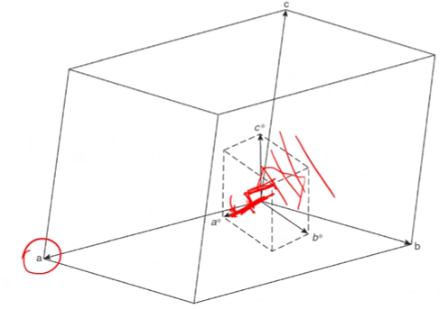
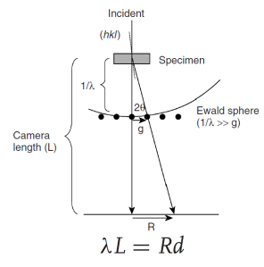

<!-- 20221010T13:12 -->
# Lecture 16: TEM Diffraction Patterns
## Objectives
- Refresh the concepts of #diffraction-pattern.
- Detail the relationship between the #crystal-structure and [reciprocal lattice](reciprocal-lattice.md).
- Introduce the [Ewald sphere](ewald-sphere.md) and its construction from [Bragg diffraction](bragg-diffraction.md)
- Describe the formation of the #diffraction-pattern using the [Ewald sphere](ewald-sphere.md).
- Highlight the process for indexing the #diffraction-pattern

## [Selected Area Diffraction (SAD)](selected-area-diffraction.md)

## [Reciprocal lattice](reciprocal-lattice.md)

## [Reciprocal space](reciprocal-space.md)

## Non-orthogonal crystal
Real and reciprocal directions are not parallel to each other.
$\mathbf{a}^{*}$ is perpendicular to $(100)$ and $\mathbf{a}$ is parallel to $[100]$.
$[100]$ is not perpendicular to $[010]$ or $[001]$ in real space.

## [Zone axis](zone-axis.md)

## [Ewald sphere](ewald-sphere.md)

## [Bragg's Law Equivalence](braggs-law-equivalence.md)

## [Relrods](relrods.md)

## Diffraction spacing
#diffraction-angle in #TEM are very small (often less than $1\degree$).
Using a #small-angles-assumption, [Bragg's law](bragg-diffraction.md) can be written as: $\lambda = 2d\theta$.
Because #diffraction-pattern is detected at some real distance, $L$, the spacing, $R$ will be larger.
$L$ is not a direct physical measurement as the imaging lenses will change the path length.
$\lambda L$ is known as the camera constant: camera length can be effectively changed by (de)magnifying the beam ($R$ changes).

## Indexing
### Cubic example
The pattern and spacing gives us the information about the #crystal-type and size.
By using the central spot on the [zone axis](zone-axis.md) of a #single-crystal, we can measure the distance (R) to each spot and determine the spacing from a given camera constant.
By choosing two spots and their included angle, the real lattice spacing can be determined:
$$\begin{split}
\lambda L &= Rd \\
d_{hkl} &= (h^{2} + k^{2} + l^{2})^{-1/2} \\
R_{(hkl)} &= \frac{\lambda L}{a}\sqrt{h^{2} + k^{2} + l^{2}}
\end{split}$$

At 200 kV, $\lambda = 0.00251 nm$:
- If $L = 1$, and $a = 0.563 nm$, $\mathbf{R}_{m}$ matches $(200)$ and $\mathbf{R}_{n}$ matches $(220)$
- The angles between the two also agrees ($45\degree$)

### Assigning indices
The pattern has $180\degree$ ambiguity (i.e. $(200)$ is equivalent to $(\bar{2}00)$), so the two points are indexed positive on the right and negative on the left.
Other spots can be indexed by #vector-addition and the [zone axis](zone-axis.md) is the determined by the #cross-product: $[uvw] = \mathbf{R}_{m} \times \mathbf{R}_{n}$.

## Summary
- The real #crystal-lattice dictates the [reciprocal lattice](reciprocal-lattice.md) where planes are represented by #diffraction-spots.
- #diffraction-pattern contains much more information about the #crystal-structure.
- A basic concept of the material is helpful to make indexing easier.