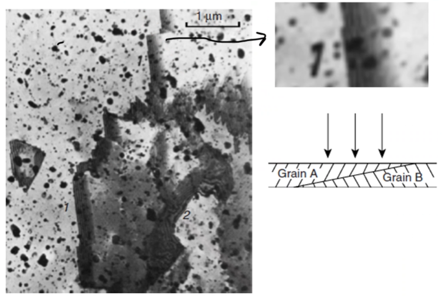
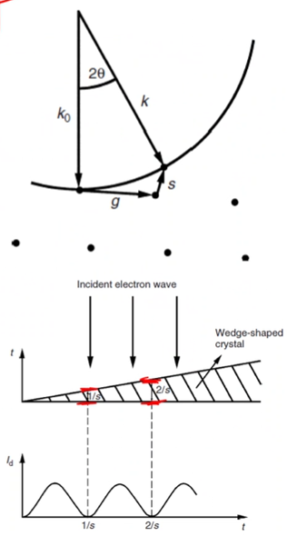
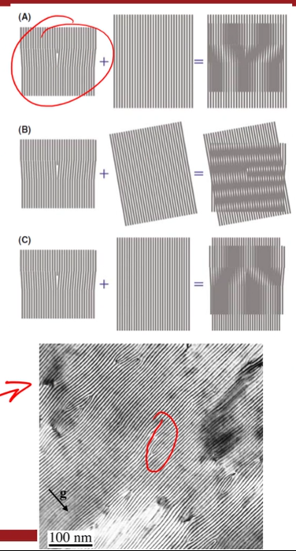

<!-- 20221012T09:36 -->
# Lecture 17: TEM Defect Imaging
## Objectives
- Identify the importance of imaging of defects in #TEM
- Describe common imaging effects related to bulk structure
- Discuss the causes for contrast in lattice defects and common examples
- Highlight high-resolution TEM ( #HRTEM ) and the need to carefully interpret the results

## Defects
#defects
: Imperfections in crystal structures wherein the pattern is neither uniform nor repeated.

#TEM is an important tool for studying defects in materials because it is one of the few that can resolve the features.
#dislocations, #stacking-faults, #twinning, #grain-boundary, etcetera are all visible under #TEM.
The mechanisms for their appearance is difference than [mass-density contrast](contrast.md#mass-density-contrast), but it may appear similar.

### Wedge fringe
#TEM samples are often prepared as thin wedges.
The continuously changing thickness can cause interference effects that appear as light and dark stripes perpendicular to the direction of increasing thickness.
This can be confused with [mass-density contrast](contrast.md#mass-density-contrast), but it is a geometrical effect dependent on the beam interactions in the material.

|  |
|:--:|
| In #grain-boundary,  #wedge-fringes could indicate a boundary, but it is not a direct representation of the boundary because the grains overlap wherein the beam destructively interacts with itself. |

## Deviation from Bragg's Law
The thickness change results in a change in diffraction intensity.
The kinematic theory of diffraction predicts this intensity ($I_{d}$) change (deviation , $\mathbf{s}$) for a thickness ($t$).
$$I_{d}\propto \Bigg(\frac{\sin(\pi st)}{\pi s}\Bigg)^{2}$$
"s" is the component of $\mathbf{s}$ parallel to the beam.
This results in an oscillation of intensity as thickness increases.

|  |
|:--:|
| A bright fringe occurs at $t = ns^{-2}$ and a dark fringe at $t = n + (2s)^{-1}$. |

## Stacking faults
Any wedge-shaped feature may produce these fringes, and #stacking-faults at an angle to the beam are no different.
The #stacking-faults are bounded by the #partial-dislocations.

|  |
|:--:|
| Because this is a mostly uniform contrast and these fringes occur within the material itself, it is safe to assume these are actually #wedge-fringes. |

## Bending contours
If the sample is bent, there will be a certain points at which the #crystal-planes satisfy [Bragg diffraction](bragg-diffraction.md).
They often occur as pairs given a symmetry contour.
#bending-contours are highly sensitive to tilting, and they can be identified that way.
The bending does not need to be drastic, as the diffraction angles are often within a few degrees of the beam axis.

## Dislocations
#dislocations are created by the presence of an extra half-plane of atoms above or below the dislocation line.
The interruption of the #crystal-structure results in a lattice distortion that diffracts the beam at certain angles.
The dislocation will not be visible if it is perpendicular to the beam.

!!! question How do you tell the difference between #dislocations and #bending-contours? <cite> #Mark-Atwater
    Tilt the sample and see if the lines disappear because #defects are not as sensitive to tilt as #bending-contours.

#dislocations appear as short lines because they terminate at the surface.
The projected image does not capture the thickness (third dimension) of the sample.
#in-situ mechanical testing can be used to visualize the #dislocation-motion.
E.g. this [video](https://www.youtube.com/watch?v=EXbiEopDJ_g) on #dislocation-glide during #in-situ #TEM straining at $400\degree C$ of #AISI-304.

## High-resolution TEM
#HRTEM is a high-magnification, atomic resolution imaging technique.
The resulting images must be carefully interpreted to avoid assigning imaging artifacts with the actual structure.
A #moire-fringes is an example where overlapping crystals result in fringes that are not related to the actual structure.
Spacing can be an artifact, suggesting that atomic patterns are from different orientations, etcetera.
This is a highly developed topic in itself.

|  |
|:--:|
| A #moire-fringes are not an actual #dislocations because it exaggerates and visually changes the representation of the pattern from the dislocation. Therefore, be carefully when looking at images. |

!!! example
    [Microstructural evolution of Alloy 709 during aging](https://www.sciencedirect.com/science/article/pii/S1044580319310514)