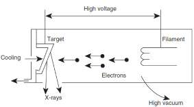
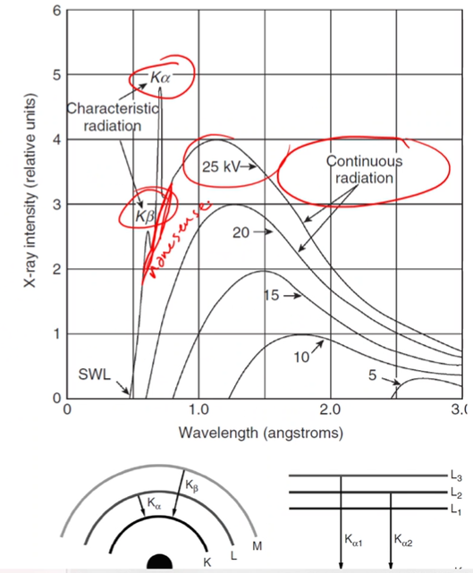
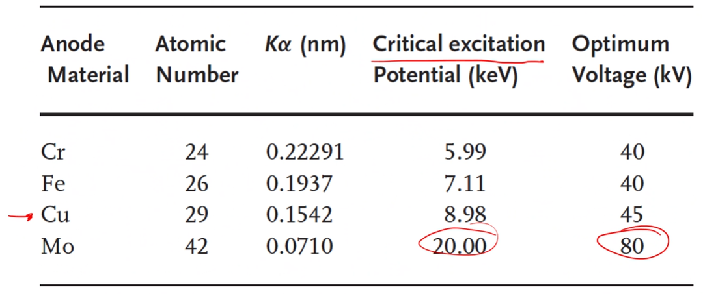
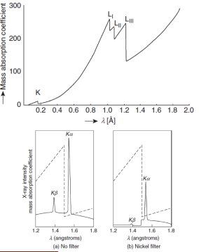
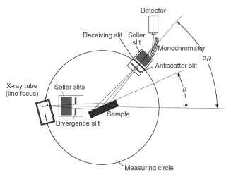
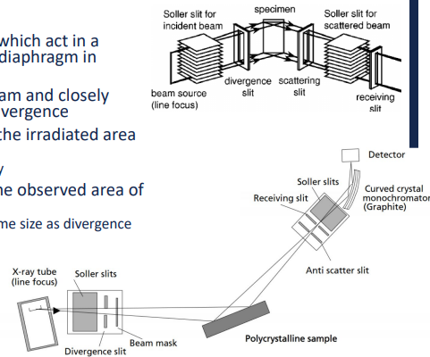

<!-- 20221017T13:06 -->
# Lecture 18: XRD Equipment and Setup
## Objectives
- Introduce #XRD as a technique for #crystallographic and composition.
- Discuss the fundamentals of the technique and general setup.
- Determine the mechanisms for x-ray reflection and phase identification.
- Describe the "optics" and layout of #XRD and sample preparation.

## X-Ray Diffraction (XRD)
#XRD is used to identify #crystallographic information.
The benefit of #XRD over #EDS (and similar techniques) is that #XRD can identify different phases of the same composition.
Spectroscopic #XRD uses x-ray reflection over a range of angles to identify varying intensity: like #EDS spectra, but not wavelength or energy based.
Photographic #XRD uses a single pattern generated by a sample to determine the #crystal-structure: like #diffraction-pattern in #TEM.

!!! note
    #XRD expands on #EDS or #EBSD because it tells you the phase of what composition is there.

## X-Ray source
#x-ray-generation by high-energy electrons bombarding a metal target.
The x-ray wavelength is determined by the target material and the accelerating voltage applied in an x-ray tube.
#x-ray-generation in all directions, but they are limited to exiting through a window in the tube.

$$\lambda = \frac{1.2398e3}{V}~nm$$

|  |
|:--:|
| Cooling is critical as only 1% of the energy input is converted to x-rays. |

## X-ray characteristics
There is a continuous x-ray spectrum (white x-rays) that create a background signal.
The minimum wavelength is determined by the maximum electron energy: e.g. $0.062 nm$ at $20 kV$.
The background is punctuated by sharp maxima that correspond to the [characteristic x-rays](characteristic-x-rays.md) of the target material.
It is desirable to produce monochromatic radiation, so filtering out the background and other peaks is performed.

|  |
|:--:|
| Everything below the peaks are non-sense. |

## X-ray generation
We have discussed the process of #x-ray-generation in relation to #EDS and #WDS ([Lecture 12](lecture-12-x-ray-generation.md)).
One of the key aspects to remember is #Siegbahn-notation:
- Transition from L to K shell: $K_{\alpha}$
- Transition from M to K shell: $K_{\beta}$
- Different subshells: $K_{\alpha 1}$, $K_{\alpha 2}$

The intensity of $K_{\alpha}$ will be higher than $K_{\alpha}$ because the probability is higher, but the wavelength of $K_{\beta}$ is shorter.
Subshell energy differences are sometimes indistinguishable for practical purposes: i.e. a doublet which is the average of $K_{\alpha,1}$ & $K_{\alpha,2}$.

|  |
|:--:|
| #copper is rather common, but may need to choose another for higher signal to noise ratio. |

## Filtering
The unwanted x-rays must be removed and/or accounted for.
The continuous and undesirable [characteristic x-rays](characteristic-x-rays.md) should be filtered from the beam.
The most common way to achieve this is to put a material that absorbs x-rays other than the #characteristic-wavelength desired.
Absorption is a function of the linear absorption coefficient ($\mu$) and mass density ($\rho$): i.e. the mass-absorption coefficient ($\mu/\rho$), which depends only on composition.
Intensity ($I$) through thickness ($x$) is given by: $$I_{x} = I_{o}e^{(\mu/\rho)\rho x}$$

## Mass-absorption coefficient
Decreases with decreasing wavelength of radiation.
There are distinct drops in the absorption, known as #absorption-edges.
These edges are indicative of the energies needed to excite #characteristic-excitations in the material.

|  |
|:--:|
| The material used as a filter can be selected such that the #absorption-edges occurs just below the target's #characteristic-wavelength. |

## Bragg's Law (again...)
We have seen the importance of [Bragg's law](bragg-diffraction.md) in #EBSD and #TEM.
#XRD is the most common analytical method where this is applied.
This will determine (mostly) what the pattern of reflections for a given structure is: $$n\lambda = 2d\sin(\theta)$$
The incoming x-rays may interact constructively or destructively.
To reinforce one another, the photons must stay in phase.
The path length difference between the reflections must be an integer multiple ($n\lambda/2$ is complete destructive).
The path length difference: $SQ+QT=2dsin(\theta)$.

## Cubic reflections
The #crystal-structure determine the #lattice-spacing and available planes for reflection.
The most basic structures are cubic, and #plane-spacing can be determined geometrically: $d_{hkl} = a/\sqrt{h^{2} + k^{2} + l^{2}}$.
The diffraction resulting from parallel planes in the #crystal-structure: $\sin^{2}(\theta) = \lambda^{2}/(4a^{2})(h^{2} + k^{2} + l^{2})$.
The difference data has to be interpreted from squared $hkl$ values.
Identifying reflection geometrically is not necessary in most cases, as the identification of phases is software based.

## General diffractometer setup
The most widely used #XRD systems are based on #powder-diffraction.
These systems scan use a constant x-ray impingement while the source, detector, and/or sample are rotated.
This allows a wide range of angles to be scanned and peaks to be identified.

|  |
|:--:|
| The sample may be horizontal or vertical, depending on the machine, and in a horizontal setup, the sample be rotated. |

## Beam path
The beam passes through slits which act in a manner similar to the #aperture-diaphragm in microscopy.
Soller slits are parallel to the beam and closely spaced to eliminate excessive divergence.
The divergence slit determines the irradiated are of the sample: controls background and intensity.
The scattering slit determined the observe are of the sample: reduces background.

## Sample
#powder-diffraction uses a powdered material.
The goal is to randomly and uniformly arrange the #crystal-structure.
#single-crystal and textured materials can also be observed with different setups in the same machine.
The sample is observed by programming the rate and range of motion during analysis (e.g. $2\theta$ of $20-120\degree$).
It is important to have the sample at the correct height to ensure the angle is accurate.
The sample holder may influence the pattern so "low-background" substrates are typically used.
Other attachments, such as heating chambers, can also be used to run experiments during the measurement.

## Summary
- #XRD is a versatile technique for gathering #crystallographic information.
- The crystallography is used to determine composition.
- The source of x-rays is critical to properly identifying the reflection positions.
- The typical arrangement for #XRD is scanning a range of angles over a powder sample.

