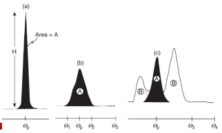

<!-- 20221019T09:44 -->
# Lecture 19: XRD Pattern Formation
## Objectives
- Introduce techniques in pattern analysis and peak identification.
- Consider example of complex structures and #phase-mixtures.
- Discuss method for determining composition and standards of analysis.

## Data acquisition
The incident x-rays produce varying intensity at the detector.
The angular position ($2\theta$) corresponds to the intensity.
Angles at which the x-rays strongly reflect are indicative of a #lattice-orientation that satisfies [Bragg diffraction](bragg-diffraction.md) ($d$ and $\theta$):
- In #single-crystals, the orientation of the crystal also effects the outcome.
- #polycrystalline samples (e.g. powder) will have a distribution of orientations such that some portion of the material will have crystals orientated at a favorable position.

The sample volume being analyzed changes with angle (both area and depth): non-homogeneous materials may be particularly affected.

!!! note Skipping Rocks and X-Rays
    #x-ray-generation as the #electron-beam skims off the surface of the material, much like you skip a rock on a pond.

## Scan parameters
The #XRD scans a user-defined range of angles (e.g. $2\theta \in [20, 120]\degree$).
The diffractometer may be set to measure continuously or in incremental steps.
The overall scan time determines the signal intensity: longer time *can* reduce the background contribution, but not guaranteed.
Large interplanar spacing corresponds to low angles (as $d$ increases, $\theta$ decreases for fixed $\lambda$): think back to [reciprocal space](reciprocal-space.md) in #TEM #diffraction-pattern.
Each #crystal-structure will produce reflections of relative intensities at specific angles: not just where, but with corresponding peak heights.

## Peak detection
Most of the peaks of appreciable intensity will occur at lower angles.
The x-ray source and sample will determine the overall signal intensity.
The source determines the possible range of $d$ spacings.
To resolve peaks, the measurement resolution should be about an order of magnitude less than the peak width at half the maximum intensity ( #full-width-half-max, FWHM).

## Post processing
The pattern will contain noise/background and sample-independent peak broadening (e.g. #instrumental-broadening).
The background should be subtracted and the pattern may be smoothed.
The ideal crystal will have a line at the exact conditions that satisfy the [Bragg equation](bragg-diffraction.md), but imperfections in the material and equipment results in a distinct peak width.
Measurement of peak widths also involves stripping $K_{\alpha 2}$.

## Calibration
No machine is perfect, but the #instrumental-broadening can be determined.
A standard can be used to identify the deviation from expected peak breadth or position.
A sample of known composition or condition can be used to account for sample deviations.
The divergence slit can be adjusted to reduce the scan area on smaller samples.
In newer machines this does not need to be performed every time but only if substantial changes have been made to the setup.
The needed accuracy of the data being collected will dictate how carefully the setup must be considered.

## Phase identification
A phase can be determined by basic comparison with known phases.
Standard diffraction data, as #powder-diffraction files (or #PDF) is available through the International Center for Diffraction Data ( #ICDD ).
These standards may be determined experimentally or theoretically.
The newest versions are preferred, as they are often collected under more stringent conditions with more advanced equipment.
The #PDF will include details on how the pattern collected, what peaks should be included, and what their relative intensities will be.

## Automated identification
Software make the task of phase identification much easier.
If elements are known, they can be specified for inclusion to narrow down the pattern options.
A major red flag occurs when the intensity of certain reflection are not in proper proportion: it *can* happen but is not typical (especially in #powder-diffraction), lower intensity peaks are less problematic.

## Composition analysis
The relative abundance of elements or compounds can be determined through peak analysis.
The pattern intensity from a phase, $i$ will be proportional to its weight fraction, $C_{i}$, and inversely proportional to its linear absorption coefficient, $\mu_{m}$, given the experimental setup (constant, $K$).
Peak heights can be used if the intensity and area are proportional.
If the peak heights and area are not proportional, the integrated intensity of the phase is used.
Where peaks overlap, deconvolution has to be applied: $$I_{i} = \frac{KC_{i}}{\mu_{m}}$$

## Quantitative analysis
To accurately identify the phase compositions, some standard must be applied.
The #External-Standard-Method uses the pure material to standardize the reflections.
The #Internal-Standard-Method uses various known mixtures to determine the relative intensity differences.
The [Direct Comparison Method](direct-comparison-method.md) is the easiest, as it does not require precise compositions for comparison.

## [Direct Comparison Method](direct-comparison-method.md)

## Temperature
The temperature factor is related to:
- Unit cell expansion, change of $d$, and angle where lines will occur
- Intensity decreases at increasing temperature
- Background increases as a result of increasing temperature

|  |
|:--:|
| #Coefficient-of-Thermal-Expansion can actually be measured by #XRD. Almost every #PDF you find will be at room temperature. |

## Relative composition
We apply the same treatment to the beta phase: $$I_{\beta} = \frac{K_{2}R_{\beta}C_{\beta}}{\mu_{m}}$$
And the intensity differences can then be used to determine the relative composition: $$\frac{I_{\alpha}}{I_{\beta}} = \frac{R_{\alpha}C_{\alpha}}{R_{\beta}C_{\beta}}$$
And this can be applied to as many phases as needed: $\sum_{i} C_{i} = 1$.

## Solid solutions
#Vegards-Law can be applied, which is a weighted average of the elements present and their respective lattice parameters: also useful for density.
Results in a peak shift in the solvent.

$$\sum A = n_{\text{solvent}}A_{\text{solvent}} + n_{\text{solute}}A_{\text{solute}}$$

## Summary
- #XRD produces valuable information on composition and structure, but the analysis can be complex.
- Software based identification is extremely useful but not perfect.
- The relative composition and phase type can be determined from #XRD, as well as, #Coefficient-of-Thermal-Expansion.