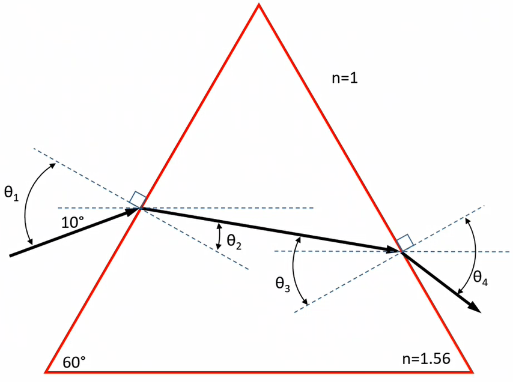

<!-- 220824 -->
# Lecture 2: Optical Microscopy Concepts
## Objectives
- Introduce concepts and uses of #optical-microscopy.
- Identify the mechanisms of light focusing and lens design.
- Specify the way images are formed and how magnification is calculated.

## Basics of Optics
#optical-microscopy uses lenses to focus and magnify an object.
Some general concepts will be helpful to understand how and why this works.
The principle of refraction will be central to lens function.
[Snell’s Law](snells-law.md) gives a geometry relationship: $n_{1}\sin(\theta_{1}) = n_{2}\sin(\theta_{2})$.

|  |
|:--:|
| The rate at which light passes through a material differs from material to material. |

!!! example [Snell's Law](snells-law.md)
    |  |
    |:--:|
    | Solve for $\theta_{1}$, $\theta_{2}$, $\theta_{3}$, and $\theta_{4}$. The index of refraction outside prism is $n = 1$ and inside is $n = 1.56$. |

    $$\begin{split}
    \theta_{1} &= 40\degree \\
    \theta_{2} &= \arcsin(\frac{n_{1}}{n_{2}}\sin(\theta_{1})) \\
    \implies \arcsin(\frac{1}{1.56}\sin(40\degree)) &\approx 24.3\degree \\
    \implies \theta_{3} &= 30\degree + (30\degree - 24.3\degree) \\
    &= 35.7\degree \\
    \theta_{4} &= \arcsin(\frac{n_{3}}{n_{4}}\sin(\theta_{3})) \\
    \implies \arcsin(\frac{1.56}{1}\sin(35.7\degree)) &\approx 65.6\degree
    \end{split}$$

## Convex and Concave Lens
[Refraction Rules for a Converging Lens](refraction-rules-for-a-converging-lens.md):
- Any incident ray traveling parallel to the principal axis of converging lens will refract through lens and travel through focal point on opposite side of lens.
- Any incident ray traveling through the focal point on the way to the lens will refract through lens and travel parallel the principal axis.
- An incident ray that passes through the center of the lens will in effect continue in the same direction that it had when it entered the lens.

|  |
|:--:|
| Incident rays which travel through the focal point will refract through the lens and travel parallel to the principal axis. |

[Refraction Rules for a Diverging Lens](refraction-rules-for-a-diverging-lens.md):
- Any incident ray traveling parallel to the principal axis of a diverging lens will refract through the lens and travel in line with the focal point: i.e., in a direction such that its extension will pass through the focal point.
- Any incident ray traveling towards the focal point on the way to the lens will refract through the lens and travel parallel to the principal axis.
- An incident ray that passes through the center of the lens will in effect continue in the same direction that it had when it entered the lens.

|  |
|:--:|
| A diverging lens is said to have a negative focal length since rays which enter the lens traveling parallel to the principal axis diverge. |

## Imaging
The purpose of #optical-microscopy is to view an object at increased magnification and/or with some alteration to the light transmitted through or reflected from that object: i.e. to provide information not available with the naked eye.
This requires lens and/or filters that manipulate the light.
The light must be captured by eye or sensor, and the construction of a microscope must be suited to the purpose: not all microscopes are the same in quality or capability.

## Vision correction
Near and far-sightedness are caused by incorrect focusing of incoming light.
The "detector" must be within the #focal-plane of the light to get a clear image.
The #focal-point of most objective lenses (not like a camera) is not variable, so the sample height must be varied.

## Magnification
|  |
|:--:|
| A simple lens magnifies an object in a *virtual* image that *appears* to be coming from a larger object. The real image will be inverted at the #focal-point on the side of the lens. |

<!-- 20220826T13:05 -->

## Thin lens equation and magnification
Magnification depends on the #focal-length of the lens ($f$) and the distances from the lens to the object ($u$) and image ($V$).
Triangles ABO and A’B’O are similar (A’B’/AB = OB’/OB).
Triangles A’B’F and OCF are similar (A’B’/OC = FB’/OF).
AB = OC, so OB’/OB = FB’/OF = (Ob’ - OF)/OF.
Let OB = -u, OB’ = v, and OF = f.
$\frac{v}{-u} = \frac{v - f}{f}$ \implies M = \frac{h’}{h}$.
Question: What is M at 2F? A: 1.

## Magnification
The near point of eye focus is conventionally taken as $250 mm$ (a relaxed focus).
The virtual image is what appears to be the object (enlarged and at a greater distance).
Higher magnification requires a shorter focal length.
Multiple lenses multiply magnification.

## It’s a little more complicated…
Example: a camera “lens”, which is a compound lens consists of numerous elements.
This is similar for microscope objectives.

## Summary
- #optical-microscopy is a valuable tool to examining a wide range of objects.
- Even basic microscopes use complex lens systems to focus and magnify objects.
- The principles of lens design are prevalent in many other light-based observation techniques, such as telescopes and cameras.