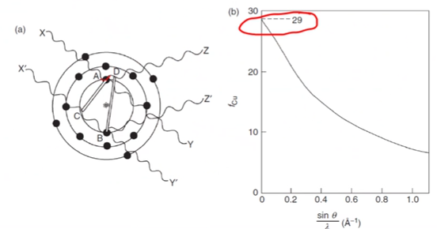
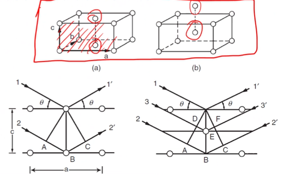
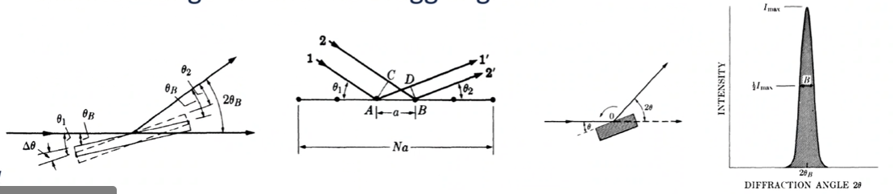

<!-- 20221031T13:24 -->
# Lecture 20: Diffraction Intensity
## Objective
- Identify factors dictating intensity of diffraction.
- Discuss the affects of atoms and #crystal-planes in determining intensity.
- Use structure factors equations to determine forbidden reflections.
- Highlight other causes of intensity variation in #XRD.

## Diffraction intensity
Even if the #Bragg-Condition is satisfied for a certain #crystal-planes, the intensity will vary.
The incident x-ray is scatterd by the electrons of the atoms.
[Scattering](electron-scattering.md) occurs in all directions.
The intensity ($I_{O}$) is determined by the angle between the incident beam and the scattering direction ($2\theta$), distance to detector ($r$), and constant ($K$) for atomic properties: $$I(2\theta) = \frac{I_{0}}{r^{2}}K\frac{1 + \cos^{2}(2\theta)}{2}$$
The last term is the polarization factor, and polarization is due to the [scattering](electron-scattering.md) not the incident beam.

## Scattering interactions
The scattering from various electrons around the nucleus are not equivalent.
Destructive interference arises due to the locations of electrons during scattering.
The scattering intensity is not equivalent to the intensity of one electron multiplied by the number of electrons in the atom.

|  |
|:--:|
| Structure does not matter at this stage, simply the number of electrons in the shells. The angle of the beam and size of structure varies the scattering intensity. |

## Scattering factor
The scattering factor is essentially to yield of signal out over the intensity for a single electron.
It is a function of scattering direction and wavelength.
As $2\theta$ is increased, the intensity is rapidly reduced: $$f = \frac{\text{amplitude of the wave scattered by one atom}}{\text{amplitude of the wave scatter by one electron}}$$

## Structure extinction
The interference effects on intensity are not limited to electrons.
The #crystal-orientation of atoms also affects the scattering of x-rays.
Atoms on different planes can cause destructive interference.
$(001)$ in the base-centered #unit-cell will by detected.
$(001)$ in the #bcc #unit-cell will not.
Line 3-3' destructively interferes with 1/2 shift.

|  |
|:--:|
| The front face is equivalent in fractometers even if of different orientations. #bcc will cancel out diffracted waves because of the 1/2 shift destructively interfering. |

## Structure factor
The structure factor, $F$ describes the intensity extinction resulting from #crystal-orientation.
For a #unit-cell with $N$ atoms, and atom, $n$ located at $u_{n}$, $v_{n}$, and $w_{n}$ and atomic structure factor, $f_{n}$ the plane structure factor, $F_{hkl}$ is given by: $$F_{hkl} = \sum_{n}^{N}f_{n}\exp(2\pi i(hu_{n} + kv_{n} + lw_{n})$$
$hkl$ is the plane and $uvw$ is the position.

!!! example Examples
    Recall: $F_{hkl} = \sum_{n}^{N}f_{n}\exp(2\pi i (hu_{n} + kv_{n} + lw_{n}))$ and [#De-Moivres-Identities](https://en.wikipedia.org/wiki/De_Moivre's_formula).
    - #bcc, $(001)$: $$\begin{split}
        F_{001} &= \sum_{n}^{N}f_{n}\exp(2\pi i (0u_{n} + 0v_{n} + 1w_{n})) \\
        &= f_{n}\exp(2\pi i (0(0) + 0(0) + 1(0))) + f_{n}\exp(2\pi i (0(1/2) + 0(1/2) + 1(1/2))) \\
        &= f_{n}\underbrace{\exp(0)}_{1} + f_{n}\underbrace{\exp(\pi i)}_{-1} \\
        F_{001} &= 0
        \end{split}$$
    - #fcc, $(110)$: $$\begin{split}
        F_{110} &= \sum_{n}^{N}f_{n}\exp(2\pi i (1u_{n} + 1v_{n} + 0w_{n})) \\
        &= f_{n}\exp(2\pi i (1(0) + 1(0) + 0(0))) + f_{n}\exp(2\pi i (1(1/2) + 1(1/2) + 0(0))) \\
        &\qquad+ f_{n}\exp(2\pi i (1(1/2) + 1(0) + 0(1/2))) + f_{n}\exp(2\pi i (1(0) + 1(1/2) + 0(1/2))) \\
        &= f_{n}\underbrace{\exp(0)}_{1} + f_{n}\underbrace{\exp(2\pi i)}_{1} + f_{n}\underbrace{\exp(\pi i)}_{-1} + + f_{n}\underbrace{\exp(\pi i)}_{-1} \\
        F_{110} &= 0
        \end{split}$$

<!-- 20221102T09:55 -->

#forbidden-reflections do not imply that the reflections are not there, simply that reflections from certain #crystal-planes cancel each other out.

## Alloys and complex unit cells
The [structure factor](#structure-factor) can be equally applied to low symmetry unit cells and those with more than one type of atom.
The solution becomes more cumbersome but not different.
The individual atom values for $n$ and $f$ must be considered.

## Other intensity factors
The relative intensity is affected by:
- Polarization factor
- [Structure factor](#structure-factor)
- Multiplicity factor
- [Lorentz factor](#lorentz-factor)
- Absorption factor
- Temperature factor

We just covered polarization (atoms) and structure (planes).
The _multiplicity factor_ corresponds to the number of planes in a particular orientation:
- Six faces (for cube), eight ($(111)$), etcetera: $\{111\}$ will have a $4/3$ intensity of $\{100\}$.

## Lorentz factor
There is only one #Bragg-angle, but the intensity is really a distribution near that ideal angle.
The integrated intensity is more useful than only the maximum intensity.
The real distribution of reflected x-rays and randomized crystals (in powders) across the surface results in geometric effects that result in a limited range around the #Bragg-angle.

## Other factors
Absorption factor includes the intensity loss from absorption within the material: this is particular important in #Debye-Scherrer-Diffraction (transmission).
Temperature factor incorporates atomic movement:
- #Al atoms at room temperature move by about $0.017 nm$.
- This agitation decreases the intensity, as the atomic positions are not clearly maintained.
- This does not broaden the peak but does reduce intensity.
- Higher temperatures also result in general scattering increases which raise the background signal.

Recall: $$R = \bigg( \frac{1}{\nu^{2}} \bigg)\Bigg[ \left|F_{hkl}\right|^{2}p \bigg(\frac{1 + \cos^{2}(2\theta)}{\sin^{2}(\theta)\cos(\theta)} \bigg) \Bigg]\Big(e^{-2M}\Big)$$

## Summary
- The incident beam is only partially responsible for the #XRD pattern.
- The atomic, crystallographic, and geometric factors of diffraction also dictate relative intensities.
- Certain, real #lattice-orientation will not show up in #diffraction-pattern because of destructive interference.
- Other factors such as temperature and absorption contribute to relative intensities and should be considered.