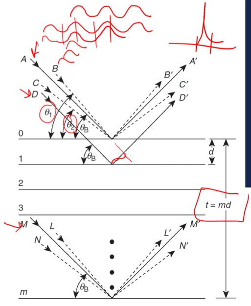
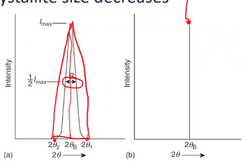
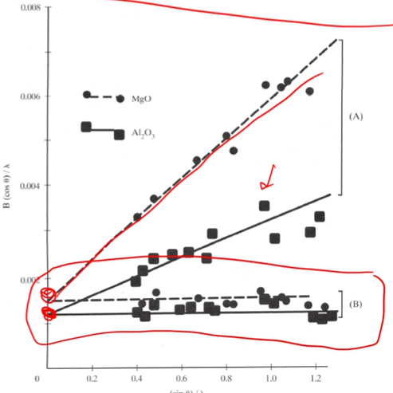

<!-- 20221102T09:54 -->
# Lecture 21: Defect Measurement
## Objectives
- Describe the considerations with "real" samples.
- Determine the sources of #peak-broadening and shift.
- Detail the effects of uniform strain, non-uniform strain, and #grain-size.
- Quantify the strain and size effects.
- Separate strain and #grain-size broadening.

## Real samples
We have been considering theoretical samples so far, without accounting for deviation.
Nearly all real samples will contain imperfections, such as #dislocations, #microstrain, #grain-boundaries, etcetera:
- These can be sparse or highly concentrated.
- Even perfect crystals must be carefully interpreted.

There are two principal changes to the #diffraction-pattern:
1. #peak-broadening
2. #peak-shift

## Grain size by transmission XRD
Transmission or back reflection ( #Laue-diffraction ) can be used to generate spot and ring patterns similar to those in [TEM DP](lecture-16-tem-diffraction-patterns.md).
This provides a qualitative measure of #grain-size.
#XRD is not particular useful for measuring #grains in the typical size range (10s or hundreds of microns).
Much smaller grains (nanoscale) can be estimated from the diffraction peaks.

## Grain size estimation
The #grain-size is important for both the constructive interference (signal) and destructive interference (peak width): i.e. the periodicity controls both height and breadth of the peak.
If there is a small deviation in the phase difference between reflecting planes, complete destructive interference will only come from planes deep within the crystal.
For very small #crystals, there are not enough planes to cancel the signal from [non-Bragg angles](bragg-diffraction.md), and the peaks will widen.

|  |
|:--:|
| Phase shifts by integers results in constructive interference. Decimal values shift the peaks up to a limit before becoming destructive for half wavelength shifts. |

## Deviation
$D'$ is one wavelength out of phase with $A'$.
$M'$ is $m$ wavelengths out of phase with $A'$.
$A'$, $D'$, ..., $M'$ are completely in phase.
$B'$ is at a slightly larger angle, $\theta_{1}$, such that at some position below, the reflection, $L'$ is $m + 1/2$ wavelengths out of phase and the signal cancels.
LLikewise, $C'$ is at a slightly smaller angle, $\theta_{2}$, such that at some position below, the reflection, $N'$ is $m-1/2$ wavelengths out of phase and the signal also cancels.
At $m \pm 1$, the signal would be constructive.

## Peak broadening
The imperfect cancelation of signal will produce a real deviation from the #Bragg-angle.
The structure influences the limit of the (max/min)imum angles of reflection ($2\theta_{1}$ and $2\theta_{2}$).
The width of the peak increases as the crystallite size decreases (range $\theta_{1} - \theta_{2}$ increases as $m$ decreases).
The peak width is often defined by #full-width-half-max.
The width $B$ can be roughly estimated as $1/2(\theta_{1} - \theta_{2})$ assuming a triangular shape.

## The Scherrer estimation of grain size
The path difference for the (min/max)imum are related to the full crystal thickness ($t$) which is the product of the number of planes ($m$) and plane spacing ($d$).
This provides a direct relationship between peak width and crystallite size at the smallest limit ( #nanograins ).
The total broadening may include more factors than just grain size, include non-uniform strain and #instrumental-broadening.
The imperfections of the beam itself also cause broadening:
- Never strictly parallel and monochromatic.
- Even a pure $K\alpha$ line has a width of $\sim 0.0001 nm$, corresponding to an increased line width $\sim 0.08\degree$ at $2\theta = 45\degree$ (for $0.15 nm$ wavelength).

$$t = \frac{0.9\lambda}{B\cos(\theta_{B})}$$

## Non-uniform strain
Real crystals have a "mosaic" structure where #dislocations form sub-boundaries.
These are slightly misaligned ($< 1\degree$).
The effect is to [Bragg diffraction](bragg-diffraction.md) over an angular range.
If the #misorientation-angle is taken as the strain, $\epsilon$ then range is $\theta_{B} + \epsilon$.
Because of this, non-uniformly strained #single-crystal will exhibit #peak-broadening.

## Effects of strain
#macrostrain is considered to be uniform over the crystal being measured if not over many grains together.
- This results in a peak shift, which increasing plane spacing (tension) shifting the peak position to a lower angle.
- This can be produced through #solid-solution-alloying or application of tension during measurement.

#microstrain is not even distributed over the grain or larger sample: bending is a straightforward example of this where the plan spacing varies based on the location within a grain and yield a range of #Bragg-Condition ( #peak-broadening ).
Differentiation of [Bragg's Law](bragg-diffraction.md) gives the #strain-broadening: $$b = \Delta 2\theta = -2\frac{\Delta d}{d}\tan(\theta)$$

## Size and strain separation
Isolating the contributions to #peak-broadening is important to understanding the state of the material being examined.
The way the contributions are separated is determined by the peak shape (Lorentzian versus Gaussian).
Consists of instrumental size, and strain factors:
- Lorentzian: $B_{\text{exp}} = B_{\text{size}} + B_{\text{strain}} + B_{\text{inst}}$
- Gaussian: $B_{\text{exp}}^{2} = B_{\text{size}}^{2} + B_{\text{strain}}^{2} + B_{\text{inst}}^{2}$

$B_{\text{inst}}$ can be determined by the diffraction result of the same material in an annealed, large grain condition.

## Williamson-Hall method
To separate the size and strain effects, the factors can be plotted.
Each peak in the pattern is analyzed.
If #size-broadening is the only significant contribution, the plot will be horizontal.
If #strain-broadening is the important contributor, the plot will be a linear function of $\sin(\theta)$.
The slope is the strain component and the y-intercept is the size component.

$$\begin{split}
t &= \frac{0.9\lambda}{B\cos(\theta_{B})} \\
b &= \Delta 2\theta = -2\frac{\Delta d}{d}\tan(\theta)
\end{split}$$

## Summary
- Even #single-crystal samples can have defect induced by line broadening.
- The amount of broadening and source can be used to quantify the microstructural characteristics.
- Careful analysis requires identifying and separating all sources of peak shift and #peak-broadening.