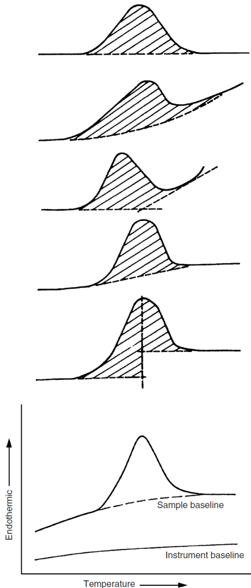
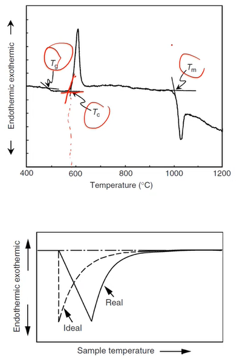
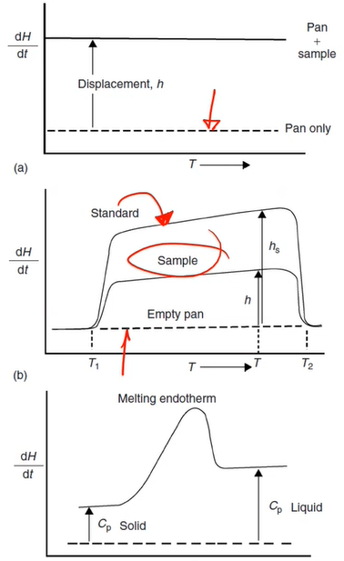
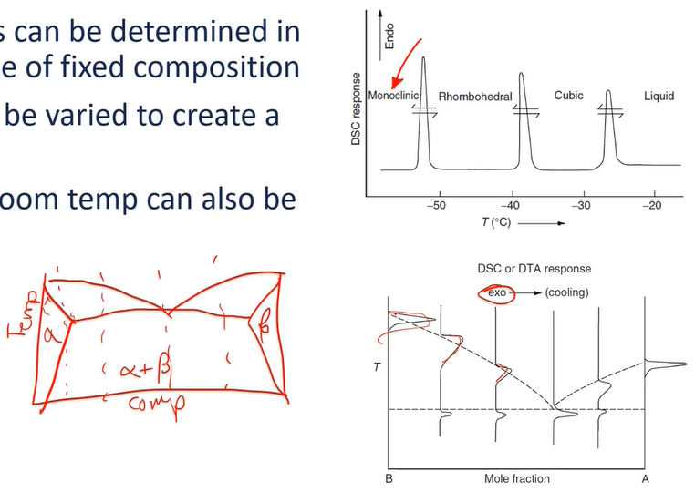
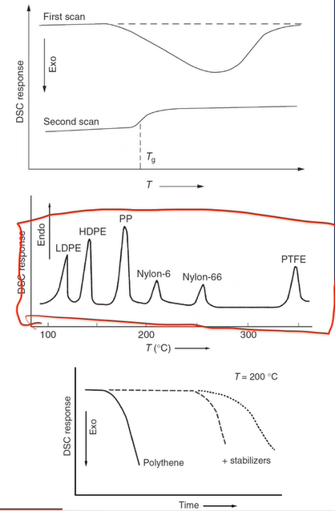
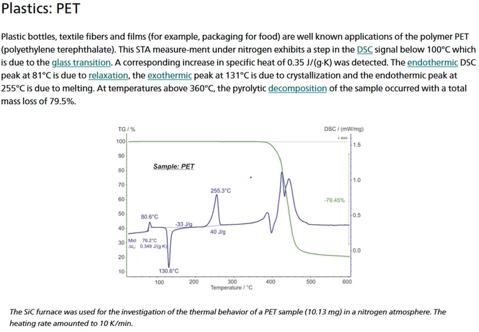

<!-- 20221207T09:43 -->
# Lecture 22: DTA and DSC
## Objectives
- Introduce the tehcniques of #DSC and #DTA.
- Describe the setup and sample conditions.
- Highlight the difference and simlarities
- Provide the typical measurement ciriteria and examples
- determine the typical material and analysis typies used.

## Thermal Events
Materials are susceptible to a variety of changes (i.e. thermal events) based on temperature:
- Dimension
- Mass
- Phase
- Oxidation
- #grain-growth
- etcetera...

Using heat is much simpler than probing with electron or x-rays.
The most common thermal analysis (TA) methods are:
- Thermogravimetry ( #TG ): mass change
- Different thermal analysis ( #DTA ): temperature difference
- Differential scanning calorimetry ( #DSC ): heat flow
- #dilatometry: length or colume change
- Thermomechanical analysis ( #TMA ): deformation
- Dynamic mechanical analysis ( #DMA ): deformation

*[TA]: thermal analysis

## Phase transisition
First order phase transitions occur where there is latent heat such that energy is added/removed without changing the temperature: include polymortphism melting/solidifying, etectera.
A second-order phase transition occurs continuously, without a distinct temperate of transition: incluses glass-transition (polymers), decomposition, etectera.
Theremal analysis methods, such as #DTA and #DSC, use the change in entalpy to determine the type, onset, and duration of these events.

## Enthalpy change
As a sample is heated, there is a certain heat flow associated with the temperatute cange (given the environment, material the sample is contained within, and the material iteself).
the internal energy is the heat flowing into the system minor the work done by the system: $\Delta U = Q - W$.
If the only work done by the system is the mechanical work of volume change at constant pressure, then $\Delta U = Q_{P} - P\Delta V$.
Enthalpy is defined as $H \equiv U + PV$, such that $\Delta H \equiv Q_{P}$.
This demonstrates that the heat flow measured during TA is directly related to the entalpy chnage in the material.

## Equipment
TA equipment is typically equipped with a furnace, controlled atmosphere, and thermocouples to measure a sample and standard.
The furnace chamber can often be evacuated and has fine control over the gas flow rate.

## Expreimental parameters
The sample type (disc, powde, etecete) siz,e and mass are very important.
The mechanical and thermal history of the sample is also critical to proper interpreatation of the results.
The sample sould be small (often < 10 mg) to reduce thermal gradient witini it.
The heating rate should be relatively low to approach equilibrium in the sample and between the the thermocouple and the sample (which are not in direct contact)(.
The type of atmoshophere and flow rate of gas cna also significatnly affect the results and should be standardized for all samples.

## [DTA](dta.md)

## [DSC](dsc.md)

## Sample conditions
The sample is very important since the data relies on heat transfer to detect temperatue.
The sample should be densiley packed powder or disks that make good contact with the sample holder (pan or crucible).
Samll samples are prefered as the y heat quickly and minimize internal thermal gradients.
The sample holders are varied for application and matertaion, but platinum, gold, aluminim, almina, graphite, etcetera are vaiable.
Some pans can be sealed to eliminate mass loss from decomponsition.

## Baselines
It is important to have a good baseline ot make any quantiative, semi-quantiative, or even meaningful qualitative statements about the events observed.
The instrument baseline is collected over the whole tmperature range to eliminaten any artifacts of the equimment.
It is important that factors such as gas low and type are the sample as the experimental conditions.

|  |
|:--:|
| The sample baseline is often more complicated to determine with some interpretation being applied. |

## Heating rate
The rate of heating can affect the onset temperature and curve shape of the data.
Because TA measures kinetic events, there is a time lag that is axaggerated by fast heating: the curve is shifted to a higher temperature and more distinct (on time scale).
The effects are unavoidable altogether so the conditions of measurement should be reported with the data.

<!-- 20221207T10:10 -->

## Transition temperature
#DTA / #DSC are used to determine the transition snad their respective temperatures.
For some transitions, the exact tempature is uncertain: the inctercept of lines extended from the curve ebfore and oafter onset can be used.
It is iportant to note that first-order transitions reach their maximum at the temperatue thte transition is complete.
Due to the sample holder, the termpature measued is ahead of the actual sample temperature.

|  |
|:--:|
| The point at which the lines intersect we say is the temperature of interest. Pay attention to the convention for (exo/endo)thermic axis direction. |

## Enthalpy change
#DSC is used to determine $\Delta H$ (per time, mass, temperature).
The peak area ($A_{p}$) is proportional to Delta H given experiment constants, $K_{c}$: $\Delta H/mass = K_{c}A_{p}$.
$K_{c}$ is nearly indeptnedet of tempratue in power componestate #DSC, but must be determined at the target temperature(s) in heat flux #DSC.
The determination of the sample baseline is also ciritical o accuratel determining the peak area.

## Standards
Careful calibration of the temperaturea enthalpy measurements is done using standards.
These are highly pure materials with precisly known properties.
These known material.s are then compared to the xerpiemental valuyes and used to calibrate hte measurements of tehe euqpketn.
Standards with metling temperares in the target range of the sample shol dbe used.
A series of standards is used to calibrate the equipment over the entire temperature range.

## Heat capacity
The heat capcity ($C_{p}$) of a material with some mass, M can be determineied by measuring the sample against an empty reference and standard ($C_{ps}$) (i.e. detemine the displacement, $h$ or $h_{s}$) given a speific heating reate, beta, and calibration $B$: $$\begin{split}
h &= B\beta C_{p} \\
C_{p} &= C_{ps}(\frac{hM_{s}}{h_{s}M})
\end{split}$$

|  |
|:--:|
| The biggest difference is to compare to standard material while running the machine. Here the sample is measured against a standard and an empty machine in different runs. |

## Phase transitions
First-order transitions can be dtermine din da pure material or one of dixed copmosition.
Teh compsition ca bevaried to create a full #phase-diagram.
Temperatue below room temperatuere can also be applied.

|  |
|:--:|
| You can run a material of known mixtures through DSC to observe the phase transitions temperatures. |

## Plymer applications
Polymers are perhaps the most popula material class in TA.
Various properties can be quickly determined.
Most TA instruments do not go to thigh temperatues (e.g. 1000 C)
The crystallinarty can be detemined from the entalpy change, as apposed to amorphous polymers which only have a glass trantions.
The #molecular-weight is alos determinable as the melting temperatture and range isaffected: the cruing of polymer is determine dthorugh the reverse relationship.
The copmoents in polmer recylcing can be idenfitied thorugh their vari melting peaks, and ecomposition can be measured in various environments.

## Simultanoues thermal analysis

## Sumary
- TA techniques are relatively simple and provide a range of information.
- The calibration of the measurement conditions are critical to accurately determining the thermal events.
- #DTA provides temperature-based transition information.
- #DSC can quantify transition information based on heat flow.
- Phase transitions such as melting, polymorpism, glass transition, etectera cna be detemrined with relatively quick setp and reuts.