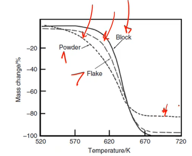

<!-- 20221109T09:56 -->
# Lecture 23: Thermogravimetry and Dilatometry
## Objectives
- Introduce thermogravimetry.
- Compare the method and data to #DSC / #DTA.
- Detail the measurement setup and data interpretation.
- Highlight applications.

## Thermogravimetry
#TG (thermogravimetric analysis, #TGA) is a technique to determine mass change during heating (using thermobalance).
The temperature can be ramped or held constant to track decomposition over time.
The results are expressed as percent/time of total mass change.
The environment is similar to #DSC / #DTA where the gas and temperature are variable.

## Instrument
Due to the importance of the sample mass, a microbalance ($\pm 1 \mu g$) is used.
The sample can be suspended such that the sample remains vertical during mass change (as in a Cahn microbalance): it can also be supported below on a sample carrier (identical to #DTA / #DSC).
Using a suspension with allows the sample to be placed in the center of the furnace with a very close size to reduce thermal gradients.

## Sample types
Like #DSC / #DTA, small samples and low temperature ramp rates are preferred as they minimize error in the data.
Sample mass is most critical since it is the variable being measured: a few mg is sufficient for the measurement.
The form of the sample affects the rate of mass change.

|  |
|:--:|
| A solid block of material has a more limited surface area. Powders are preferred over flakes. |

## Gas flow effects
The type and amount of gas flow can affect the measurement results of #TG.
Gas flowing upward can cause buoyancy effects, lessening the mass.
Gas flow from the top can effectively add mass as well as shielding a thermocouple below the sample.
Excessive flow from either direction can lower the furnace temperature.
The setup should be calibrated under the same conditions as the sample is run under.

## Calibration
The temperature calibration of #TG is dependent on non-contact measurement.
This can be achieved used Curie point measurement, where materials with curie temperatures are examined.
A magnet is placed below the furnace and exerts an added force to the sample until it reaches its Curie point.
Each material has a known Curie temperature and the furnace temperature is compared to that.
A fusible link can also be used in conjunction with hanging weight.

## Heating rate
Like #DSC / #DTA, #TG benefits from a slow heating rate to identify the onset temperature of the mass change.
A faster heating rate will shift the onset to a higher temperature and spread the reaction over a greater temperature range.
A faster heating rate will increase the difference between the thermocouple and sample and the reaction products may kinetically limit the reaction rate.
$5-10 \degree C$ is typical, with $1 \degree C/min$ being useful for accurately identifying the mass change onset.
Other heating programs, such as stepwise or dynamic heating, can be used to identify various reaction conditions.

## Data types
|  |
|:--:|
| The mass change curves may include: (i) no decomposition (stable/inert); (ii) initial mass loss (dehydration/desorption); (iii) one-stage decomposition; (iv) multi-stage decomposition with stable intermediates; (v) multi-stage decomposition with unstable intermediates because of possible too high of a heating rate; (vi) chemical reaction with mass gain; and (vii) mass gain followed by mass loss. |

## Derivative TG
#DTG is used to identify the slope change points where they are unclear.
A peak in the #DTG curve indicates the maximum mass change temp.
This highlights important temperatures in complex curves but contains no new information.

## Other temperature determination
Like #DSC / #DTA, lines can be drawn tangent to the curve.
Where the lines intersect is the temperature used to report the thermal event (mass loss/gain in this case).

## Applications
#TG is simple and effective for determining:
- Dehydration
- Desorption
- Decomposition
- Oxidation

Polymers are an important application (like #DSC / #DTA) and the decomposition of blends can be studied.
Retained mass can also be used to determine concentration in composite materials.

## Dilatometry
In simplest form, dilatometry measures geometric change with change in temperature.
The sample is placed in a furnace of controlled atmosphere (typically inert).
A pushrod is placed with a light force against the sample.
As the furnace is heated, the movement in the pushrod is measured.
It is important to run standards to compensate for the #Coefficient-of-Thermal-Expansion of the pushrod and other equipment variables.

## Optical Dilatometry
Non-contact, optical dilatometry can be used.
The sample must be compared to a known standard.

## Summary
- #TG is a simple but useful technique for measuring mass loss against temperature.
- The conditions of measurement should be chosen carefully, and many of the considerations of #DSC / #DTA carry over.
- #TG is able to identify reactions based on environment and heating rat e(mass loss or gain).
- #dilatometry is a valuable tool for measuring dimensional change with temperature.