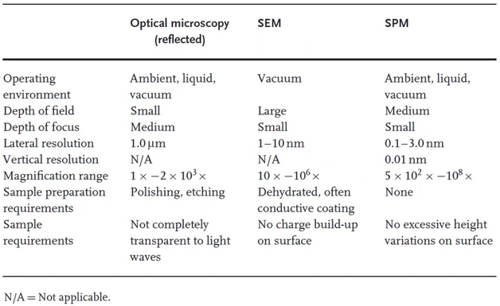
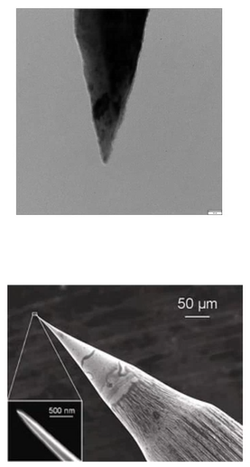

<!-- 20221114T13:17 -->
# Lecture 24: Profilometry and STM
## Objectives
- Introduce dedicated surface measurement techniques.
- Highlight the principles of profilometry and typical methods.
- Detail the setup for scanning probe microscopy ( #SPM ) in general.
- Discuss the design, principles, and applications of scanning tunneling microscopy ( #STM ).

## Scanning Probe Microscopy
#SPM includes a wide variety of techniques, but the most common are scanning tunneling microscopy ( #STM ) and #atomic-force-microscopy ( #AFM ).
Both methods are very high-resolution surface measurement techniques able to resolve atomic structure.
We will start with a brief look at profilometry which is similar in many regards but less capable.

## Profilometry
Profilometry is used to measure surface features (profiles).
In contact (or stylus) profilometry a sharp probe is pressed against a surface and translated a desired distance:
- Stylus is often diamond tip with radius of 10s of $nm$ or microns.
- Force is in milligrams.

Benefits include direct measurement of the surface: no optical reflectance or color issues, no contamination artifacts, fast and sample.
Most widely accepted standard for surface roughness measurement.

## Optical profilometry
Optical profilometry uses light interference to generate a 3D map along a line or area.
Height differences cause varying interference patterns that are interpreted by the computer as specific heights.
The measurement is very quick and can be stitched over numerous areas.
The surface must be clean and some transparent materials may cause issues.
Resolution can be to nanometer scale in Z, but X and Y are similar to optical microscopy.
Equipment is more capable but much more expensive.

## SPM vs OM, EM
|  |
|:--:|
| #SPM techniques are not limited by far-field interactions involved with electromagnetic waves, but these techniques have their own limitations. |

## Equipment
### Probe
The basic requirements for #SPM include:
- Specialized probe
- Means for scanning the surface (X, Y, Z motion)
- Computer controlled feedback and measurement
- Vibration isolation

The probe is critical since it is the means by which the surface is measured.
It is often made from #W, #PtIr, #SiO2, or #Si3N4 (depending on #STM or #AFM ).
The probe is most often mounted on a cantilever.

### Scanning
The lateral area of measurement in #SPM is relatively limited and must be highly accurate: e.g. $pm$ resolution for atomic measurement.
To achieve this, piezoelectric position is used.
The displacement of the sample in a given axis is proportional to the voltage applied (E) to a piezoelectric crystal:
Typical performance is $0.3 nm/mmV$ (300 V to achieve $1 \mu m$ displacement in $10 mm$ crystal).
The piezoelectric properties of the material, such as hysteresis and creep must also be calibrated to achieve accurate positioning.

$$\frac{\Delta L}{L} = d_{ij}E$$

### Control and Vibration
Like other high-precision measuring techniques, vibration will degrade the measurement accuracy.
Since there are only atomic-scale spacings being measured, vibration isolation is especially important.
The software side of the measurement is also critical, as the raw data must be interpreted in three dimensions.
The measurement feedback system and creation of 3D height maps requires sophisticated software.

## STM
### Tunneling
#STM uses electron tunneling to image a surface.
Tunneling is a quantum phenomenon whereby an electron can cross an energy barrier with less energy than the barrier "should" require:
- This is different than arcing!
- Tunneling is also part of field-emission #SEM.

To generate a tunneling current ($I_{t}$), the tip distance ($d$) is made very small (interatomic spacing), and a small voltage (applied mV to single V), depending on material characteristics (constant, $C$).
The surface topography is determined by the total charge density, which corresponds to the probe position over the atom.
Sample and probe must be conductive to measure, and oxidation of either can prevent the measurement.

### Probe and environment
The #STM probe is often #W or #PtIr.
The tip is sharpened by chemical etching or mechanical grinding.
The size and sharpness (tip radius) will determine the lateral resolution: $nm$ tip radii are common.
The tunneling effect is so localized to the surface that a single atom on an otherwise smooth surface acts as the tip.
The measurement can be conducted in air or liquid environments, but the measurement is often done in ultra-high vacuum to reduce oxidation.
The sample is often cooled to reduce thermal drift and diffusion as well: high temperature can be used to observe surface changes.

### Modes
Four modes:
1. Constant current
2. Constant height
3. Spectroscopic
4. Manipulation

#### Constant Current
Constant current is the most common, and the tip is moved vertically to maintain a constant offset (tunneling constant).
A corrugation contour is created based on the local density of states, which is representative of atom positions: not strictly representative of surface topography, it is typically quite accurate.

#### Constant Height
Constant height mode can scan faster, but requires a flat, level surface: better for tracking dynamic processes, but probe-surface crashes are more likely.

#### Spectroscopic
Spectroscopic mode allows measurement of the tunneling current as a unction of probe spacing or bias voltage: can be used to study super-conduction and molecular adsorption.

#### Manipulation
Manipulation mode is used to position atoms by shifting them along the surface or picking them up and moving them to another location: attachment and detachment can be controlled by pulsing the voltage.

### Applications
The primary use of #STM is to characterize atomic surfaces.
Atomic layers, steps, crystal structures, and phenomena such as quantum confinement can be studied.
The interpretation of the results must be carefully done: adsorbed atoms can appear as a protrusion or depression, depending on bias voltage.

## Summary
- These surface measurement techniques are fundamentally different than optical or electron methods we have considered so far.
- The most significant difference is that the surface is measured by direct interaction with a probe, such that they are not limited by wavelength resolution limits.
- The accuracy is proportional to cost and complexity, with stylus profilometry being very simple but limited and #STM having sub-atomic resolution but much more stringent equipment requirements.