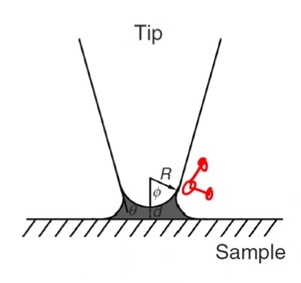
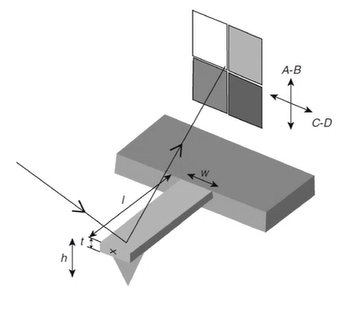
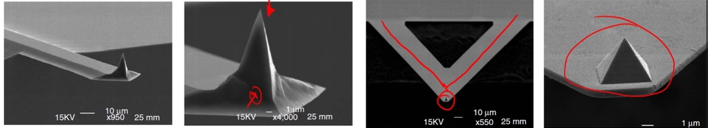
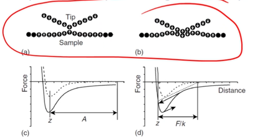
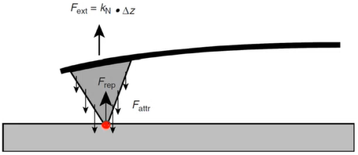
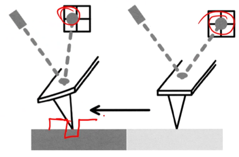
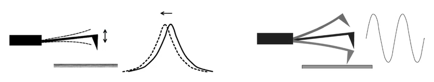
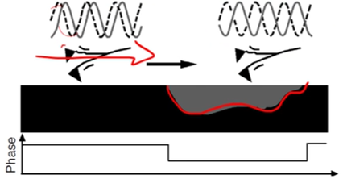
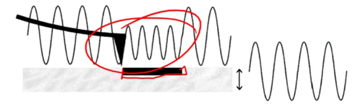
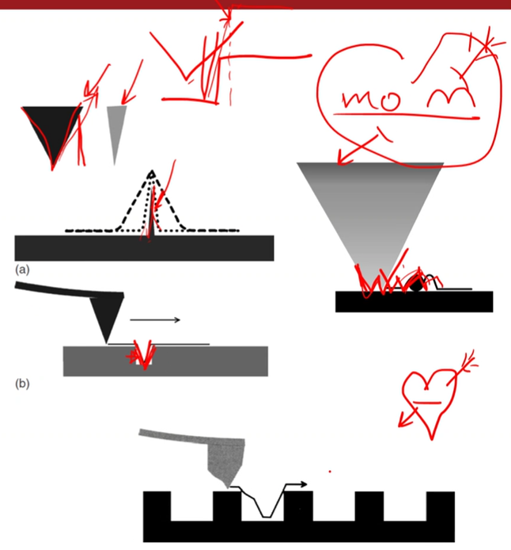

<!-- 20221116T09:39 -->
# Lecture 25: AFM and Artifacts
## Objectives
- Introduce #AFM.
- Detail the setup and operation of #AFM.
- Highlight various measurement methods.
- Determine the utility and application of #AFM.
- Identify typical artifacts in SPM and solutions.

## Atomic Force Microscopy
#AFM uses near-field forces to measure surface topography and materials properties, depending on the mode.
Like #STM, it uses a sharp prove to scan a surface.
Instead of tunneling current, it primarily uses probe deflection: can be either attractive or repulsive.
The force is calculated from the cantilever geometry and material properties.

## Near field forces
#AFM can use a variety of forces to map a surface.
Short-range forces occur when the electron clouds of the tip and surface overlap:
- This can cause an attractive force, but eventually becomes repulsive when they are too close (Pauli Exclusion principle).
- Forces in the range of $0.5-1 nN$ at a distance of $0.05-0.2 nm$.

#van-der-Waals-forces occur by random fluctuation of atomic dipoles and induced dipoles: for a probe tip with radius, $R$, Hamasker constant, $H$ of $10^{-19} J$, distance, $d$, the force $F_{vdW}$ is $F_{vdW} = HR/(6d^{2})$.
#van-der-Waals-forces are greatly influenced by the measurement medium and vacuum is more sensitive to the spacing.

Electrostatic occur between non-conductive materials or with a conductive sample is a voltage bias applied.
For a tip radius of $20 nm$, distance of $0.5 nm$, and voltage difference of $1 V$, a force of $0.5 nN$ is developed ($\epsilon_{0}$ is the permittivity of vacuum): $$F_{els} = \epsilon_{0}\pi\frac{R}{d}(V_{bias} - V_{cpd})^{2}$$
Capillary forces result from moisture condensing between the tip and sample, forming a meniscus: for a $100 nm$ tip, the force can be much higher, $\sim 90 nN$: $$F_{cap} = \frac{4\pi R\gamma\cos(\theta)}{1 + d/[R(1 - \cos(\phi))]}$$

## Force sensing
The force is determined by reflecting a laser off the cantilever used to scan the surface.
The cantilever has a metal coating on the top surface to strongly reflect the laser.
As the cantilever moves vertically or tilts, the beam will strike various photodiodes that corresponds to the amount of deflection and therefore the overall force.
The distance between the cantilever and the photodiodes is 3 orders of magnitude greater than the length of the cantilever, so the motion is greatly magnified.

|  |
|:--:|
| Determining whether the probe tip is interacting with the surface is measured by deflection of a cantilever. |

## Cantilever design
The probe is critical to the measurement, and various measurement modes may use different types.
The single-beam cantilever, which is often made from #Si, is $100-500 \mu m$ long and $0.5-5 \mu m$ wide.
Triangular cantilevers are often made of silicon nitride and stiffer than the single beam.

|  |
|:--:|
| It is most common to have the probe tip integrated into the cantilever: these are created by etching processes, so the crystal structure determined tip geometry. |

## Operational modes
There are to categories: Static or Dynamic.
In static modes, the cantilever deflects based on interaction with the sample: known as contact mode.
In dynamic, modes, the cantilever is oscillated at a specific frequency and the interaction with the sample dampens the amplitude:
- Can contact the sample (tapping mode) or may not.
- Contact may cause sample damage but also provides additional material information.

|  |
|:--:|
| Note jump-to and jump-off in contact (attraction near then adherence before lifting). |

!!! quote <cite> #Mark-Atwater
    Tapping is not near as damaging to the sample as simply dragging the tip across the sample.

### Static Modes
Tip is brought into region of repulsive force (other regions of probe will be attracted): cantilever force balances the forces.
The contact mode resolution is highest and best for atomic imaging.
The actual measurement is determined by the contact area, a, which can be estimated by the Hertz model: typical parameters mean $a$ is on the order of several nm which is insufficient for atomic resolution.

$$\begin{split}
a &= 2(DRF)^{1/3} \\
D &= \frac{1 - \nu_{t}^{2}}{E_{t}} + \frac{1 - \nu_{t}^{2}}{E_{t}}
\end{split}$$

|  |
|:--:|
| Static modes measures the delicate balance of the tip supported by a cantilever and the tips interactions with the surface. |

#### Lateral force microscopy
Also known as friction force microscopy, this method tracks the the tip rotation as it is scanned across surface.
This provides information on the material properties, based on the friction associated with the tip.
Multi-phase materials can be imaged if they have different frictional properties.
Also reports topographical information such as holes or steps.

### Dynamic modes
Dynamic non-contact modes can provide atomic resolution images:
- Cantilever oscillates by means of a piezoactuator at or near its resonant frequency.
- The sample surface is sensed through weak attractive forces that shift the oscillation frequency.

Tapping mode operates similarly, but it does contact the sample surface very lightly:
- The oscillation frequency is maintained by the amplitude is dampened when the sample is closer to the probe (distance is then increased to maintain the lowest possible force).
- Overcomes the tip-sample sticking and shear forces on the sample.

|  |
|:--:|
| Dynamic, non-contact modes measures the oscillation of the probe cantilever. Tapping mode measures the dampening of the constant probe cantilever oscillation frequency. |

## Phase contrast
Tapping mode allows direct force information about the sample to be determined.
Differences in material properties result in different effects on the cantilever.
Information about composition, adhesions, friction, and #viscoelasticity can be determined.
Phase lag occurs when the oscillation measured deviates from the generator, so the properties of the material can be measured: topography (amplitude) can be mapped simultaneously with the phase contrast.

## Force modulation
A low frequency vibration is induced, and the cantilever contacts the surface.
When in contact a constant force is applied.
The stiffness of the sample in that location is determined by the amount of deformation: cantilever deflection is a measure of the sample stiffness.

## Image artifacts
### Probe
#SPM methods share some common considerations when making the measurements.
Errors may arise from the probe, scanning, vibration, etcetera.
The tip is perhaps the most important, as its geometry (opening angle) determines the lateral resolution.
If the tip is broader, contaminated, or does not have a single distinct point, errors in the results may occur.

!!! question Would this work for pores? <cite> #Adriel-Lau
    This method could still work provided the pores were large enough.
    You may not see the entire depth and shape of the pore, but you would know the pore is there.

### Scanning
The scanning methods is also important given the extremely small scale.
The piezoelectrical material does not have a perfectly linear behavior, may not behave the same in both directions, and may creep at constant voltage.
Environmental changes, especially temperature, can also cause dimensional inaccuracies.
The scanning phenomena can largely be corrected by calibrating on a standard grid and scanning in each direction.

## Vibration and operation
Vibration must be eliminated to get the highest resolution:
- Can be acoustic or within the structure.
- The equipment should be housed on a ground flow in a corner.
- The equipment can be housed in an isolation box.

Artifacts can also come from measurement parameters, such as too high of a scan speed.
To detect artifacts:
- Repeat the scan
- Change the scanning direction
- Change the scan area size
- Rotate the sample and repeat the scan
- Compare different scan speeds.

## Summary
- #SPM techniques are very capable for surface topography.
- They can provide truly atomic resolution.
- They are not suitable for large area measurement or rough surfaces.
- Some compositional information can be determined, but it is not highly specific.
- They must be carefully setup to consider the properties of the probe in relation to the material and topography.