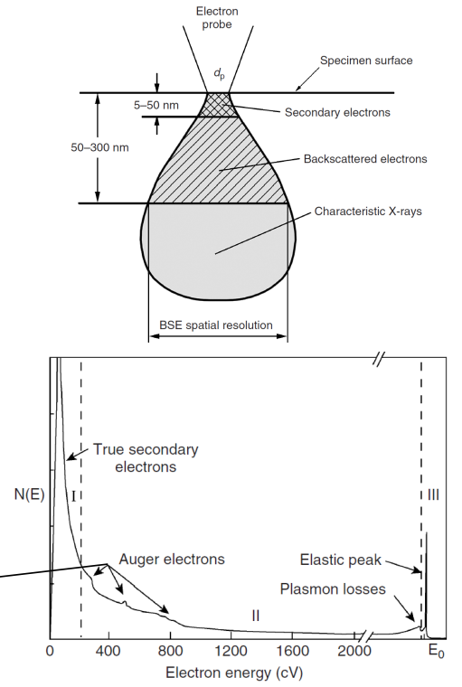

<!-- 20221128T13:16 -->
# Lecture 26: XPS and AES Introduction
## Objective
- Introduce #XPS and #AES techniques.
- Describe the setup for these methods.
- Compare and contrast the two methods.
- Detail the signal generation.
- Discuss variations in detection for each.

## Introduction
X-ray photoelectron spectroscopy ( #XPS ) and Auger Electron Spectroscopy ( #AES ) are techniques for measuring surface chemistry.
Both use characteristic *electrons* emitted from the sample: similar in concept to #EDS and [characteristic X-rays](characteristic-x-rays.md).
These electrons have low energy ($20-2000 eV$) and can only escape from a $~10 nm$ depth: EDS signal comes from up to several microns in depth.
#XPS and #AES use electrons originating from different phenomena, but they provide similar information.

## X-ray photoelectron spectroscopy
A photoelectron is an electron ejected from an orbital when an atom absorbs and x-ray photon.
The incident x-ray must have enough energy to known out the electron.
the binding energy of the photoelectron can be determined given the x-ray energy ($hv$), the kinetic energy ($E_{k}$) and the energy required to escape the material's surface ($\Phi$).
The binding energy is the characteristic that can be measured to determine composition.
The energy of each electron is traceable to the element and shell/subshell based on spin-orbit coupling.

$$E_{B} = hv - E_{k} - \Phi$$

## Auger Electron Spectroscopy (AES)
#AES uses electron beam excitation to generate the signal.
Discovered by Auger and Meinter, #AES detects electron generated by the relaxation of the atom after ionization: this was the alternative to characteristic x-ray generation discussed with #EDS.
The energy of the Auger electron is approximately equal to the difference of the binding energies in the shells involved in the transition.

### AES Nomenclature and Spectrum
#AES uses notation that describes the signal origin (electron transition).
$E_{BX}$ indicates the binding energy of shell $X$.
$E_{KL_{1}L_{2,3}}$ indicates that a $K$-shell electron was knocked out, an $L_{1}$-shell electron refilled the $K$-shell and an $L_{2,3}$-shell electron was ejected as an Auger electron.

$$E_{KL_{1}L_{2, 3}} \approx E_{BK} - E_{BL} - E_{BL_{2, 3}}$$

|  |
|:--:|
| The #AES spectrum is plotted by intensity vs kinetic energy, but it is more common to plot the first derivative instead: the accentuates the peaks against the background. |

### AES Signal
The Auger electron signal is relatively weak compared to the overall electron generation.
From our discussion of electron microscopy, there is a greater likelihood of #BSE and #SE generation.

|  |
|:--:|
| The low energy of Auger electrons limits the depth from which they can escape the material. |

## Equipment
The instruments used to collect #XPS and #AES have many similarities, and both can be included in one instrument.
These techniques require ultra-high vacuum to keep the sample surface clean and to reduce electron scattering by gas molecule:
- A monolayer of gas is deposited on a surface within one second at $10^{-6} mbar$.
- Typical pressures at $10^{-8} to 10^{-10} mbar$.
- The chamber is heated to remove adsorbed gases from its surface.

Because surface composition is the primary interest in these techniques, it is critical to have a clean surface.
The measurement of light elements that may be part of the gaseous environment (i.e. #C, #O, #N) is most affected.
Magnetic shielding is also needed because the electron trajectories must be carefully controlled.

## Source guns
#XPS and #AES use various sources to generate signal and modify the sample condition:
- #XPS uses an x-ray gun (or more than one)
- #AES uses an electron gun
- Both can use an ion gun
- #XPS may use an electron flood gun

### X-ray gun
This mirrors the discussion in the section on #XRD.
A high-energy electron beam bombards a target.
That target has a characteristic x-ray wavelength that is isolated to bombard the target: the target is commonly #Al or #Mg in #XPS.
The x-ray source can be monochromatic or not:
- Monochromatic x-rays have reduced background.
- Non-monochromatic will help reduce charging in insulators.

Lower x-ray energy than #XRD is used as the line widths are smaller (less than $1 ev$).

|  |
|:--:|
| Often a dual anode x-ray tube is used to quickly switch between #Mg and #Al. |

### Electron gun
Follows the sample principles of design and operation as #SEM.
Spatial resolution is determined by the filament type: field emission sources have higher brightness and better resolution.
An ion gun is used to bombard the surface with #Ar ions.
Ions are sued to clean the surface as well as sputter away material for depth profiling.
The energy and beam type will determine the amount of material removed.

## Electron energy analyzers
A concentric hemispherical analyzer ( #CHA ) is the most commonly used setup: hemispherical sector analyzer ( #HSA ).
The trajectory of an electron is detected by its energy in response to the applied potential on the hemisphere.

|  |
|:--:|
| Only electron of a specific energy are allowed through: e.g. pass energy. Incoming electron are electrostatically focused and retarded. |

### CHA modes
The spectrum for #XPS and #AES can be measured in two primary ways:
1. Constant analyzer energy ( #CAE )
2. Constant retarding ration ( #CRR )

#CAE maintains the pass energy and records the change in electron retardation: typical for #XPS.
#CRR holds the electron retardation constant records the change in pass energy: typical for #AES.

## Detection Resolution
electron energy resolution is given in absolute ($\Delta E$) or relative form ($\Delta E/E$).
#XPS requires an *absolute* resolution of $0.5 eV$ over the entire spectrum, but the CHA itself has a *relative* resolution lit: based on geometric configuration, such as hemisphere radii and slit-opening.
The resolution requirement is easily achievable at low photoelectron energies:
- At $E = 200 eV$, CHA relative resolution must be 0.025 to achieve $0.5 eV$.
- At $E = 1500 eV$, CHA relative resolution must be 0.003 to achieve $0.5 eV$.

To make the measurements practical, the electron are retarded to the $10-100 eV$ range.
#AES requires the lowest energy electrons to be suppressed, a constant retardation ratio is used, and the pass energy is varied.

## Summary
- #XPS and #AES are both highly surface sensitive chemical measurement techniques.
- #XPS uses incident x-rays and #AES uses incident electrons.
- Both plot signal intensity versus the electron energy and similar measurement setups.
- The measurement must be carried out under ultra-high vacuum making fully integrated equipment rather expensive.