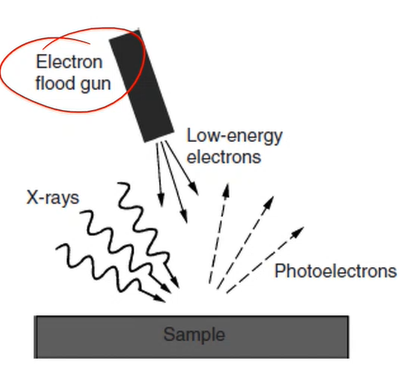

d<!-- 20221130T09:42 -->
# Lecture 27: XPS and AES Spectra
## Objectives
- Revisit the key concepts in #XPS and #AES.
- Discuss the data produced.
- Detail the spectra and interpretation.
- Highlight factors affecting the peak positions, chemical shift and surface energies.
- Discuss the importance of area mapping and depth profiling and their caveats.

## Recall
- #XPS and #AES both measure electron emission from a sample surface.
- #XPS uses an X-ray gun to generate the signal.
- #AES uses an electron gun to generate the signal.
- Auger electron are generated by #XPS as well.

|  |
|:--:|
| it is *how* the electron signal is generated that is important. |

## XPS Spectra
#XPS spectra plot binding energy vs the intensity.
Three types of peaks may appear in the spectrum:
- Core level photoemission
- Valence photoemission
- Auger emission (X-ray generated)

Core peaks are used for elemental identification.
Valence peaks ($0-20 eV$ binding energy) can be useful for electronic information.
Auger peaks can provide chemical information as well.
The step-like background results from inelastic scattering of the photoelectrons.
Characteristics and continuous x-rays can also contribute to the background.

|  |
|:--:|
| Notice that there are two x-axes here because they are direct inverses of each other. |

!!! quote <cite> #Mark-Atwater
    Valence electrons have lower binding energies and much easier to knock of the atom; however, they generate very low signal and one would need to magnify the view on the plot to see any effects.

### Shake-up satellite peaks
Core-level photoelectrons may have weaker satellite peaks associated with them.
A core-level photoelectron may interact with a valence electron and lose energy creating "shake-up" satellite.
Some materials exhibit relatively strong satellites.

|  |
|:--:|
| The satellites may also provide specific bonding information: e.g. #CuO exhibits a satellite but #CU2O does not. |

!!! quote <cite> #Mark-Atwater
    Can be useful to identify the type of bonding in chemical composition if not already known.

### Multiplets and Plasmon loss
Multiplet splitting may occur where a compound has unpaired electrons in its valence level: this can be useful to distinguish between compounds (e.g. #NiO has $2p_{3/2}$) splitting by #NiOH does not.

|  |
|:--:|
| Plasmon loss also creates satellites, but they are not useful for analysis: the energy lost is due to collective vibrations in the conduction electrons in a metals. |

!!! example Nanoparticles
    Depending on their size, gold nanoparticles show up as red or purple because of these effects.

## AES Spectra
#AES spectra are presented in two modes:
1. Direct
2. Differential

The direct spectra displays intensity over a range of kinetic energies: the number of electrons of a given energy are collected using the #CRR mode of the #CHA.
The differential mode plots the first derivative of the direct data to accentuate peaks: the Auger energy is given by the sharp minimum in the differential intensity.

|  |
|:--:|
| The differential method is useful to visualize weaker signals. For chemical identification, the range of energies is rather small but sufficient to identify where this minimum occurs. |

### Auger Energy
Although the minimum is taken as the Auger energy, the peak maximum in the direct data is zero in the differential data.
The minimum will be of a slightly higher energy in differential data.
The difference is small enough to be ignored for elemental identification (qualitative): it is easier to identify the maximum.
Light elements are identified by their KLL peaks, but heavier elements ($Z >= 15$) use LMM or MNN triplets: multiple peaks are generated with KLL, but only one peak dominates.

## Qualitative analysis
#XPS and #AES are capable of determining surface composition (what elements) as well as some information about their bonding (how they relate to other elements).
The difference in peak location based on bonding is known as chemical shift: #C in #CO2 has a different location than #C in a hydrocarbon molecule.
The equipment also provides means for depth profiling, such that layer thickness can be determined to an extent.
Peak identification is done through comparison to known locations and energies: chemical shift, surface charge, satellites, and other phenomena all complicate peak identification.

## Peak ID
Peaks in #AES are more straightforward and can be referenced in standard datasets.
#XPS is more complicated because the spectra also contain Auger peaks.
The x-ray source can be changed to identify the Auger peaks which will shift with the source energy.
The peak locations in #XPS are sensitive to the measurement conditions, and calibration is important with known standards especially with poorly conductive samples.
A standard that is not susceptible to chemical shift is also important so that contamination is less likely to cause inaccuracy.

## XPS chemical shift
The surrounding chemical state of the element dictates the peak position.
it is important to know possible states before analysis.
Ex. poly(vinyl trifluoroacetate): carbon and oxygen both have various bonding conditions resulting in different peak locations.
Small peaks shift will result in peak overlap/convolution.

|  |
|:--:|
| The bond difference between $C-C$ and $C=O$ is only $3 eV$ but can be resolved with #XPS. |

!!! note Bond shifts with #C
    This technique can be used to identify the degree of bonding: $C-O$ to $C=O$.

## Insulating materials
Peaks can shift significantly with non-conductive materials.
In #XPS, photelectric emission results in a positive charge building up on the surface of the sample being analyzed: this change in surface potential affects, $\Phi$ and the calculating of the binding energy.
In #AES, the surface becomes negatively charged also resulting i change in the peak position.

|  |
|:--:|
|  |
| Charge neutralization must be applied to accurately measure the energy. In #XPS, an electron flood gun can be used to neutralize the surface (or non-monochromatic x-rays). #AES requires a conductive coating *near* the surface to be measured and is more difficult to address overall. |

## Compositional Mapping
Like #EDS in #electron-microscopy, the composition can be measured across a surface.
#AES is well suited as it is essentially an #electron-microscopy technique: the resolution is not as good but compositional sensitivity and surface measurement is better.
#XPS is more difficult to apply mapping as an x-ray beam is used: a focused monochromatic beam can be used, but the resolution is much worse than with #AES.

## Depth profiling
Sputter depth profiling can be applied by bombarding the surface with an ion gun.
The un is rastered across the surface to produce a crater.
The depth is determined indirectly given the sputter yield for the material being measured: this may need to be experimentally determined as part of the analysis.
Varying elements and mixtures will have varying etch rates.
Sharp interfaces can be made diffuse by the bombardments; therefore, losing the atomically sharp detail they had originally.

## Summary
- #XPS and #AES provide surface composition information.
- They can be used complimentarily to determine the chemistry by depth and area.
- #AES is beast for conductive materials and #XPS for any material type (using flood gun for instance).
- Both are sued for thin film analysis, contamination, surface passivation, or other near-surface properties.
- Unlike EDS, #XPS and #AES can also reveal bonding information through peak position and characteristics.