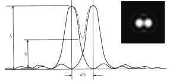

<!-- 220826 -->
# Lecture 3: Resolution and Aberrations
## Objectives
- Consider the practical performance metrics and limits to #optical-microscopy.
- Determine how [resolution](../engr-743-001-damage-and-fracture/resolution.md) is defined and what factors control it.
- Discuss the factors influence image quality ([brightness](brightness.md) and [contrast](contrast.md)).
- Identify source of image distortion ([aberrations](aberrations.md)) and their importance.

## Light diffraction
Light passing through an aperture will be diffracted.
The interference pattern created will produce an #Airy-disk through a round opening.
The distribution of light intensity will result a broadening of a point and unavoidable overlap between nearby points.

## Resolution limit
[Resolution](../engr-743-001-damage-and-fracture/resolution.md#limits)
: The smallest distance between two points at which they are both distinctly visible.

The Rayleigh Criterion states that two points are just resolved when the center of the Airy disk generated by one point coincides with the first zero of the Airy disk generated by the second point: $R = \frac{d}{2} \approx \frac{0.61\lambda}{\mu\sin(\alpha)}$.
$d$ is the Airy disk diameter (central spot); $\mu$ is the refractive index of medium between object and lens; $\alpha$ is the half-angle cone of light entering objective; and $\lambda$ is wavelength of light.

|  |
|:--:|
| The Airy disks should not severely overlap, or the two points will appear as one. |

## [Numerical aperture](numerical-aperture.md)

## [Brightness](brightness.md)

## [Contrast](contrast.md)

## [Depth of field](depth-of-field.md)

## Depth of field and depth of focus
One way to increase [depth of field](depth-of-field.md) is to decrease alpha.
This simultaneous reduces the resolution.
Features of a significant z-height may benefit from increased $D_{f}$ but only if large enough to sufficiently resolve.
The [depth of field](depth-of-field.md) is the distance from the lens to the object, and the [depth of focus](depth-of-focus.md) is the range of positions at which the detector or eye sees the object as in focus at a single object position ($M^{2}$ times larger than $D_{f}$).

## [Aberrations](aberrations.md)

## Summary
- #optical-microscopy is versatile and capable, but the use of visible light has real limitations.
- Getting an image and getting a good image are very different.
- The sources of error are linked to fundamental physical principals and imperfections in design and manufacture.
- Knowing the sources of error can help in determining proper use of the optical microscope.