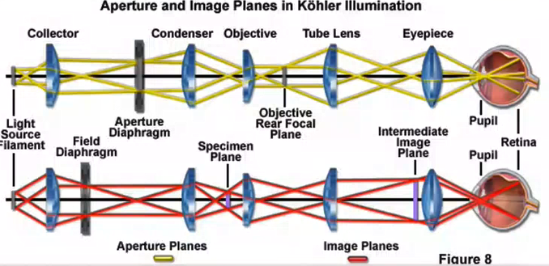
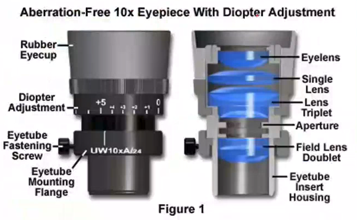

<!-- 20220829T13:05 -->
# Lecture 4: Light Microscope Design
## Objectives
- Discuss the design and operation of light microscopes.
- Identify key components and layout.
- Detail the light path and critical illumination points.
- Describe the way illumination and object focus achieved simultaneously.
- Identify microscopy layout and the means for controlling image quality.

## Microscopy Components
Components of optical microscope include:
- Illumination
- Objective lens
- Eyepiece
- Camera
- Specimen stage

## Illumination Source
The illumination can vary in type and the characteristic wavelength it emits (color, temperature) and the [total brightness](brightness.md).
(The light source can be very hot, so do not put a cover on a microscopy too quickly!)
The choice of illumination source is important as lens may be optimized for [chromatic aberrations](aberrations.md#chromatic) in that spectrum range or for the excitation of fluorophores.
LED sources can be tuned for a specific wavelength, which is especially useful in flourophore excitation.

## Illumination
Consists of a collector lens and condenser lens ( #Koehler-system ).
Collector lens focuses the light at the front focal plane of the condenser lens.
Condenser lens focuses light at the sample.
Defocuses the filament image at the sample for even illumination.

|  |
|:--:|
| Light that is diverging from the focal plane and incident to the lens, the exiting light is collimated which is perfectly defocused but is helpful to provide light onto the specimen. |

## Conjugate Focal Planes
In the #Koehler-system, the same light path has two sets of conjugate focal planes: aperture planes are field planes.
The aperture planes are for illumination (filament image).
Light rays focused at the focal plane of the condenser are parallel after it.
The field planes are for specimen image formation.

|  |
|:--:|
| These two paths are in the same light source and path. These are not two different ways to diagram or map the light rays: this is the same system from the specimen. |

!!! note
    Think of the pinhole effect looking through a pinhole in a piece of paper by limiting the off-axis light.

## [Koehler diaphragms](koehler-diaphragms.md)

## Reflected light (epi-illumination) and filters
Reflected light microscopes rely on a beam splitter to transmit light through the objective lens and back to the eyepiece or camera.
Light filters can be placed in the light path to regulate intensity or color compensation.

## Objective lens
Most important to image magnification and quality.
[NA](numerical-aperture.md) between 0.16-1.4.
Highest dry lens [NA](numerical-aperture.md) $\sim 0.95$.
Provide [chromatic aberrations](aberrations.md#chromatic) correction:
- Achromat (good)
- Semi-achromat (fluorite) (better)
- Apochromat (best)

## [Aberration Correction Types](aberrations.md#correction-types)
Achromat provide red and blue correction: must be illuminated green for black and white photography (old timey stuff).
Semi-achromat has higher NA and better resolution, including some spherical aberrations correction.
Apochromat lenses have better spherical aberrations correction, higher NA, much more complex design.

## Lens identification

## Eyepiece
|  |
|:--:|
| Provides magnification multiplier. May further correct [aberrations](aberrations.md). May provide a graticule for measurements of features. May incorporate independent focal adjustment (parfocal) to correspond to a separate camera. May include diopter adjustment. |

## [Optimizing resolution](../engr-743-001-damage-and-fracture/resolution.md#optimizing-in-optical-microscopy)

## [Optimize depth of field](depth-of-field.md#optimizing-in-optical-microscopy)

## Summary
- Light microscopes use a complex arrangement of lens to get quality images.
- The lens quality is critical, but the design and adjustment of the microscope must be correct to get the performance from those lenses.
- Proper illumination and defocused is achieved with the #field-diaphragm and #aperture-diaphragm.
- The light quality (wavelength and dispersion) can be filtered for specific needs.