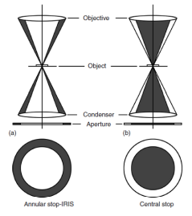

<!-- 20220902T13:08 -->
# Lecture 5: Light Microscope Operation
We will be finishing up Chapter 1 today, but will not be getting into light waves.
Certainly, know how light affects #SEM and #TEM, but do not need to know the physics behind these concepts in this class.

## Objectives
* Describe the processes for generating samples of appropriate type and quality: identify the sources of damage and artifacts and how to avoid them.
* Detail various imaging modes for both type and mechanism(s).
* Determine the appropriate imaging type for diverse sample types.
* Describe the basic differences between imaging methods and when they are useful.

## [Sample Preparation](sample-preparation.md)

## Imaging Modes
### Brightfield/Darkfield
By altering the light path, different variations on the features can be highlighted.
The alteration may be in amplitude, phase, or angle, and area of illumination.
[Brightfield](brightfield.md) is the most common type and is a uniform illumination of the surface (or transmission through).
[Darkfield](darkfield.md) uses a central stop to only allow light rays to be used from the outer edge of the optics: this causes surface features to appear bright as they scatter oblique lighting back up through the objective (topographical contrast).

### [Phase Contrast](contrast.md#phase-contrast)

### Polarized Light
Light has random wave orientations, and a polarizer blocks all or some of those orientations.
This allows certain waves to be passed through.
After interacting with the sample, the wave plane may change, and be blocked, producing [contrast](contrast.md).
Two polarizers ( #cross-polarization ) can be used to further reduce the light transmittance.

#### Polarization of light
The polarization of light can be used to control which plane orientations are available, and they can be shifted as needed.
A #birefringent-crystal has anisotropic refractive properties, and when polarized (planar) light hits it, it is split into two polarized light rays (E wave and O wave) with a phase difference.

#### Nomarski/DIC
Differential interference contrast uses the E and O wave phase differences to generate shading.
These polarized waves can interfere constructively or destructively, and cross-polarization can be used to isolate certain types.

|  |
|:--:|
| The difference in phases of light interacts with #grain-boundary in different ways to emphasize the change in height. |

### Fluorescence
The use of light filters and fluorophores/fluorochromes can be used to highlight areas of a sample.
The light should be of a wavelength suitable to excite the fluorophores, usually a very short wavelength (UV or blue).
This is common in biological materials where certain features are tagged and highlighted in the sample.

### [Confocal microscopy](confocal-microscopy.md)

## Summary
* There are many ways in which #optical-microscopy can be performed in order to get the most information from a sample.
* These techniques use various optics to achieve the best outcome.
* Commonly the advanced optical arrangements are not use controlled, but knowing how to make the most of the them is valuable.
* The concepts of #optical-microscopy will carry over to #electron-microscopy.

Ideally, we should now know how to interpret reported microscopy images and what goes into the technique used: limitations, benefits, and fundamental concept.