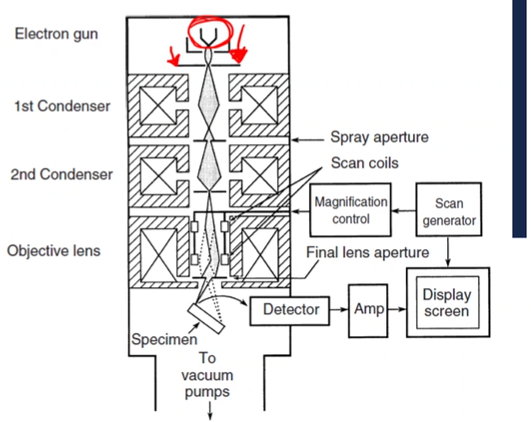

<!-- 20220905T13:17 -->
# Lecture 6: SEM General Setup
This differs from [reflected (epi-illuminated) light](lecture-4-light-microscope-design.md#reflected-light-epi-illumination-and-filters) that reflects off the surface of a specimen.
The content here dips into Ch. 3 but mostly with Ch. 4 with [electromagnetic lenses](electromagnetic-lenses.md) and transmission microscopy.

## Objectives
* Describe the basic difference between #optical-microscopy and #electron-microscopy.
* Highlight the functional aspects of #electron-microscopy.
* Detail the major components of a #SEM.
* Determine some of the key performance factors in #electron-microscopy.

## Introduction
#SEM is a versatile technique for imaging samples.
There are concepts from #optical-microscopy that will carry over, but in a much different form.
The primary difference is the use of electrons, instead of photons, to form images: closest analogue is a confocal leaser scanning microscopy ( #CLSM ).
The implications of this allow a greater range of magnification and new possibilities in chemical analysis and other analytical techniques.

## Comparison to optical microscopy
Source in #optical-microscopy the source is a heated filament or LED producing a specific light spectrum (wavelength dispersion): in #electron-microscopy, the source is a filament (often heated) that produces #free-electrons that are given a specific energy (wavelength).
In #optical-microscopy, the light is collected, focused, and magnified through a series of lenses: #electron-microscopy is the same.
In #optical-microscopy, the lenses are glass, fixed, and subject to [aberrations](aberrations.md)[^1]:
* In #electron-microscopy, the lenses are [electromagnetic](electromagnetic-lenses.md), adjustable, and also subject to [aberrations](aberrations.md)
* Some [aberrations](aberrations.md) can be easily corrected, such as [astigmatism](astigmatism.md)

[^1]: For more discussion on aberrations see [Lecture 3](lecture-3-resolution-and-aberrations.md)

!!! note Some #SEM machines require evacuating the imaging chamber.
    Keep in mind that not all things behave the same under vacuous conditions: i.e. water will boil at low pressures.

## General SEM "optics"
The #SEM uses an #electron-gun to generate electrons which are accelerated by high voltage down the column.
The electrons pass through [electromagnetic lenses](electromagnetic-lenses.md) to condense and focus the beam.
The beam is rastered across the sample to generate signal that is converted to an image.

## [Electron source](electron-source.md)

## [Electromagnetic lenses](electromagnetic-lenses.md)

## Detecting Electrons
Electrons interact with the sample surface, and this produces a signal that can be detected.
The common electron detector is the [Everhart-Thornley detector](everhart-thornley-detector.md).

!!! note 3D Perspective in #SEM images
    Images appear to be 3D, which is correct, but is only an artifact of the rastering process and the shadows behinds crevices and ledges.
    Unlike in a [confocal microscope](confocal-microscopy.md), the objective lens does not move azimuthally to scan at various depths.

Some electrons from the source interact inelastically with the sample, and these are called backscattered electrons (BSE).
These are high-energy electrons and not susceptible to the small grid bias on the E-T detector.
The majority of these electrons are reflected toward the pole piece (objective lens), and a separate detector can be placed there to detect BSE.
SE provide topographical contrast and BSE provide compositional contrast.

## In-Lens detectors
Some #SEM will be equipped with a detector in the column.
An #electrostatic-field accelerates electrons back up the column to a detector.
Both #SE and #BSE can be detected this way:
- The incident beam will be decelerated by the opposing voltage.
- The sample must be relatively close to the pole piece.

Provides very good [resolution](../engr-743-001-damage-and-fracture/resolution.md), even at low voltages.
Can be used in tandem with other detectors.

## Summary
- #electron-microscopy has a number of similarities with #optical-microscopy.
- The unique possibilities with using electrons allows higher [resolution](../engr-743-001-damage-and-fracture/resolution.md) and manipulation of the image.
- The signal generated by electrons can contain additional information, other than just surface features.
- There are many possible configurations for #electron-microscopy, but the capability and cost increase together.