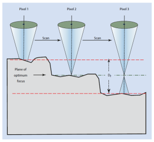
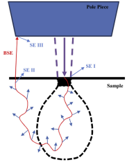

<!-- 20220912T13:10 -->
# Lecture 8: SEM Operations
Today, we will convert everything we have learned thus far into practical rules and procedures when using an actual microscope.
Higher magnification images become much more tedious, but most imaging is done at lower magnification and not as intensive.

## Objectives
- Discuss general user parameters and their importance.
- Identify the way various control features affect the #electron-beam and the resulting information.
- Determine the best ways to achieve high [resolution](../engr-743-001-damage-and-fracture/resolution.md), high signal output, and high [depth of field](depth-of-field.md) (not all together, though).
- Use image qualities to determine appropriate beam modifications.

## Comparing [contrast](contrast.md) images
You can never get rid of topographical contrast.
You can adjust compositional contrast intensity, but never rid the topographical information.

!!! tip Intensity in Contrast Images
    The higher the Z-number for an element (the heavier it is), the brighter the image.

## Operator adjustments to SEM
- There are many possible adjustments available to the user that are not typical in #optical-microscopy.
- #SEM incorporates numerous detectors, beam energies, apertures, scan speeds, and more.
- It is important to know what these do and when to adjust them.

## Working distance
One of the most fundamental settings in #SEM is the #working-distance.
The #working-distance is the distance from the objective lens exit aperture to the #focal-point of the beam: also, the surface of the sample, if your sample is in focus.
The longer the #working-distance will give greater [$D_{f}$](depth-of-field.md).
Why?
The screen resolution will also play a role.
$$\begin{split}
D_{f} &= \frac{2R}{\tan(\alpha)} \\
 &\cong \frac{200}{\alpha_{f}M} \\
 &\cong \frac{200 D_{W}}{R_{fap}M}
\end{split}$$

## [Depth of field](depth-of-field.md#sem)
The large $D_{f}$ in SEM is a consequence of the very small beam size and angle.
The beam is small enough to sufficiently resolve features over a large z-height, especially at low magnification.

|  |
|:--:|
| The over- and under-focus conditions are still in focus. |

## Aperture size
The #aperture-size determines the #convergence-angle for any given #working-distance.
The smallest apertures will yield a greater [$D_{f}$](depth-of-field.md) but reduces the overall signal intensity.
The use of a large aperture reduces [resolution](../engr-743-001-damage-and-fracture/resolution.md), but it enables faster analytical results ( #EDS and #EBSD ).
Aperture alignment is also important:
- If your image mover laterally as you focus, your aperture is not centered with the beam
- A focus "wobble" is used to align the aperture

## Acceleration voltage and probe current
Higher accelerating voltages reduces the wavelength of electrons (better [resolution](../engr-743-001-damage-and-fracture/resolution.md)) and increases #probe-brightness.
The high voltage results in a larger interaction zone, which reduces lateral resolution.
#FEG are able to provide the high brightness and resolution needed to images are low surface energies.
At low probe current, the gain on the signal amplifier will be excessive and generate noise.

!!! tip At higher voltage,  lose surface detail.

## [Astigmatism](astigmatism.md)
Stigmation or simply "stig" adjustment ensures the beam is equiaxed.
This is an essential step in beam focus and is used in tandem with "focus".
The stigmation can be quickly checked by going through...

## Working distance and detector choice
The detector choice will vary with working distance as the signal will be distributed differently.
Not all #SE are the same:
- $SE_{1}$: primary surface signal from #inelastically scattering
- $SE_{2}$: #SE created from interactions away from the probe
- $SE_{3}$: #SE created from #BSE interactions in the chamber

|  |
|:--:|
| $SE_{1}$ and $SE_{2}$ are true #SE from the sample.
More #SE signal is lsot to the pole piece at low #working-distance: [ET detector](everhart-thornley-detector.md) suffers and [In-lens detector](lecture-6-sem-general-setup.md#in-lens-detectors) benefits. |

## Demo time
If you are trying to focus and nothing you do seems to work, then your lens may have a stigmatism.

## Summary
- Each sample material will determine the best beam conditions.
- Each information type may require different beam conditions.
- The magnification needed will determine the level of beam alignment and conditioning needed.
- The imaging mode can be considered separately as:
  - High resolution
  - High current
  - High $D_{f}$
  - Low voltage