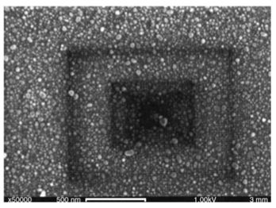
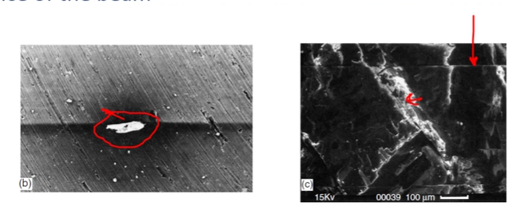

<!-- 20220914T09:42 -->
# Lecture 9: SEM Sample Prep and Vacuum Condition
Sometimes, this step is more critical than for #optical-microscopy.

## Objectives
- Identify the various sample preparation techniques for #SEM.
- Highlight the differences between #optical-microscopy and #electron-microscopy.
- Determine the challenges of #electron-beam imaging for some samples.
- Describe the methods to overcome those challenges.
- Discuss other "modes" of operation to reduce the sample preparation.

## Sample Types
Any type of sample can be examined by #SEM: geological, biological, polymer, metal, ceramic, composite, etcetera.
The #SEM settings are varied to optimize the imaging and analysis of each sample.
The sample may need to be processed to make observation possible or more practical.
The #SEM is typically used to examined very small regions, so a small sample volume is typically sufficient.
The primary considerations in sample type are:
- Hydration
- Electrical conductivity

!!! quote <cite> #Mark-Atwater
    If you wanna look at the interior structure of a biological sample, you can't just throw it on a cutting wheel.
    If you have a large sample, the whole specimen does not need to go into the #SEM (nor would it fit to begin with).

## Topographic Examination
The analysis of surfaces requires little to no preparation.
As long as the sample fits into the #SEM and can be secured, it is suitable for analysis.
The caveat for this is contamination.
Dirty samples (moisture, oils, other residue) will contaminate the #SEM vacuum system and should be removed or minimized: there are some situation where residual materials *are* the sample.

|  |
|:--:|
| Dirty samples will be more likely to form beam artifacts which appear as dark rectangles from #hydrocarbon-cracking under the beam: low melting point materials may also exhibit this type of artifact as they are evaporated by the beam. |

!!! hint Keeping Things in Focus
    When using the #SEM, zoom in as much as you can to focus the beam because everything else at lower magnifications will be in focus.

## Fractography Example
It is common to examine the #fracture-surface of a mechanical test sample to identify the cause and type of failure.
The samples are often much larger than the fractured area, so it is cut off and examined separately.
This makes it much easier to work with the area of interest, but that area is not modified.

## Charging
!!! warning
    This may be the number one challenge in imaging.

The nature of #electron-microscopy requires that a sample be bombarded by electrons.
If the electrons cannot escape the sample, they accumulate.
This charging occurs when the sample is not electrically conductive or is conductive with no path to ground: e.g. metal mounted in epoxy.
Charging is evidenced by unusually bright areas, sudden flickers of light, streaks in the image, or other image instabilities: small poorly supported samples (fibers, powders, etc) may also move under the influence of the beam.

|  |
|:--:|
| These bright spots are similar to if someone reflects the sun into your eye with a mirror or watch face. |

## [Sputter Coating](sputter-coating.md)

## Hydrated Samples
Vacuum causes water to vaporize around $200 mbar$ (at room temperature).
The #SEM chamber is typically at $10^{-4}-10^{-5} mbar$.
The water vapor prevents the pumping down of the chamber.
The release of water as vapor can destroy the sample integrity: especially biological samples.
There are several ways to image hydrated samples:
- [Ion exchange liquids](#ion-exchange)
- [Cryogenic stages](#cryogenic-observation)
- [Variable pressure SEM (VPSEM)](#variable-pressure-sem)
- [Environmental SEM (ESEM)](#environmental-sem)

### Ion Exchange
The hydrated sample is treated with an ionic liquid.
The ionic liquid has good electrical conductivity and low #vapor-pressure.
Replaces water and preserves structure.
Used for general conductivity enhancement as well.
Example: Hitachi HILEM IL100

### Cryogenic Observation
The sample can be cooled cryogenically to prevent the moisture from vaporizing under vacuum.
The sample is first rapidly frozen then loaded in the cryochamber where is can be sliced, fractured, or otherwise processed for imaging (including [sputter coating](sputter-coating.md)).
Part of processing include etching, which is the removal of water by heating for sublimation.
Last, the sample is loaded into the #SEM where it is maintained at cryogenic temperature during imaging.

!!! tip
    The sample needs to frozen quickly enough to not form ice and be kept on a cold stage in the microscope.

#### Critical Point Drying
The critical point is the point on the #phase-diagram where the density of liquid and vapor are equivalent.
Water has a very high temperature and pressure where this occurs ($374\degree C$ and $22 MPa$ ($217 atm$)).
Water can be removed from a sample before imaging by using CO2 as a transitional fluid, as the temperature and pressure requirements are much lower (more specimen compatibility $31\degree C, 7 MPa$).
The sample is traded with ethanol of increasing concentration to replace the water then loaded (in ethanol) in the critical point drier.
Ethanol is then gradually replaced with CO2 and heated/pressurized.
Finally, the CO2 vaporizes at the critical point and the camber is slowly depressurized.

*[CPD]: Critical Point Drying

#### Freeze Drying
In a similar manner to [CPD](#critical-point-drying), the moisture in a sample can be removed by utilizing that phase transition, this time around the triple point.
The sample is first frozen, then put under vacuum, and finally it is heated under vacuum to drive sublimation of the water.

### [Variable-Pressure SEM](variable-pressure-sem.md)

### [Environmental SEM](environmental-sem.md)

## Summary
- Sample prep can be very minimal to #SEM.
- Non-conductive samples are the most common requiring additional preparation.
- The most difficult sample to prepare and image are those that are hydrated or with structures that will be damaged under vacuum.
- Dehydrating techniques and alternative #SEM modes and types may be beneficial.

!!! question When would be use #VPSEM and not [sputter coat](sputter-coating.md)? <cite> #Mark-Atwater
    You want higher pressures for compositions.
    [Sputter coating](sputter-coating.md) something where the composition is of interest introduces more uncertainty.